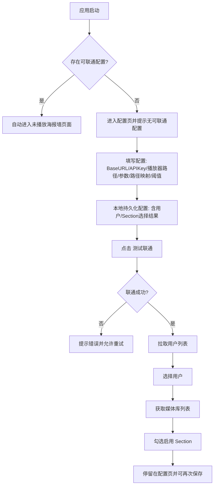
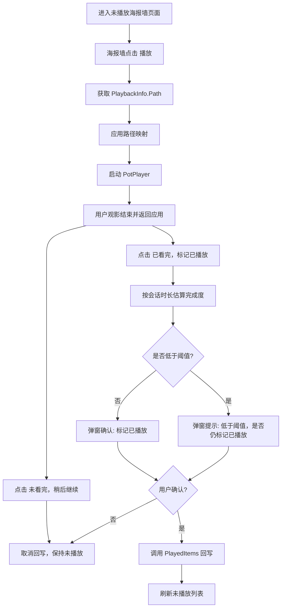

# Emby Desktop Player PRD（MVP 重构版）

## 0. 文档信息
- 产品名：`Emby Desktop Player`（工作名）
- 平台范围：`Windows`（MVP 仅 Windows）
- 目标人群：使用 Emby 管理媒体库、偏好 PotPlayer 等第三方播放器的用户
- 文档目标：明确 MVP 闭环与验收标准，直接指导实现与测试

## 1. 背景与核心痛点

### 1.1 现状问题
- 官方 Emby Windows 客户端不能很好地接入第三方播放器。
- 内置播放器难以满足自定义渲染、音频直通等高级诉求。
- 用户当前流程繁琐：在 Emby 找片 -> 手动找本地文件 -> PotPlayer 播放 -> 回 Emby 手动标记已播放。

### 1.2 目标体验
- 在 Emby 相关列表中“一键播放”目标条目。
- 由本应用唤起第三方播放器播放本地/映射路径文件。
- 观影结束后，按规则确认并回写 Emby “已播放”状态，形成闭环。

## 2. 产品目标与非目标

### 2.1 MVP 目标
1. 打通端到端播放链路：未播放列表 -> 启动 PotPlayer -> 回写已播放。
2. 支持按媒体库（Section）过滤未播放条目，只展示用户选中的库。
3. 使用“用户主动确认 + 阈值提示”策略，避免误回写。
4. 不依赖播放器热键或剪贴板能力，保证不同 PotPlayer 版本下可用。
5. 提供可追踪日志，支持排障与验证。

### 2.2 非目标（MVP 不做）
- 不实现浏览器扩展/猴油脚本方式的网页劫持。
- 不实现播放器深度双向控制（暂停、跳转、倍速同步等）。
- 不实现跨平台（macOS/Linux）支持。
- 不实现复杂多用户并发会话管理。

## 3. 关键业务约束（已确认）
- 配置流程必须为：`保存配置` -> `测试联通` ->（成功后）加载用户列表并选择用户。
- 不手动输入 `UserId`，应由 API 拉取用户供选择。
- 未播放条目必须按已选择 Section 过滤。
- UI 采用海报墙风格。
- 回写“已播放”必须经过用户确认，不直接自动写入。
- 应用启动时，若存在“可联通配置”（联通成功且用户/Section有效），应自动进入未播放海报墙页面。
- 若不存在可联通配置，停留在配置页并提示“没有可联通的配置，请先配置并测试联通”。

## 4. 用户流程（MVP）

### 4.1 首次配置流程

### 4.2 观影与回写流程

## 5. 功能需求

### 5.1 配置管理
- 本地配置项：
  - `baseUrl`
  - `apiKey`
  - `userId`（来自用户选择）
  - `enabledSectionIds`
  - `playerExePath`
  - `argsTemplate`（支持 `{path}`、`{itemId}`）
  - `pathMapFrom` / `pathMapTo`
  - `markPlayedThresholdPercent`（默认 90）
  - `fallbackMinSeconds`（总时长未知时兜底）
- 保存配置与联通测试解耦。
- 联通成功前，禁用依赖 Emby 的操作按钮。
- 启动时自动检测本地配置是否“可联通”（可达 Emby + 已选用户 + 已选至少一个 Section），满足则自动跳转海报墙页。
- 若自动检测失败，显示“没有可联通的配置”提示并停留在配置页。

### 5.2 Emby 联通与用户选择
- `测试联通`：调用 Emby 服务信息接口，展示服务名称/版本。
- `获取用户列表`：联通成功后加载，支持选择并持久化。

### 5.3 媒体库与未播放列表
- 获取媒体库列表并可多选启用。
- 仅对启用库拉取未播放列表，前端合并展示。
- 展示方式：海报墙（标题 + 封面）。
- 海报墙页必须提供“更改配置”入口，可返回配置页调整联通信息、用户与 Section 选择。

### 5.4 播放唤起
- 通过 `PlaybackInfo` 获取可播放文件路径。
- 应用路径映射（服务端路径 -> 客户端可访问路径）。
- 按模板组装参数后唤起 PotPlayer。
- PotPlayer 兼容策略：
  - 避免使用会导致“播放旧文件”的不稳定参数组合。
  - 优先保证“打开正确文件”。

### 5.5 结束观影与回写
- 不再依赖“监控播放器进程退出”作为唯一依据。
- 用户在会话态可主动点击“已看完，标记已播放”或“未看完，稍后继续”。
- 系统基于会话时长估算完成度，仅作为提示，不直接阻断回写。
- 当估算完成度低于阈值时，弹窗做二次提醒，用户仍可强制确认回写。
- 用户确认后调用：
  - `POST /Users/{UserId}/PlayedItems/{ItemId}`

### 5.6 日志与调试
- 本地日志必须记录关键链路：
  - 播放请求与参数（脱敏）
  - 路径解析与映射结果
  - 会话时长估算与阈值提示结果
  - 用户确认/取消回写动作
  - 回写请求结果与错误
- 日志用于验证“用户确认主导”方案的稳定性与可追踪性。

## 6. Emby API 设计（MVP）

### 6.1 联通与用户
- `GET /System/Info`：测试服务可达
- `GET /Users/Query`（失败时可降级 `GET /Users`）：获取用户列表

### 6.2 媒体库与未播放
- `GET /Library/MediaFolders`：媒体库列表
- 未播放列表首选：
  - `GET /Users/{UserId}/Sections/{SectionId}/Items`
- 若首选接口不可用（如 404）降级：
  - `GET /Users/{UserId}/Items?ParentId={SectionId}&Recursive=true`

### 6.3 媒体路径与时长
- `GET /Items/{Id}/PlaybackInfo?UserId={UserId}`：读取 `MediaSources[].Path`
- `GET /Items/{Id}`：必要时获取时长等补充字段

### 6.4 已播放回写
- `POST /Users/{UserId}/PlayedItems/{Id}`
- 可带 `DatePlayed`（按 Emby 要求格式）

## 7. 判定规则（MVP）

### 7.1 完成度规则
- 基于会话时长估算：
  - `completionPercent = sessionElapsedSeconds / runtimeSeconds * 100`（runtime 可得时）
- 当总时长不可得：
  - 使用 `fallbackMinSeconds` 兜底

### 7.2 回写规则
- 无论是否达到阈值，都由用户确认是否回写
- 低于阈值时，弹窗明确给出风险提示
- 用户取消确认 -> 不回写

## 8. UI/交互要求

### 8.1 列表展示
- 未播放条目使用海报墙布局。
- 支持在已筛选 Section 范围内刷新与播放。

### 8.2 关键提示
- 清晰提示联通状态（已联通/未联通）。
- 对失败场景给出可行动提示（重试、检查路径、确认会话状态）。
- 配置页需在启动检测失败时显示“没有可联通的配置”提示。
- 海报墙页需固定提供“更改配置”按钮（返回配置页，不清空已保存配置）。

## 9. 异常场景与降级策略
- Emby 不可达：阻止列表和回写操作，提示网络/地址问题。
- 用户列表为空：提示权限不足或接口不可用。
- 无可播放路径：不启动播放器，不回写。
- 会话信息丢失：提示重新播放后再执行“已看完/未看完”操作。
- 回写失败：提示错误原因并记录日志。

## 10. 验收标准（MVP）
1. 用户可按“保存配置 -> 测试联通 -> 选择用户”完成初始化。
2. 媒体库可多选，未播放列表仅来自选中库。
3. 点击海报可正确唤起 PotPlayer 且打开目标文件。
4. 观影后可使用“已看完，标记已播放 / 未看完，稍后继续”两种动作。
5. 无论完成度是否达阈值，均需用户确认后才回写；确认后 Emby 状态更新成功。
6. 用户选择“未看完”或取消确认时不回写。
7. 关键动作均有本地日志可追踪并可用于排障。

## 11. 指标与日志建议
- `connection_test_success_total` / `connection_test_failure_total`
- `user_list_load_success_total` / `user_list_load_failure_total`
- `unplayed_load_success_total` / `unplayed_load_failure_total`
- `player_launch_success_total` / `player_launch_failure_total`
- `session_completion_estimated_total`
- `mark_played_confirm_total`
- `mark_played_cancel_total`
- `mark_played_success_total` / `mark_played_failure_total`

## 12. 风险与后续规划

### 12.1 MVP 风险
- 会话时长为估算值，与真实播放进度可能存在偏差。
- 用户主观确认可能带来少量误标记。
- 部分 Emby 版本接口行为不一致，需要接口降级与兼容。

### 12.2 V1 方向
- 增加“继续观看会话列表”（保留最近会话，减少误操作）。
- 增加回写失败重试队列（本地持久化）。
- 增加会话级调试面板（可复制日志摘要）。

### 12.3 V2 方向
- 探索更强的播放器集成方式（非侵入 API/插件）。
- 增强播放进度同步能力（更细粒度 check-in）。

