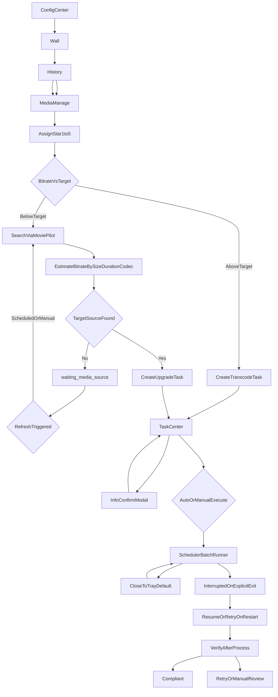

# Emby Desktop Player PRD（v1.0.0 正式版）

## 0. 文档信息

- 产品名：`Emby Desktop Player`
- 平台范围：`Windows`（v1.0.0）
- 本文重点：`v1.0.0 正式版`能力定义与落地方案；与实现细节冲突时，**任务调度与任务中心交互**以 `TASK_CENTER_FULL_LOGIC.md` 为单一事实来源（SSOT）。
- 兼容说明：文末附 `beta.1 ~ beta.3` 已实现能力简述及**当前开发中**快照。
- **修订（2026-04）**：对齐五页壳层与配置集中化；任务中心执行/暂停（含软停）、批量操作与信息确认弹窗；废弃独立「质量审阅」顶层入口。
- **修订（2026-04-17）**：`**v1.0.0-beta.5`** 落地媒体库管理页治理能力：条目**体积**与**蓝光/原盘**标识；原盘（`.iso`、**BDMV** 文件夹结构，含经**配置中心路径映射**后本机可验证路径）**不参与**码率压缩/洗版入队；侧栏增加原盘筛选。
- **修订（2026-04-17）**：媒体库管理**全量列表**增加 `localStorage` 结构化缓存（键 `embyDesktopPlayerLibraryManageCacheV1`，含 `version`、`fingerprint`、`savedAt`、`items`）；指纹绑定规范化 Base URL、用户与已启用库集合；**进入管理页不自动请求 Emby**，由用户点击「刷新媒体库列表」拉取并落盘；指纹变化时丢弃旧缓存。
- **修订（2026-04-17）**：`**v1.0.0-beta.6`**（实验室分支能力合并入 `master`）：豆瓣电影「看过」**个人评分**抓取、本地缓存与媒体库**片名匹配**；**有效星级**（码率策略）以豆瓣星优先，否则沿用媒体库内用户标注星级；配置中心增加「豆瓣个人评分（实验）」分区（用户 ID、可选 Cookie、同步与风险提示）。实现细节见 **§4.4**。

---

## 1. 产品定位与目标

### 1.1 定位

本产品是一个面向 Emby 用户的桌面应用，核心价值包含两条主线：

- 前台主线：调用第三方播放器，提升观影体验。
- 后台主线：媒体库质量治理，在体积与画质之间达到可控平衡。

### 1.2 v1.0.0 目标

1. 保持并强化“未播放 -> 第三方播放器 -> 回写已播放”的前台闭环。
2. 新增媒体库管理能力，支持基于星级策略的压缩/补源治理。
3. 建立低占用后台任务体系（可托盘运行、可恢复、可重试、可审计）。
4. 明确前台与后台的职责分层，避免相互干扰。

### 1.3 非目标

- 不做跨平台（macOS/Linux）。
- 不做播放器深度双向控制（暂停/进度回传/倍速同步）。
- 不做分布式任务集群，仅支持单机任务执行。

---

## 2. v1.0.0 页面清单

### 2.1 顶层信息架构（五页 + 壳层）

应用采用**统一壳层**：顶部主导航约五页，每页**左侧为操作侧栏**、右侧为主内容区（开发中实现与 PRD 对齐）。

1. **配置中心（Config）**：连接与播放器、**任务调度与补源**（执行模式、双队列并发、补源重试节奏、海报墙打分自动入队等）及其他配置分区。
2. **未播放海报墙（Wall）**：观影入口；观看结束打分后，可按策略自动创建任务（受配置开关约束）。
3. **播放记录页（History）**：行为回放；**不再**承担「添加任务」类重入口（与媒体库重复者已收敛）。
4. **媒体库管理页（MediaManage）**：资产治理；全库列表（含已观看）、搜索与多维筛选（含**是否蓝光/原盘**）、单条/批量入队、星级与策略；列表展示**体积**、**原盘**、**豆瓣个人评分（匹配结果）**与**有效星级状态**（用于策略的星级：豆瓣优先）；**原盘条目**不提供码率压缩/洗版入队（需先提取或转封装为常规片源）。列表数据可持久化到本机 `localStorage`（`embyDesktopPlayerLibraryManageCacheV1`），与当前连接指纹绑定；**进入本页不自动拉取 Emby**，需用户主动「刷新媒体库列表」与服务器对齐（回写观看状态等流程可附带静默刷新以保持接近一致）。
5. **任务中心页（TaskCenter）**：任务列表、状态筛选、单条/批量**调度类**操作（移除、暂停、执行、批量执行等）；**补源信息确认**以**弹窗**完成。

### 2.2 非顶层页面 / 已调整项

- **质量审阅**：不再作为独立顶层页面与路由入口；候选确认纳入任务中心 **「信息确认」** 流程（与 SSOT §11.3 一致）。
- **任务日志**：任务中心内**首版占位**，完整采集与检索为后续迭代。

---

## 3. 页面职责与关系

### 3.1 播放记录页 vs 媒体库管理页（核心边界）

- 播放记录页：行为回放页，关注“看了什么、何时看、看完状态”。
- 媒体库管理页：资产治理页，关注“是否达标、该怎么优化、排队状态”。

### 3.2 数据关系

- 播放记录页输出“最近观看事实”（最近播放时间、频次、已看状态）。
- 媒体库管理页输出“质量状态”（用户标注星级、**豆瓣个人评分（若匹配）**、**有效星级**（策略用）、目标码率、当前码率偏差、任务状态）。
- 通过 `itemId` 关联，形成“行为流 + 资产流”双视角。

### 3.3 操作关系

- 播放记录页允许轻操作：重新播放、已看/未看修正、跳转媒体库等（**不**在播放记录页执行重任务或任务控制）。
- 媒体库管理页负责重操作：星级调整、策略覆盖、批量入队。
- **任务执行控制**（执行、暂停、批量执行、批量暂停、移除等）**统一在任务中心**；配置项在**配置中心 → 任务调度与补源**维护。

---

## 4. 星级与目标码率策略（H265等效）

### 4.1 星级定义

- 1 星：删除（进入回收确认流程）。
- 2~5 星：进入码率目标治理。

### 4.2 默认目标码率梯度（按分辨率）

- 1080p：2 星 3Mbps / 3 星 6Mbps / 4 星 10Mbps / 5 星 16Mbps
- 4K：2 星 8Mbps / 3 星 14Mbps / 4 星 22Mbps / 5 星 35Mbps

### 4.3 等效换算

- 统一使用 H265 等效码率比较。
- 非 H265（如 H264）通过折算系数换算后参与阈值判断。

### 4.4 豆瓣「看过」个人评分与有效星级（产品实现）

本节描述 **beta.6** 已落地的「豆瓣评分」能力：用于在**本地**将用户在豆瓣标记的**电影**个人星级，与 Emby 媒体库条目对齐，并驱动 §4 的码率阶梯（**不**回写 Emby 服务端星级字段）。

#### 4.4.1 数据来源与抓取方式

- **页面 URL**：`https://movie.douban.com/people/{userId}/collect`，查询参数包括 `type=movie`、`mode=grid`、`sort=time`、`filter=all` 等；分页参数 `start=0,15,30,...`（每页步长 **15**）。
- **解析规则（主进程）**：在返回的 HTML 中查找 `div.item.comment-item`块；自块内提取：
  - `subjectId`：`movie.douban.com/subject/{数字}/`；
  - 标题：`em` 标签内文本（去除内嵌标签与多余空白）；
  - 个人评分：`span.ratingN-t` 中 `N` 为 1～5 的整数（用户对该片的「看过」打分）。
- **与 RSS**：**不以** `www.douban.com/feed/people/.../interests` RSS 作为列表来源（该方式在翻页/完整性上不可靠）；产品实现以 **collect 网格 HTML** 为准。配置中若仍保留 RSS 相关字段，仅作兼容或辅助推导账号信息，**抓取链路不依赖 RSS**。

#### 4.4.2 用户配置与隐私

- **必填**：豆瓣用户 ID（即上述 URL 中 `people/` 与 `/collect` 之间的段，字母数字及 `_-`）。
- **可选**：HTTP `Cookie` 请求头内容（用户从已登录浏览器复制）。**公开**「看过」页在无 Cookie 时可抓取；若豆瓣账号将「看过」设为仅自己可见，则需要 Cookie 才能拉取完整列表。
- **本地存储**：主进程将会话写入应用 `userData` 下 `douban-session.json`（含 `userId`、`cookieHeader` 等）；渲染进程将抓取结果写入 `localStorage` 键 **`embyDesktopPlayerDoubanRatingEntriesV1`**（条目数组，含 `subjectId`、`title`、`stars` 及同步时间元数据）。**不向第三方服务器上传**豆瓣数据。

#### 4.4.3 同步策略（增量 / 全量）

- **合并模型**：每次同步在内存中以 `subjectId` 为键 **Map 合并**；新抓取覆盖同键标题与星级，并保留此前缓存中未在本次页面上出现的条目（除非用户清空本地缓存）。
- **增量（默认）**：从 `start=0` 起逐页请求。若某一页解析出的**所有** `subjectId` 在本次请求开始前**均已存在于**本地缓存集合中，则判定无新「看过」记录，**停止翻页**；否则继续直至某一页解析条数为 **0**、HTTP 失败（非首页则中止）、或达到安全上限（防止无限循环）。
- **全量刷新**：约每 **14 天**触发一次完整分页扫描（时间戳存 `localStorage` **`embyDesktopPlayerDoubanLastFullSyncAtMs`**），或首次同步等场景；全量仍与缓存 **合并**，用于纠偏标题变更与评分修改。
- **请求节奏**：页与页之间引入约 **800ms** 间隔，降低对豆瓣站点的请求压力；具体数值以实现代码为准。进度通过 IPC 事件推送到渲染进程以便展示状态文案。

#### 4.4.4 与 Emby 条目的匹配规则

- **范围**：仅 **Movie** 类型参与匹配；剧集等类型不展示豆瓣匹配分（视为未抓取）。
- **豆瓣标题**：常见形式为「中文 / 英文 / 其他译名…」。将标题按 **`/`** 分段，每段及**整串标题**分别做 Unicode规范化（NFKC）、去除标点符号与空白后得到**规范化键**；同一豆瓣条目可对应多个键。
- **Emby 片名**：按主副标题分隔符（半角/全角**冒号**、半角/全角**竖线**）拆段，每段与整串同样生成规范化键；匹配时按键**长度降序**依次查找，优先长键命中，减少短词误匹配。
- **未匹配**：片名差异过大、仅一方有别名、或豆瓣侧无该片时，豆瓣列为「未抓取到」；**有效星级**回退为用户在媒体库内标注的 `rating`（若有）。

#### 4.4.5 与码率策略、筛选与 UI 的关系

- **有效星级**：`effectiveRating`（实现名可略有不同）定义为：若该条目 **豆瓣匹配星级非空** 则采用豆瓣星，否则采用用户在媒体库中标注的星级。**目标码率**、**推荐动作**（压缩/补源/保持）、以及「相对目标码率」等筛选均基于有效星级。
- **配置中心**：增加「**豆瓣个人评分（实验）**」分区：填写用户 ID、可选 Cookie、保存会话、**同步豆瓣评分**与停止同步；展示合规与频率提示、当前匹配统计（如已匹配电影数/总电影数）。
- **媒体库列表**：展示豆瓣原始匹配星级列与有效星级状态列（避免与仅 Emby 标注混淆）。

#### 4.4.6 合规说明与已知限制

- 用户须自行遵守豆瓣网站服务条款及适用法律法规；应用仅作为**个人本地工具**辅助整理片库，**不**鼓励高频抓取或绕过访问控制。
- **已知限制**：仅覆盖出现在 collect **电影**列表中的条目；依赖页面结构稳定性（若豆瓣改版需更新解析）；**不**写入 Emby 服务器元数据；剧集、纪录片等若不在电影 collect 中则无豆瓣分。

---

## 5. 媒体库治理动作

### 5.0 蓝光/原盘资源（ISO、BDMV）排除

- **定义**：资源为 `.iso` 映像，或磁盘上存在 `**BDMV` 目录结构**（含 Emby 返回路径经**配置中心「路径映射」转换后在本机可验证的情形），视为原盘类**，与「常规单文件/文件夹片源」区分治理。
- **产品规则**：原盘类资源**不允许**创建**码率压缩（Transcode）**与**洗版补源（Upgrade）**任务；界面需明确提示，批量场景需跳过并汇总说明。用户需先提取或转封装为常规容器后，再纳入 §5.1 / §5.2 流程。

### 5.1 高码率压缩（Transcode）

- 条件：`currentEquivalentBitrate > targetBitrate + safetyMargin`
- 动作：创建转码任务（FFmpeg），输出临时文件，校验通过后原子替换。
- 失败：进入重试/人工复核队列。

### 5.2 低码率补源（Upgrade）

- 条件：`currentEquivalentBitrate < targetBitrate - safetyMargin`
- 动作：通过 MoviePilot 搜索候选，按“体积 + 时长 + 编码”估算码率并排序。
- 命中：创建补源任务并入队执行。

### 5.3 无高码率资源时的处理

- 不判定为终态失败，状态设为 `waiting_media_source`。
- 记录：`lastSearchAt`、`nextSearchAt`、`searchAttempt`、`bestCandidateScore`。
- 触发再搜：
  - 到期自动重搜
  - 用户手动“立即重搜”
  - 策略变化事件触发（星级/目标策略/站点策略变化）

---

## 6. 补源刷新策略（v1推荐）

### 6.1 周期重搜

- 第 1~3 次：每 24 小时
- 第 4~10 次：每 3 天
- 第 11 次后：每 7 天（低频监控态）

### 6.2 结果判定

- 若出现候选满足 `estimatedBitrate >= targetMin` 且质量评分优于当前资源：进入可执行/可确认路径（实现上经调度与 Flow 协作；可能表现为入队或 `**awaiting_user_confirm`（待信息确认）** 等停泊态，**不以独立页面为必经入口**）。
- 否则保留 `waiting_media_source` 并刷新 `nextSearchAt`

### 6.3 示例场景

- 1 月 5 日：用户设为 5 星，无达标资源 -> `waiting_media_source`
- 3 月 5 日：应用启动触发到期重搜，出现达标资源 -> 进入可执行/信息确认路径 -> 入队或由用户确认后继续 Flow

---

## 7. 调度与执行模式

### 7.1 执行模式（与 SSOT 一致）

- **自动模式**：新任务在**添加瞬间**即获准调度（如进入「排队等槽」语义，典型 `queued`），由调度器按并发与 Flow 推进。
- **手动模式**：新任务初始为**待启动**（如 `pending_manual`）；用户须通过任务中心 **单条「执行」** 或侧栏 **「批量执行」**（对勾选集合）发令后，任务才进入可调度就绪态。
- **批量执行**与**单条执行**语义相同，仅作用范围不同；占槽中（`precheck` / `executing` / `verify`）点执行无效（置灰）。`awaiting_user_confirm`、`waiting_media_source` 上执行置灰，推进由信息确认或 Flow 重试负责。
- **定时/时间窗口**：可作为后续增强（按用户配置窗口自动允许调度）；与「自动/手动」正交，不以本文旧稿「定时模式」单独替代「自动模式」。

### 7.2 暂停（调度层冻结）

- **暂停**冻结调度推进；恢复**仅**通过**执行**（单条或批量）。
- **占槽时软停**：当前步骤正常收尾，**本步结束后**再进入 `paused` 并释放槽位；实现可借助 `pause_requested` 类标记（见 SSOT §9）。
- `**awaiting_user_confirm` / `waiting_media_source`**：允许暂停；`pending_manual`：禁止暂停并提示未启动。
- **批量暂停** = 单条暂停语义 × 选中集合。

### 7.3 双队列与并发

- 转码与补源为**两条逻辑队列**，各有 FIFO 与**独立占槽上限**（配置项如 `transcodeConcurrency`、`upgradeConcurrency`）；**同视频互斥**（未结案任务存在时禁止同 `itemId` 再建任务）。

### 7.4 批量执行前提示（目标）

- 预计耗时
- 预计磁盘占用
- 预计负载影响（CPU/IO）

### 7.5 优先级建议

- 显式**任务优先级队列/抢占**：当前阶段**不实现**（以 SSOT 为准）；产品侧仍可保留「1 星删除确认 > 已观看不达标 > 未观看不达标」作为**默认处理习惯**描述。

---

## 8. 前后台双轨技术方案（v1关键）

### 8.1 进程分层

- `renderer`：页面交互与轻状态，不执行重任务。
- `main`：调度中枢（队列、生命周期、托盘、恢复逻辑）。
- `worker`：后台执行（FFmpeg 转码、补源搜索、刷新任务）。

### 8.2 资源占用控制

- 默认低并发（建议：转码 1 并发 + 补源刷新 1 并发）。
- 观影会话活跃时自动降载/暂停高负载任务。
- 磁盘阈值保护：不足时禁止新任务启动。

### 8.3 托盘与窗口行为（已确认）

- 关闭窗口默认行为：最小化到托盘（不退出）。
- 托盘菜单：显示主窗口 / 开始批量执行 / 暂停队列 / 退出应用。
- 只有显式“退出应用”才进入真正终止流程。

---

## 9. 任务状态机与中断恢复

### 9.1 状态与主路径（扁平 `status`，与 SSOT 对齐）

- **主路径（示意）**：`queued` → `precheck` → `executing` → `verify` → `done`（洗版等 Flow 在 `verify` 之后可能进入 `awaiting_user_confirm` 而非直接 `done`，以 SSOT / Flow 为准）。
- **停泊（不占活跃槽或待发令）**：`pending_manual`（手动模式下待启动）、`paused`、`awaiting_user_confirm`、`waiting_media_source` 等。
- **占槽**：`precheck`、`executing`、`verify`。
- **异常 / 辅助**：`failed_hard`；`interrupted` / `resume_pending`。

### 9.2 中断恢复机制

- 执行中每阶段 checkpoint 落盘。
- 启动时将 `running` 重置为 `interrupted` 并提示：
  - 继续
  - 重试
  - 终止

### 9.3 幂等与文件安全

- 幂等键：`taskId + itemId + actionType + sourceHash`
- 转码输出写 `.partial` 临时文件，验收后原子替换。
- 中断时保留原片并清理过期临时文件。

### 9.4 v1 恢复简化策略

- 转码任务：从头重跑（不做编码断点续跑）。
- 补源任务：已下发下载时仅恢复追踪，不重复下发。

---

## 10. 与 MoviePilot 联动方案

### 10.1 联动原则

- 优先使用 API（搜索/下载/历史），避免直接读数据库。
- 将“码率估算 + 候选排序”放在本应用侧执行，保持规则可控。

### 10.2 估算口径

- 总码率估算：`sizeGB * 8192 / durationSec`
- 视频码率估算：总码率减去音频和容器开销估计
- 结合编码标签进行加权评分

### 10.3 结果处理

- 候选达标：入队执行
- 候选不达标：`waiting_media_source`
- 接口鉴权或系统错误：`failed_hard`

---

## 11. 用户操作流程（v1.0.0）

---

## 12. 验收标准（v1.0.0）

1. 用户可在**顶层五页**（配置、海报墙、播放记录、媒体库、任务中心）完成「观影 + 治理」闭环；补源确认走任务中心弹窗，**不依赖**独立质量审阅顶页。
2. 星级策略可正确驱动删除、压缩、补源三类动作。
3. 高码率压缩任务可稳定执行并完成验收替换。
4. 低码率补源可执行搜索、估算、筛选与入队。
5. 无达标补源时任务进入 `waiting_media_source`，并可自动/手动再触发。
6. 任务支持 **自动/手动执行模式**、单条与批量**执行/暂停**（含占槽软停语义），双队列并发可配置。
7. 关闭窗口默认最小化到托盘，不中断后台进程。
8. 显式退出后，任务状态可恢复，且不重复下发、不污染媒体文件。

---

## 13. 风险与缓解

- 码率估算误差：引入目标区间与可信度分级，低可信候选走人工审阅。
- 后台占用影响观影：双轨架构 + 观影会话降载 + 低并发默认策略。
- 长期无优质源导致任务遗忘：`waiting_media_source` + 周期重搜 + 到期提醒。
- 任务中断导致数据不一致：checkpoint 落盘 + 幂等键 + 原子替换。

---

## 14. beta 版本能力简述（历史基线）

### 14.1 v1.0.0-beta.1

- MVP 基线可运行（Electron + React）。
- 打通基础链路：配置 -> 未播放海报墙 -> 第三方播放器 -> 手动确认回写已播放。

### 14.2 v1.0.0-beta.2

- 强化打包与生产启动稳定性。
- 配置项交互收敛，降低误操作。

### 14.3 v1.0.0-beta.3

- 新增播放记录页面与筛选能力。
- 支持已看/未看状态同步与重新播放。
- 增强本地历史与服务器历史合并，提升记录稳定性。

### 14.4 当前开发中快照（非发行说明，截至 2026-04）

- **壳层与导航**：五页顶栏 + 各页左侧侧栏 + 右侧主区；暗色主题与基础响应式样式。
- **配置集中化**：媒体策略与任务调度相关表单迁入**配置中心**；任务中心侧栏聚焦列表与调度操作。
- **任务中心（前端 MVP）**：本地持久化队列、状态筛选、双队列调度模拟、`pauseRequested` 软停、信息确认弹窗；行为与 `TASK_CENTER_FULL_LOGIC.md` 对表。
- **工程**：Electron + React（`mvp/`）持续迭代；部分后端/FFmpeg/MoviePilot 集成仍为规划或占位。

### 14.5 v1.0.0-beta.5（媒体库治理强化）

- **媒体库管理页**：已启用库内电影/剧集全量列表（含已观看）；侧栏片名搜索、定位高亮；筛选含码率相对目标、分辨率、编码、观看记录、**蓝光原盘**；库容量与类型统计；列表列含**体积**、**原盘**、策略相关操作。
- **列表本地缓存**：`embyDesktopPlayerLibraryManageCacheV1`保存最近一次成功刷新的结构化列表；`fingerprint` 由规范化 `baseUrl`、`userId`、排序后的 `enabledSectionIds` 构成；指纹不匹配则清空可用缓存；进入页面仅从缓存恢复，**不自动**打 Emby API。
- **原盘识别（主进程）**：`.iso`、路径中含 `BDMV`、本机目录 `BDMV` 探测；与第三方播放器一致，对 Emby 路径应用**配置中心 pathMapFrom/To**；`applyPathMap` 支持斜杠统一与 Windows 前缀大小写匹配。
- **入队限制**：原盘条目禁止单条码率压缩/洗版；批量入队跳过并提示；海报墙观看后自动入队对原盘给出说明；与「同视频互斥」等规则正交。
- **实现要点**：`mvp/electron/embyService.js`、`mvp/src/App.tsx`、`MediaLibraryManageRow.tsx`、`mediaManager.ts` 等；详见 `DEVELOPMENT_PROGRESS.md` 时间线。

### 14.6 v1.0.0-beta.6（豆瓣个人评分与有效星级）

- **主进程**：`mvp/electron/doubanService.js` 负责 HTTPS 拉取 collect 分页、HTML 解析、`douban-session.json` 读写；`main.js` / `preload.js` 暴露 `window.doubanApi`（`saveSession`、`fetchRatings`、`stopFetch`）及进度 IPC。
- **渲染进程**：`mvp/src/doubanUtils.ts` 标题规范化与 Emby/豆瓣键匹配；`mediaManager.ts` 中 `effectiveRatingForPolicy` 实现豆瓣优先；`App.tsx` 中豆瓣缓存键、增量/全量同步与配置分区 UI；`MediaLibraryManageRow.tsx` 展示豆瓣分与有效星级。
- **开发辅助**：`mvp/scripts/count-douban-collect-full.js` 等脚本可用于离线验证分页与解析（非运行时依赖）。

---

## 15. 版本结论

`v1.0.0` 正式版定义为：

- 前台观影体验稳定可用；
- 后台媒体治理能力可持续运行；
- 在托盘、恢复、重试、补源刷新等关键机制上具备工程可行性与用户可控性。

