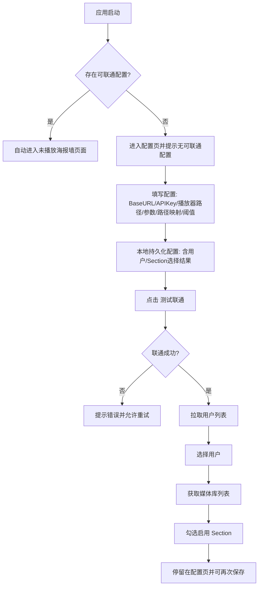
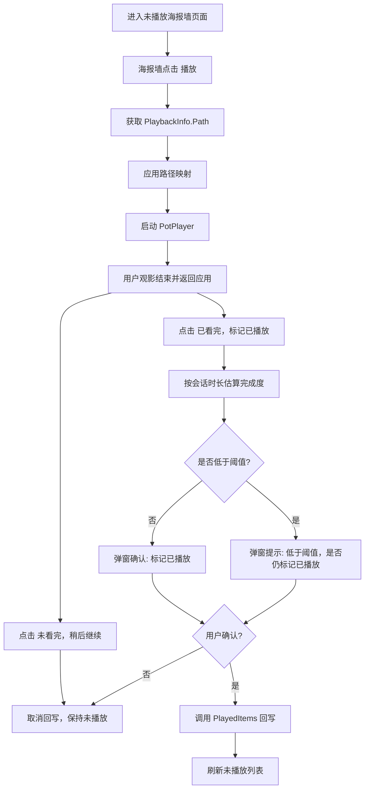
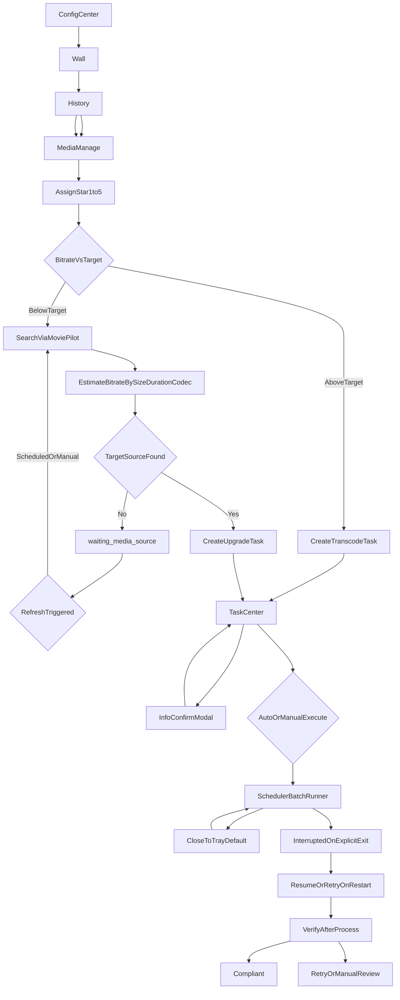

# Emby Desktop Player PRD（v1.0.0 正式版 · 按模块编排）

> **编排说明**：本文按 **模块 A～G** 重组旧版线性条文；**技术内容自旧版迁移，不删减**。任务调度与任务中心**交互细则**以 `TASK_CENTER_FULL_LOGIC.md` 为 SSOT。  
> **完整修订列表**见 **附录 A**（§0 仅保留摘要）。

---

## 0. 文档信息

- 产品名：`Emby Desktop Player`
- 平台范围：`Windows`（v1.0.0）
- 本文重点：`v1.0.0 正式版`能力定义与落地方案；与实现细节冲突时，**任务调度与任务中心交互**以 `TASK_CENTER_FULL_LOGIC.md` 为单一事实来源（SSOT）。
- 兼容说明：文末附 `beta` 能力简述及当前开发中快照。
- **修订摘要**：自 2026-04 起对齐五页壳层、任务中心、媒体库/豆瓣/删除 Flow、H265 等效码率等；**完整修订条目见附录 A**。

---

## 1. 产品定位与目标

### 1.1 定位

本产品是一个面向 Emby 用户的桌面应用，核心价值包含两条主线：

- 前台主线：调用第三方播放器，提升观影体验。
- 后台主线：媒体库质量治理，在体积与画质之间达到可控平衡。

### 1.2 v1.0.0 目标

1. 保持并强化“未播放 -> 第三方播放器 -> 回写已播放”的前台闭环。
2. 新增媒体库管理能力，支持基于星级策略的压缩/补源治理。
3. 建立低占用后台任务体系（可托盘运行、可恢复、可重试、可审计）。
4. 明确前台与后台的职责分层，避免相互干扰。

### 1.3 非目标

- 不做跨平台（macOS/Linux）。
- 不做播放器深度双向控制（暂停/进度回传/倍速同步）。
- 不做分布式任务集群，仅支持单机任务执行。

---

## 2. 模块 A — 壳层与信息架构

### 2.1 顶层信息架构（五页 + 壳层）

应用采用**统一壳层**：顶部主导航约五页，每页**左侧为操作侧栏**、右侧为主内容区（开发中实现与 PRD 对齐）。

1. **配置中心（Config）**：连接与播放器、**任务调度与补源**（执行模式、**删除/转码/洗版多队列**并发、补源重试节奏、海报墙打分自动入队等）及其他配置分区。
2. **未播放海报墙（Wall）**：观影入口；观看结束打分后，可按策略自动创建任务（受配置开关约束）。
3. **播放记录页（History）**：行为回放；**不再**承担「添加任务」类重入口（与媒体库重复者已收敛）。
4. **媒体库管理页（MediaManage）**：资产治理；全库列表（含已观看）、搜索与多维筛选（含**是否蓝光/原盘**）、单条/批量入队、星级与策略；列表展示**体积**、**原盘**、**当前/目标码率**、**预测体积**（电影行；按 §4.5 与策略目标估算）、**豆瓣个人评分（匹配结果）与有效星级状态**（用于策略的星级：豆瓣优先）；侧栏汇总**当前库容量**与**电影按目标码率预测占用**（洗版/删除档规则见 §4.5）；**原盘条目**不提供码率压缩/洗版入队（需先提取或转封装为常规片源）。列表数据可持久化到本机 `localStorage`（`embyDesktopPlayerLibraryManageCacheV1`），与当前连接指纹绑定；**进入本页不自动拉取 Emby**，需用户主动「刷新媒体库列表」与服务器对齐（回写观看状态等流程可附带静默刷新以保持接近一致）。
5. **任务中心页（TaskCenter）**：任务列表、状态筛选、单条/批量**调度类**操作（移除、暂停、执行、批量执行等）；**补源信息确认**以**弹窗**完成。

### 2.2 非顶层页面 / 已调整项

- **质量审阅**：不再作为独立顶层页面与路由入口；候选确认纳入任务中心 **「信息确认」** 流程（与 SSOT §11.3 一致）。
- **任务日志**：任务中心内**首版占位**，完整采集与检索为后续迭代。

---

### 2.3 页面职责与关系（原 §3）

### 2.3.1 播放记录页 vs 媒体库管理页（核心边界）

- 播放记录页：行为回放页，关注“看了什么、何时看、看完状态”。
- 媒体库管理页：资产治理页，关注“是否达标、该怎么优化、排队状态”。

### 2.3.2 数据关系

- 播放记录页输出“最近观看事实”（最近播放时间、频次、已看状态）。
- 媒体库管理页输出“质量状态”（用户标注星级、**豆瓣个人评分（若匹配）**、**有效星级**（策略用）、目标码率、当前码率偏差、任务状态）。
- 通过 `itemId` 关联，形成“行为流 + 资产流”双视角。

### 2.3.3 操作关系

- 播放记录页允许轻操作：重新播放、已看/未看修正、跳转媒体库等（**不**在播放记录页执行重任务或任务控制）。
- 媒体库管理页负责重操作：星级调整、策略覆盖、批量入队。
- **任务执行控制**（执行、暂停、批量执行、批量暂停、移除等）**统一在任务中心**；配置项在**配置中心 → 任务调度与补源**维护。

---

## 3. 模块 B — 配置中心

> 聚合「配置中心」在架构中的职责、**原 §16.4.1** 配置字段摘要，以及指向模块 F 的调度类配置说明。

### 3.1 配置中心在顶层架构中的定义（原 §2.1 条 1）

1. **配置中心（Config）**：连接与播放器、**任务调度与补源**（执行模式、**删除/转码/洗版多队列**并发、补源重试节奏、海报墙打分自动入队等）及其他配置分区。

### 3.2 前台与治理相关配置字段（原 §16.4.1）

- `baseUrl`、`apiKey`、`userId`（来自用户选择）、`embyUserPassword`（可选；删除等写操作鉴权见 **§7.3.1**）
- `enabledSectionIds`、`playerExePath`、`argsTemplate`（支持 `{path}`、`{itemId}`）
- `pathMapFrom` / `pathMapTo`
- `markPlayedThresholdPercent`（默认 90）、`fallbackMinSeconds`

### 3.3 任务调度与补源类配置（指向 §7）

- 执行模式、删除/转码/洗版并发、`wallRatingAutoEnqueue`、补源重试节奏等由**配置中心 → 任务调度与补源**维护；条文见 **§7**（模块 F）。

---

## 4. 模块 C — 前台观影与播放记录

### 4.1 未播放海报墙（原 §2.1 条 2）

2. **未播放海报墙（Wall）**：观影入口；观看结束打分后，可按策略自动创建任务（受配置开关约束）。

### 4.2 播放记录页（原 §2.1 条 3）

3. **播放记录页（History）**：行为回放；**不再**承担「添加任务」类重入口（与媒体库重复者已收敛）。

### 4.3 附录：前台 MVP 基线（原 §16）

### 4.3.0 附录总述（原 §16）

> 下列自原 §16 迁入；文中若仍写「§12」「§2」等，指**旧版线性编号**。

> **说明**：下列内容来自早期 **MVP 重构版** PRD，聚焦于**前台播放闭环**的细节流程、API 清单与验收辅助材料。全文产品定义、五页架构、任务中心与治理策略以 **§1～§15** 为准；**删除类接口与鉴权**以 **§7.3.1** 为准（替代旧文档中与正式版不一致的删除 API 表述）。

### 4.3.1 背景与核心痛点

#### 4.3.1.1 现状问题

- 官方 Emby Windows 客户端不能很好地接入第三方播放器。
- 内置播放器难以满足自定义渲染、音频直通等高级诉求。
- 用户当前流程繁琐：在 Emby 找片 → 手动找本地文件 → PotPlayer 播放 → 回 Emby 手动标记已播放。

#### 4.3.1.2 目标体验

- 在 Emby 相关列表中「一键播放」目标条目。
- 由本应用唤起第三方播放器播放本地/映射路径文件。
- 观影结束后，按规则确认并回写 Emby「已播放」状态，形成闭环。

### 4.3.2 关键业务约束（前台 MVP 基线）

- 配置流程：`保存配置` → `测试联通` →（成功后）加载用户列表并选择用户。
- 不手动输入 `UserId`，应由 API 拉取用户供选择。
- 未播放条目必须按已选择 Section 过滤。
- UI 采用海报墙风格。
- 回写「已播放」必须经过用户确认，不直接自动写入。
- 应用启动时，若存在「可联通配置」（联通成功且用户/Section 有效），应自动进入未播放海报墙页面。
- 若不存在可联通配置，停留在配置页并提示「没有可联通的配置，请先配置并测试联通」。

### 4.3.3 用户流程图（MVP）

#### 4.3.3.1 首次配置流程

#### 4.3.3.2 观影与回写流程

### 4.3.4 功能需求摘要（前台与配置）

以下内容与 **§2.1 配置中心**、未播放海报墙等交叉对照；**媒体库全量列表缓存**（`embyDesktopPlayerLibraryManageCacheV1`）的约定以 **§2.1** 与 **§11**（小节 **14.5**）为准。

**16.4.1 配置项（字段名与实现一致）**

- `baseUrl`、`apiKey`、`userId`（来自用户选择）、`embyUserPassword`（可选；删除等写操作鉴权见 **§7.3.1**）
- `enabledSectionIds`、`playerExePath`、`argsTemplate`（支持 `{path}`、`{itemId}`）
- `pathMapFrom` / `pathMapTo`
- `markPlayedThresholdPercent`（默认 90）、`fallbackMinSeconds`

**16.4.2 播放与回写**

- 通过 `PlaybackInfo` 获取可播放文件路径；应用路径映射后按模板唤起第三方播放器。
- 不依赖「监控播放器进程退出」作为唯一依据；用户主动点击「已看完/未看完」。
- 低于阈值时二次提醒，用户仍可强制确认；确认后 `POST /Users/{UserId}/PlayedItems/{ItemId}`。

**16.4.3 本地日志（排障）**

建议记录：播放请求与参数（脱敏）、路径解析与映射、会话时长与阈值提示、用户确认/取消、回写结果与错误。

### 4.3.5 Emby API 清单（前台最小集）

与具体 Emby 版本差异时允许降级；**删除媒体**的请求鉴权与流程以 **§7.3.1** 为准，下表「删除」一行仅作端点索引。

| 用途       | 方法 / 路径                                                                                                                  |
| -------- | ------------------------------------------------------------------------------------------------------------------------ |
| 测试服务     | `GET /System/Info`                                                                                                       |
| 用户列表     | `GET /Users/Query`（失败时可降级 `GET /Users`）                                                                                  |
| 媒体库      | `GET /Library/MediaFolders`                                                                                              |
| 未播放列表    | 首选 `GET /Users/{UserId}/Sections/{SectionId}/Items`；不可用则 `GET /Users/{UserId}/Items?ParentId={SectionId}&Recursive=true` |
| 播放路径与时长  | `GET /Items/{Id}/PlaybackInfo?UserId={UserId}`；补充 `GET /Items/{Id}`                                                      |
| 已播放回写    | `POST /Users/{UserId}/PlayedItems/{Id}`（可带 `DatePlayed`）                                                                 |
| 删除条目（治理） | `DELETE /Items/{ItemId}`；鉴权见 **§7.3.1**；可选 `GET /Items/{ItemId}/DeleteInfo` 预检                                           |

### 4.3.6 完成度与回写判定

- `completionPercent = sessionElapsedSeconds / runtimeSeconds * 100`（runtime 可得时）。
- 总时长不可得：使用 `fallbackMinSeconds` 兜底。
- 无论是否达到阈值，均由用户确认是否回写；取消则不回写。

### 4.3.7 UI 与异常场景（摘要）

**UI**

- 未播放条目使用海报墙；联通状态（已联通/未联通）需清晰展示。
- 配置页在启动检测失败时显示「没有可联通的配置」。
- 海报墙提供「更改配置」入口（返回配置页，不清空已保存配置）。

**异常与降级**

- Emby 不可达：阻止列表与回写，提示网络/地址问题。
- 用户列表为空：提示权限不足或接口不可用。
- 无可播放路径：不启动播放器，不回写。
- 会话信息丢失：提示重新播放后再操作。
- 回写失败：提示原因并记录日志。

### 4.3.8 MVP 验收标准（前台闭环）

作为 **§9** 正式版验收的补充检查项（后台治理见 §9 全文）：

1. 用户可按「保存配置 → 测试联通 → 选择用户」完成初始化。
2. 媒体库可多选，未播放列表仅来自选中库。
3. 点击海报可正确唤起第三方播放器且打开目标文件。
4. 观影后可使用「已看完 / 未看完」两种动作。
5. 无论完成度是否达阈值，均需用户确认后才回写；确认后 Emby 状态更新成功。
6. 用户选择「未看完」或取消确认时不回写。
7. 关键动作均有本地日志可追踪。

### 4.3.9 指标建议（可观测性）

可与实现阶段的遥测/埋点设计对齐（命名仅供参考）：

`connection_test_success_total` / `connection_test_failure_total`、`user_list_load_success_total` / `user_list_load_failure_total`、`unplayed_load_success_total` / `unplayed_load_failure_total`、`player_launch_success_total` / `player_launch_failure_total`、`session_completion_estimated_total`、`mark_played_confirm_total`、`mark_played_cancel_total`、`mark_played_success_total` / `mark_played_failure_total`。

### 4.3.10 窗口、键盘与播放记录页详设（原 MVP 文档归档）

以下为早期 **MVP→V1 过渡**阶段对壳层与播放记录页的细化，与当前 **五页架构（§2）** 兼容；若与 §2 / §11（beta 快照）冲突，以 **§2、§11** 为准。

- **窗口**：启动时窗口最大化（`maximize`），隐藏默认 `File/Edit/...` 菜单栏；恢复/最小化后再次激活时维持最大化（除非用户主动还原）。
- **海报墙键盘**（在无弹窗聚焦时）：方向键按网格移动焦点；`Enter` 播放；`R` 刷新列表；`Esc` 关闭弹窗或取消焦点；焦点移动时顶部可显示当前条目名称。
- **播放记录页**：一级入口与 **§2.1** 一致；按 `DatePlayed` 倒序；支持时间范围（7 天/30 天/全部）与媒体库筛选；支持重新播放与手动刷新。

### 4.3.11 风险与后续方向（原 MVP 文档归档摘要）

- **风险**：会话时长为估算值；不同 Emby 版本接口行为差异需兼容与降级。
- **后续（非承诺排期）**：更强播放器集成、更细粒度播放进度同步、会话调试面板等——以 **§10～§12** 与版本迭代为准。

---

## 5. 模块 D — 媒体库治理（列表、码率策略与治理动作）

> 不含豆瓣专章（**§6**）；不含补源周期策略（**§7.7**，属 Flow）。

### 5.1 媒体库管理页能力摘要（原 §2.1 条 4）

4. **媒体库管理页（MediaManage）**：资产治理；全库列表（含已观看）、搜索与多维筛选（含**是否蓝光/原盘**）、单条/批量入队、星级与策略；列表展示**体积**、**原盘**、**当前/目标码率**、**预测体积**（电影行；按 §4.5 与策略目标估算）、**豆瓣个人评分（匹配结果）与有效星级状态**（用于策略的星级：豆瓣优先）；侧栏汇总**当前库容量**与**电影按目标码率预测占用**（洗版/删除档规则见 §4.5）；**原盘条目**不提供码率压缩/洗版入队（需先提取或转封装为常规片源）。列表数据可持久化到本机 `localStorage`（`embyDesktopPlayerLibraryManageCacheV1`），与当前连接指纹绑定；**进入本页不自动拉取 Emby**，需用户主动「刷新媒体库列表」与服务器对齐（回写观看状态等流程可附带静默刷新以保持接近一致）。

### 5.2 星级、目标码率与 H265 等效（原 §4.1～§4.3）

### 5.2.1 星级定义

- **1★、2★：删除档**（计划从库中移除；进入回收/确认流程；在任务体系中对应 `**delete` 类型** 的独立 Flow，与转码、洗版并列，见 SSOT §2.1；**不参与**码率压缩与洗版；容量预测按0）。
- **3★～5★：码率目标治理**（转码/洗版/保持规则见 **§4.5**）。

### 5.2.2 默认目标码率梯度（按分辨率）

配置中心可编辑；下列为 **MVP 默认**（与典型4K UHD H265 成片体积校准相关，可随版本调整）：

- **1080p**：2 星 2Mbps / 3 星 4Mbps / 4 星 7Mbps / 5 星 12Mbps - *说明*：**2★ 为删除档**，表中2 星 Mbps 仅作配置兼容占位，**不**用于目标对齐或推荐动作。
- **4K**：2 星 5Mbps / 3 星 10Mbps / 4 星 16Mbps / 5 星 25Mbps  
  - *同上*，2★ 删除档不使用该档目标。

### 5.2.3 等效换算（H265 等效码率）

#### 5.2.3.1 要解决的问题

- **§4.2 默认目标码率梯度**按 **H.265（HEVC）** 成片观感与体积习惯标定；若用「容器/文件估算出的**原始视频码率**」直接与该梯度比较，**不同编码效率的片源会被不公平对待**：
  - 相同 **标称 Mbps** 下，**H.264** 通常比 H.265 **更占体积、信息密度更低**；若不做换算，容易**低估**其相对「H265 目标档」的偏高程度，**少判**「建议转码」。
  - **AV1** 等更高效编码则相反：相同 Mbps 可能承载更高观感；若不做换算，容易**高估**偏高程度，**多判**不必要的转码。
- **等效换算**将各编码下的估算视频码率，归一到 **「与 H.265 目标表同一标尺下的等效 Mbps」**（记为 `**eq`**），再与 §4.5 中的目标、`±1 Mbps` 滞回、洗版比例阈值等比较，使 转码 / 洗版 / 保持 的推荐在编码维度上**可比较、可校准**。

#### 5.2.3.2 定义与计算步骤（与实现对齐）

实现参考：`mvp/src/mediaManager.ts`（`estimateEquivalentBitrate`、`codecToH265Factor`）。下列参数随版本可微调，**以仓库实现为准**；PRD 记录**当前约定**。

1. **容器总码率（Mbps）**
  `totalMbps = sizeGb × 8192 / max(1, durationSec)`  
   （`8192 = 1024 × 8`，将 GB 与秒换算为 Mbps 的经验公式。）
2. **估算视频码率（Mbps）**
  `videoMbps = max(0.3, totalMbps − audioLump)`  
  - `**audioLump`（音轨等扣减）**：当前默认 `**0.5` Mbps**，与「预测体积」中音轨估算口径一致（见 `AUDIO_MBPS_LUMP`）。
3. **H265 等效码率**
  `eq = videoMbps × codecToH265Factor(codec)`  
   结果可保留两位小数用于展示与比较。

#### 5.2.3.3 编码折算系数 `codecToH265Factor`（当前默认）

| 片源编码（`ManagedMediaItem.codec`） | 系数       | 产品含义（简述）                                        |
| ------------------------------ | -------- | ----------------------------------------------- |
| `h265`（HEVC）                   | **1.0**  | 与目标梯度同标尺，不放大不缩小。                                |
| `h264`（AVC）                    | **1.35** | 相对 H.265，同 Mbps 下视为「等效偏高」，与更易触发 **偏高转码** 的判断一致。 |
| `av1`                          | **0.85** | 相对 H.265，同 Mbps 下视为「等效偏低」，减少 **过度建议转码**。        |

系数为**经验校准值**，可随真实片源统计与误报/漏报反馈调整。

#### 5.2.3.4 产生的效果（对推荐动作与队列语义）

- **推荐动作**（`recommendedAction`，见 **§4.5**）中，凡涉及「当前码率 vs 目标码率」的比较，均使用 `**eq`**，而非未折算的 `videoMbps`。
- **典型效果**（在星级、分辨率、目标档相同的前提下）：
  - **H.264**：`eq` 相对原始估算 **抬高** → 更易满足「**高于目标 + 滞回**」→ **更多**条目进入 **建议转码（压缩）** 语义；与「H264 同 Mbps 不如 H265 省体积」的直觉一致。
  - **H.265**：与目标表同一标尺，作为基准。
  - **AV1**：`eq` 相对原始估算 **压低** → 相对更不易被判为偏高转码、相对更易落在「保持」或偏低洗版区间（仍受 §4.5 星级规则约束）。
- **与「转码后的体积」的关系**：**优化后的预测占用**（如按策略目标码率估算的 GB）由 **§4.2 目标码率 + 固定音轨假设** 驱动，**不**把 `eq` 再乘一次系数；**等效换算主要影响「是否建议动手转码/洗版」的决策，不直接放大或缩小「目标体积」公式本身**。

#### 5.2.3.5 与 §4.2、§4.5 的分工

| 概念            | 作用                                                       |
| ------------- | -------------------------------------------------------- |
| **§4.2 目标码率** | 策略希望片源对齐到的 **H265 档**（可配置）；洗版/保持/预测体积的参照。                |
| **§4.3 `eq`** | 当前片源在 **同一 H265 标尺**下的等效占用，用于和 **目标 + 规则** 比较。           |
| **§4.5 推荐动作** | 在 `eq`、目标、`±1 Mbps`、洗版比例等规则下的 **转码 / 洗版 / 保持 / 删除档** 输出。 |

### 5.3 分星级推荐动作（MVP 前端演算）

以下与 `mediaManager.recommendedAction`、**H265 等效码率**及 **±1 Mbps** 转码滞回一致；洗版比例常数 `**UPGRADE_EQ_BELOW_TARGET_RATIO = 0.8`**（4★ 与 **5★4K** 共用）。

| 有效星级      | 转码压缩（偏高）                         | 洗版补源（偏低）                                          | 其它      |
| --------- | -------------------------------- | ------------------------------------------------- | ------- |
| **1★～2★** | 否                                | 否                                                 | **删除档** |
| **3★**    | 等价码率 **>** 目标 **+ 1 Mbps** 时建议转码 | **永不**                                            | 否则保持    |
| **4★**    | 同上                               | 等价码率 **< 目标 × 0.8** 时建议洗版                         | 否则保持    |
| **5★**    | **永不**（再高码率也不压）                  | **1080p：一律建议洗版**；**4K**：等价码率 **< 目标 × 0.8** 时建议洗版 | 否则保持    |

**目标码率取值（展示与容量预测）**：

- 片源为 **4K** → 使用 `target4k[星级]`。
- 片源为 **1080p** → 默认使用 `target1080p[星级]`；**例外**：**5★ 且 1080p** 时，按洗版预期使用 `**target4k[5]`**（列表「目标码率」与「预测体积」与 4K 档对齐，避免低估洗版后体积）。

**容量预测**：电影行按「目标视频码率 + 0.5 Mbps 音轨估算」与时长推算体积；删除档为 0；未标注星级保持当前体积。

---

### 5.4 媒体库治理动作

### 5.4.0 蓝光/原盘资源（ISO、BDMV）排除

- **定义**：资源为 `.iso` 映像，或磁盘上存在 `**BDMV` 目录结构**（含 Emby 返回路径经**配置中心「路径映射」转换后在本机可验证的情形），视为原盘类**，与「常规单文件/文件夹片源」区分治理。
- **产品规则**：原盘类资源**不允许**创建**码率压缩（Transcode）**与**洗版补源（Upgrade）**任务；界面需明确提示，批量场景需跳过并汇总说明。用户需先提取或转封装为常规容器后，再纳入 §5.1 / §5.2 流程。

### 5.4.1 高码率压缩（Transcode）

- **MVP 前端**：是否建议转码以 **§4.5** 为准（例如 **5★ 永不**、**删除档 永不**）。
- **通用条件（正式执行层）**：`currentEquivalentBitrate > targetBitrate + safetyMargin`
- 动作：创建转码任务（FFmpeg），输出临时文件，校验通过后原子替换。
- 失败：进入重试/人工复核队列。

### 5.4.2 低码率补源（Upgrade）

- **MVP 前端**：是否建议洗版以 **§4.5** 为准（例如 **3★ 永不**、**5★1080p 必洗版**、4★/5★4K 的 **0.8** 比例阈值）。
- **通用条件（正式执行层）**：`currentEquivalentBitrate` 明显低于目标且候选优于当前（含 MoviePilot 搜索与排序）。
- 动作：通过 MoviePilot 搜索候选，按“体积 + 时长 + 编码”估算码率并排序。
- 命中：创建补源任务并入队执行。

### 5.4.3 无高码率资源时的处理

- 不判定为终态失败，状态设为 `waiting_media_source`。
- 记录：`lastSearchAt`、`nextSearchAt`、`searchAttempt`、`bestCandidateScore`。
- 触发再搜：
  - 到期自动重搜
  - 用户手动“立即重搜”
  - 策略变化事件触发（星级/目标策略/站点策略变化）

---

## 6. 模块 E — 豆瓣「看过」与有效星级（原 §4.4）

本节描述 **beta.6** 已落地的「豆瓣评分」能力：用于在**本地**将用户在豆瓣标记的**电影**个人星级，与 Emby 媒体库条目对齐，并驱动 §4 的码率阶梯（**不**回写 Emby 服务端星级字段）。

### 6.1 数据来源与抓取方式

- **页面 URL**：`https://movie.douban.com/people/{userId}/collect`，查询参数包括 `type=movie`、`mode=grid`、`sort=time`、`filter=all` 等；分页参数 `start=0,15,30,...`（每页步长 **15**）。
- **解析规则（主进程）**：在返回的 HTML 中查找 `div.item.comment-item`块；自块内提取：
  - `subjectId`：`movie.douban.com/subject/{数字}/`；
  - 标题：`em` 标签内文本（去除内嵌标签与多余空白）；
  - 个人评分：`span.ratingN-t` 中 `N` 为 1～5 的整数（用户对该片的「看过」打分）。
- **与 RSS**：**不以** `www.douban.com/feed/people/.../interests` RSS 作为列表来源（该方式在翻页/完整性上不可靠）；产品实现以 **collect 网格 HTML** 为准。配置中若仍保留 RSS 相关字段，仅作兼容或辅助推导账号信息，**抓取链路不依赖 RSS**。

### 6.2 用户配置与隐私

- **必填**：豆瓣用户 ID（即上述 URL 中 `people/` 与 `/collect` 之间的段，字母数字及 `_-`）。
- **可选**：HTTP `Cookie` 请求头内容（用户从已登录浏览器复制）。**公开**「看过」页在无 Cookie 时可抓取；若豆瓣账号将「看过」设为仅自己可见，则需要 Cookie 才能拉取完整列表。
- **本地存储**：主进程将会话写入应用 `userData` 下 `douban-session.json`（含 `userId`、`cookieHeader` 等）；渲染进程将抓取结果写入 `localStorage` 键 `**embyDesktopPlayerDoubanRatingEntriesV1`**（条目数组，含 `subjectId`、`title`、`stars` 及同步时间元数据）。**不向第三方服务器上传**豆瓣数据。

### 6.3 同步策略（增量 / 全量）

- **合并模型**：每次同步在内存中以 `subjectId` 为键 **Map 合并**；新抓取覆盖同键标题与星级，并保留此前缓存中未在本次页面上出现的条目（除非用户清空本地缓存）。
- **增量（默认）**：从 `start=0` 起逐页请求。若某一页解析出的**所有** `subjectId` 在本次请求开始前**均已存在于**本地缓存集合中，则判定无新「看过」记录，**停止翻页**；否则继续直至某一页解析条数为 **0**、HTTP 失败（非首页则中止）、或达到安全上限（防止无限循环）。
- **全量刷新**：约每 **14 天**触发一次完整分页扫描（时间戳存 `localStorage` `**embyDesktopPlayerDoubanLastFullSyncAtMs`**），或首次同步等场景；全量仍与缓存 **合并**，用于纠偏标题变更与评分修改。
- **请求节奏**：页与页之间引入约 **800ms** 间隔，降低对豆瓣站点的请求压力；具体数值以实现代码为准。进度通过 IPC 事件推送到渲染进程以便展示状态文案。

### 6.4 与 Emby 条目的匹配规则

- **范围**：仅 **Movie** 类型参与匹配；剧集等类型不展示豆瓣匹配分（视为未抓取）。
- **豆瓣标题**：常见形式为「中文 / 英文 / 其他译名…」。将标题按 `**/`** 分段，每段及**整串标题**分别做 Unicode规范化（NFKC）、去除标点符号与空白后得到**规范化键**；同一豆瓣条目可对应多个键。
- **Emby 片名**：按主副标题分隔符（半角/全角**冒号**、半角/全角**竖线**）拆段，每段与整串同样生成规范化键；匹配时按键**长度降序**依次查找，优先长键命中，减少短词误匹配。
- **未匹配**：片名差异过大、仅一方有别名、或豆瓣侧无该片时，豆瓣列为「未抓取到」；**有效星级**回退为用户在媒体库内标注的 `rating`（若有）。

### 6.5 与码率策略、筛选与 UI 的关系

- **有效星级**：`effectiveRating`（实现名可略有不同）定义为：若该条目 **豆瓣匹配星级非空** 则采用豆瓣星，否则采用用户在媒体库中标注的星级。**目标码率**、**推荐动作**（压缩/补源/保持）、以及「相对目标码率」等筛选均基于有效星级。
- **配置中心**：增加「**豆瓣个人评分（实验）**」分区：填写用户 ID、可选 Cookie、保存会话、**同步豆瓣评分**与停止同步；展示合规与频率提示、当前匹配统计（如已匹配电影数/总电影数）。
- **媒体库列表**：展示豆瓣原始匹配星级列与有效星级状态列（避免与仅 Emby 标注混淆）。

### 6.6 合规说明与已知限制

- 用户须自行遵守豆瓣网站服务条款及适用法律法规；应用仅作为**个人本地工具**辅助整理片库，**不**鼓励高频抓取或绕过访问控制。
- **已知限制**：仅覆盖出现在 collect **电影**列表中的条目；依赖页面结构稳定性（若豆瓣改版需更新解析）；**不**写入 Emby 服务器元数据；剧集、纪录片等若不在电影 collect 中则无豆瓣分。

---

## 7. 模块 F — 任务中心、调度与 Flow 规划

> 任务中心 UI/按钮语义等以 **SSOT** 为准。删除 API 与鉴权见 **§7.3.1**（本节内）。

### 7.1 执行模式（与 SSOT 一致）

- **自动模式**：新任务在**添加瞬间**即获准调度（如进入「排队等槽」语义，典型 `queued`），由调度器按并发与 Flow 推进。**删除类任务（`delete`）例外**：即使处于自动模式，也 **不得** 在无人确认的情况下一路推进直至结案；**必须** 在 `**awaiting_user_confirm`** 停泊并完成删除前信息确认后，方可调用 Emby 删除（详见 SSOT §2.3.2、§6.1）。
- **手动模式**：新任务初始为**待启动**（如 `pending_manual`）；用户须通过任务中心 **单条「执行」** 或侧栏 **「批量执行」**（对勾选集合）发令后，任务才进入可调度就绪态。
- **批量执行**与**单条执行**语义相同，仅作用范围不同；占槽中（`precheck` / `executing` / `verify`）点执行无效（置灰）。`awaiting_user_confirm`、`waiting_media_source` 上执行置灰，推进由信息确认或 Flow 重试负责。
- **定时/时间窗口**：可作为后续增强（按用户配置窗口自动允许调度）；与「自动/手动」正交，不以本文旧稿「定时模式」单独替代「自动模式」。

### 7.2 暂停（调度层冻结）

- **暂停**冻结调度推进；恢复**仅**通过**执行**（单条或批量）。
- **占槽时软停**：当前步骤正常收尾，**本步结束后**再进入 `paused` 并释放槽位；实现可借助 `pause_requested` 类标记（见 SSOT §9）。
- `**awaiting_user_confirm` / `waiting_media_source`**：允许暂停；`pending_manual`：禁止暂停并提示未启动。
- **批量暂停** = 单条暂停语义 × 选中集合。

### 7.3 多逻辑队列与并发

- **删除、转码、洗版** 各为**一条逻辑队列**（与 `actionType` 一一对应），各有 FIFO 与**独立占槽上限**（配置项示例：`deleteConcurrency`、`transcodeConcurrency`、`upgradeConcurrency`，以实现与配置中心为准）；**同视频互斥**（未结案任务存在时禁止同 `itemId` 再建任务）。
- 未来可 **追加** 新的任务类型与队列，**不** 改变既有三条 Flow 的语义边界（SSOT §2.2）。

### 7.3.1 删除类任务（`delete`）行为摘要

- **执行路径**：仅调用 **Emby** 删除该 `**itemId`**（`DELETE /Items/{id}`）；客户端 **不** 按本机路径删除整包影片目录。
- **鉴权（beta.8起）**：服务端常要求删除请求具备 **用户会话**（用户 `AccessToken`）。应用支持在配置中填写 **所选用户的 Emby 登录密码**（字段 `embyUserPassword`，本地持久化，与 API Key 同级敏感）；若已填写，则在删除前调用 `**POST /Users/AuthenticateByName`**（`Username` 来自用户列表中与当前 `userId` 对应的显示名、`Pw` 为所填密码）获取 `**AccessToken`**，并以该令牌作为后续删除请求的 `api_key` / `X-Emby-Token`。若未填密码，则仍以 API Key 发起删除并附带查询参数 `**UserId**`；若返回类似 `Parameter 'user' null`，UI 提示用户配置密码后重试。
- **确认与停泊**：删除前须 **信息确认**；用户关闭或未确认时任务 **保持** `awaiting_user_confirm`，不自动暂停或移除。
- **验收**：删除后以 Emby **查询该条目不存在**（如 **404**）为 `verify` 通过条件；不要求客户端扫盘验证文件夹是否已空。细节与 `status` 逐步对照见 SSOT **§2.3**。

### 7.4 批量执行前提示（目标）

- 预计耗时
- 预计磁盘占用
- 预计负载影响（CPU/IO）

### 7.5 优先级建议

- 显式**任务优先级队列/抢占**：当前阶段**不实现**（以 SSOT 为准）；产品侧仍可保留「**1–2 星**删除确认 > 已观看不达标 > 未观看不达标」作为**默认处理习惯**描述。

---

### 7.6 任务状态机与中断恢复

### 7.6.1 状态与主路径（扁平 `status`，与 SSOT 对齐）

- **主路径（示意）**：`queued` → `precheck` → `executing` → `verify` → `done`（洗版等 Flow 在 `verify` 之后可能进入 `awaiting_user_confirm` 而非直接 `done`，以 SSOT / Flow 为准）。
- **停泊（不占活跃槽或待发令）**：`pending_manual`（手动模式下待启动）、`paused`、`awaiting_user_confirm`、`waiting_media_source` 等。
- **占槽**：`precheck`、`executing`、`verify`。
- **异常 / 辅助**：`failed_hard`；`interrupted` / `resume_pending`。

### 7.6.2 中断恢复机制

- 执行中每阶段 checkpoint 落盘。
- 启动时将 `running` 重置为 `interrupted` 并提示：
  - 继续
  - 重试
  - 终止

### 7.6.3 幂等与文件安全

- 幂等键：`taskId + itemId + actionType + sourceHash`
- 转码输出写 `.partial` 临时文件，验收后原子替换。
- 中断时保留原片并清理过期临时文件。

### 7.6.4 v1 恢复简化策略

- 转码任务：从头重跑（不做编码断点续跑）。
- 补源任务：已下发下载时仅恢复追踪，不重复下发。

---

### 7.7 补源刷新策略（原 §6，Flow 侧规划）

### 7.7.1 周期重搜

- 第 1~3 次：每 24 小时
- 第 4~10 次：每 3 天
- 第 11 次后：每 7 天（低频监控态）

### 7.7.2 结果判定

- 若出现候选满足 `estimatedBitrate >= targetMin` 且质量评分优于当前资源：进入可执行/可确认路径（实现上经调度与 Flow 协作；可能表现为入队或 `**awaiting_user_confirm`（待信息确认）** 等停泊态，**不以独立页面为必经入口**）。
- 否则保留 `waiting_media_source` 并刷新 `nextSearchAt`

### 7.7.3 示例场景

- 1 月 5 日：用户设为 5 星，无达标资源 -> `waiting_media_source`
- 3 月 5 日：应用启动触发到期重搜，出现达标资源 -> 进入可执行/信息确认路径 -> 入队或由用户确认后继续 Flow

---

### 7.8 用户操作流程总览（原 §11）

---

## 8. 模块 G — 工程架构、集成与后台形态

### 8.1.1 前后台双轨技术方案

### 8.1 进程分层

- `renderer`：页面交互与轻状态，不执行重任务。
- `main`：调度中枢（队列、生命周期、托盘、恢复逻辑）。
- `worker`：后台执行（FFmpeg 转码、补源搜索、刷新任务）。

### 8.1.2 资源占用控制

- 默认低并发（建议：删除 / 转码 / 洗版 **各类** 至少可单独配置并发；常见起点如各 1 并发，以实现为准）。
- 观影会话活跃时自动降载/暂停高负载任务。
- 磁盘阈值保护：不足时禁止新任务启动。

### 8.1.3 托盘与窗口行为（已确认）

- 关闭窗口默认行为：最小化到托盘（不退出）。
- 托盘菜单：显示主窗口 / 开始批量执行 / 暂停队列 / 退出应用。
- 只有显式“退出应用”才进入真正终止流程。

---

### 8.2 与 MoviePilot 联动方案

### 8.2.1 联动原则

- 优先使用 API（搜索/下载/历史），避免直接读数据库。
- 将“码率估算 + 候选排序”放在本应用侧执行，保持规则可控。

### 8.2.2 估算口径

- 总码率估算：`sizeGB * 8192 / durationSec`
- 视频码率估算：总码率减去音频和容器开销估计
- 结合编码标签进行加权评分

### 8.2.3 结果处理

- 候选达标：入队执行
- 候选不达标：`waiting_media_source`
- 接口鉴权或系统错误：`failed_hard`

---

## 9. 验收标准（v1.0.0）（原 §12）

1. 用户可在**顶层五页**（配置、海报墙、播放记录、媒体库、任务中心）完成「观影 + 治理」闭环；补源确认走任务中心弹窗，**不依赖**独立质量审阅顶页。
2. 星级策略可正确驱动删除、压缩、补源三类动作。
3. 高码率压缩任务可稳定执行并完成验收替换。
4. 低码率补源可执行搜索、估算、筛选与入队。
5. 无达标补源时任务进入 `waiting_media_source`，并可自动/手动再触发。
6. 任务支持 **自动/手动执行模式**、单条与批量**执行/暂停**（含占槽软停语义），双队列并发可配置。
7. 关闭窗口默认最小化到托盘，不中断后台进程。
8. 显式退出后，任务状态可恢复，且不重复下发、不污染媒体文件。

---

## 10. 风险与缓解（原 §13）

- 码率估算误差：引入目标区间与可信度分级，低可信候选走人工审阅。
- 后台占用影响观影：双轨架构 + 观影会话降载 + 低并发默认策略。
- 长期无优质源导致任务遗忘：`waiting_media_source` + 周期重搜 + 到期提醒。
- 任务中断导致数据不一致：checkpoint 落盘 + 幂等键 + 原子替换。

---

## 11. beta 版本能力简述（原 §14）

### 14.1 v1.0.0-beta.1

- MVP 基线可运行（Electron + React）。
- 打通基础链路：配置 -> 未播放海报墙 -> 第三方播放器 -> 手动确认回写已播放。

### 14.2 v1.0.0-beta.2

- 强化打包与生产启动稳定性。
- 配置项交互收敛，降低误操作。

### 14.3 v1.0.0-beta.3

- 新增播放记录页面与筛选能力。
- 支持已看/未看状态同步与重新播放。
- 增强本地历史与服务器历史合并，提升记录稳定性。

### 14.4 当前开发中快照（非发行说明，截至 2026-04）

- **壳层与导航**：五页顶栏 + 各页左侧侧栏 + 右侧主区；暗色主题与基础响应式样式。
- **配置集中化**：媒体策略与任务调度相关表单迁入**配置中心**；任务中心侧栏聚焦列表与调度操作。
- **任务中心（前端 MVP）**：本地持久化队列、状态筛选；**删除（`delete`）Flow已于 `v1.0.0-beta.8` 与 Emby 真删对齐**；转码/洗版仍以调度模拟为主；完整契约以 SSOT **三类型 / 三队列** 为准；`pauseRequested` 软停、信息确认弹窗、删除类 `**flowLog`**；行为与 `TASK_CENTER_FULL_LOGIC.md` 对表。
- **工程**：Electron + React（`mvp/`）持续迭代；部分后端/FFmpeg/MoviePilot 集成仍为规划或占位。

### 14.5 v1.0.0-beta.5（媒体库治理强化）

- **媒体库管理页**：已启用库内电影/剧集全量列表（含已观看）；侧栏片名搜索、定位高亮；筛选含码率相对目标、分辨率、编码、观看记录、**蓝光原盘**；库容量与类型统计；列表列含**体积**、**原盘**、策略相关操作。
- **列表本地缓存**：`embyDesktopPlayerLibraryManageCacheV1`保存最近一次成功刷新的结构化列表；`fingerprint` 由规范化 `baseUrl`、`userId`、排序后的 `enabledSectionIds` 构成；指纹不匹配则清空可用缓存；进入页面仅从缓存恢复，**不自动**打 Emby API。
- **原盘识别（主进程）**：`.iso`、路径中含 `BDMV`、本机目录 `BDMV` 探测；与第三方播放器一致，对 Emby 路径应用**配置中心 pathMapFrom/To**；`applyPathMap` 支持斜杠统一与 Windows 前缀大小写匹配。
- **入队限制**：原盘条目禁止单条码率压缩/洗版；批量入队跳过并提示；海报墙观看后自动入队对原盘给出说明；与「同视频互斥」等规则正交。
- **实现要点**：`mvp/electron/embyService.js`、`mvp/src/App.tsx`、`MediaLibraryManageRow.tsx`、`mediaManager.ts` 等；详见 `DEVELOPMENT_PROGRESS.md` 时间线。

### 14.6 v1.0.0-beta.6（豆瓣个人评分与有效星级）

- **主进程**：`mvp/electron/doubanService.js` 负责 HTTPS 拉取 collect 分页、HTML 解析、`douban-session.json` 读写；`main.js` / `preload.js` 暴露 `window.doubanApi`（`saveSession`、`fetchRatings`、`stopFetch`）及进度 IPC。
- **渲染进程**：`mvp/src/doubanUtils.ts` 标题规范化与 Emby/豆瓣键匹配；`mediaManager.ts` 中 `effectiveRatingForPolicy` 实现豆瓣优先；`App.tsx` 中豆瓣缓存键、增量/全量同步与配置分区 UI；`MediaLibraryManageRow.tsx` 展示豆瓣分与有效星级。
- **开发辅助**：`mvp/scripts/count-douban-collect-full.js` 等脚本可用于离线验证分页与解析（非运行时依赖）。

### 14.7 v1.0.0-beta.7（星级治理规则与容量预测）

- **策略**：`mvp/src/mediaManager.ts` — `isDeleteTierRating`（**1–2★** 删除档）；`recommendedAction` 按 **§4.5**（3★仅压、4★压+条件洗版、5★不压且 1080p 必洗版、4K/4★ 共用 **80%** 阈值）；`targetBitrateFor`（**5★1080p** 用 4K 档目标）；`predictedSizeGbAtPolicyTarget`；默认梯度下调（§4.2）。
- **UI**：`MediaLibraryManageRow` **预测体积**列；`App.tsx` 侧栏**电影按目标码率预测占用**；配置中心与侧栏文案同步删除档与分星规则。
- **PRD**：本文 **§4.1～§4.5**、§2.1 媒体库管理页、§5.1/§5.2 与 MVP 前端的衔接说明。

### 14.8 v1.0.0-beta.8（删除任务 Flow 与 Emby 真删）

- **主进程**：`mvp/electron/embyService.js` — `getLibraryItem`、`getItemDeleteInfo`、`deleteLibraryItem`（含 `**authenticateEmbyUserAccessToken`** / `Users/AuthenticateByName`）、`libraryItemExists`；`main.js` / `preload.js` IPC。
- **任务中心**：`taskQueue.ts` / `taskScheduler.ts` 删除类型与调度；`App.tsx` 删除 Flow（预检、确认、`executing`、`verify`、`**flowLog`**）；手动模式单条执行与调度推进修复。
- **媒体库**：`MediaLibraryManageRow` / `mediaManager.buildTaskPreview` 支持删除入队。
- **配置**：`EmbyConfig.embyUserPassword`（可选）；配置页说明与 API Key 同级本地敏感存储。
- **PRD /进度**：本文 **§7.3.1**、**§4.3.5**、`DEVELOPMENT_PROGRESS.md`、`VERSION_HISTORY.md` 同步。

---

## 12. 版本结论（原 §15）

`v1.0.0` 正式版定义为：

- 前台观影体验稳定可用；
- 后台媒体治理能力可持续运行；
- 在托盘、恢复、重试、补源刷新等关键机制上具备工程可行性与用户可控性。

---

## 附录 A — 修订历史（完整条目）

- **修订（2026-04）**：对齐五页壳层与配置集中化；任务中心执行/暂停（含软停）、批量操作与信息确认弹窗；废弃独立「质量审阅」顶层入口。
- **修订（2026-04-17）**：`**v1.0.0-beta.5`** 落地媒体库管理页治理能力：条目**体积**与**蓝光/原盘**标识；原盘（`.iso`、**BDMV** 文件夹结构，含经**配置中心路径映射**后本机可验证路径）**不参与**码率压缩/洗版入队；侧栏增加原盘筛选。
- **修订（2026-04-17）**：媒体库管理**全量列表**增加 `localStorage` 结构化缓存（键 `embyDesktopPlayerLibraryManageCacheV1`，含 `version`、`fingerprint`、`savedAt`、`items`）；指纹绑定规范化 Base URL、用户与已启用库集合；**进入管理页不自动请求 Emby**，由用户点击「刷新媒体库列表」拉取并落盘；指纹变化时丢弃旧缓存。
- **修订（2026-04-17）**：`**v1.0.0-beta.6`**（实验室分支能力合并入 `master`）：豆瓣电影「看过」个人评分抓取、本地缓存与媒体库**片名匹配**；**有效星级**（码率策略）以豆瓣星优先，否则沿用媒体库内用户标注星级；配置中心增加「豆瓣个人评分（实验）」分区（用户 ID、可选 Cookie、同步与风险提示）。实现细节见 **§4.4**。
- **修订（2026-04-18）**：`**v1.0.0-beta.7`**：分星级治理规则细化（见 §4.5）；默认目标码率梯度下调以更贴近常见 UHD H265 片源（§4.2）；媒体库列表增加**预测体积**列与侧栏**电影按目标码率预测占用**；**1–2★** 统一为**删除档**（低质片源不再转码/洗版，容量预测按 0）；**5★** 不压缩、**1080p 一律洗版**、**4K** 与 **4★** 共用「低于目标 **80%**」洗版阈值；**5★ 且当前为 1080p** 时，列表目标码率与体积预测按 **4K 档**对齐洗版预期。
- **修订（2026-04-18，任务模型）**：与 `TASK_CENTER_FULL_LOGIC.md` 对齐——可入池治理任务为 **三种类型 / 三条 Flow**：**删除（`delete`）**、**转码（`transcode`）**、**洗版（`upgrade`）**；调度层为 **多逻辑队列**（各类型 FIFO + 独立占槽上限）；框架上 **可追加** 新 `actionType` 与 Flow，**各 Flow 独立演进**（详见 SSOT §2.1–§2.2、§5）。
- **修订（2026-04-18，删除 Flow）**：删除类任务 **仅通过 Emby** 删除条目（不经客户端直删影片文件夹）；**自动执行模式不得跳过**删除前 `**awaiting_user_confirm`**；用户未确认时 长期停泊 该状态；验收 `**verify`** **仅以** Emby 再查 `**itemId` 不存在（如 404）** 为准。全文见 SSOT **§2.3**。
- **修订（2026-04-18）**：**v1.0.0-beta.8** — 删除 Flow **端到端落地**（任务中心 +媒体库入队、`embyService` IPC、`flowLog` 可观测性）；**删除 API 鉴权**：多数 Emby/Jellyfin 上 `DELETE /Items/{id}` 需 **用户 AccessToken**，纯 API Key 易出现 `Parameter 'user' null`；配置中心增加 **所选用户登录密码**（`embyUserPassword`，仅存本机），删除前 `**POST /Users/AuthenticateByName`** 换令牌再删；未填密码时仍尝试 API Key + `UserId` 查询参数并给出配置提示。详见 **§7.3.1**、**§11**（小节 **14.8**）、**§4.3.5**。
- **文档合并（2026-04-18）**：原独立文件 `**EmbyDesktopPlayer_PRD.md`（MVP 重构版）** 的条文已吸收为本文 **§4（模块 C）** 中前台闭环与历史详设（尤见 **§4.3**）。**条款冲突时以本文 §1～§12 及 `TASK_CENTER_FULL_LOGIC.md` 为准**。
- **修订（2026-04-18，§4.3）**：补充 **H265 等效码率** 的计算步骤、**编码折算系数**与**音轨扣减**等实现参数；阐述等效换算要解决的问题、对推荐动作（转码/洗版/保持）的影响，及与 **§4.2 目标码率**、**预测体积** 的边界区分。

---

## 附录 B — 旧版章节编号对照

| 旧版线性 PRD 章节 | 本文章节 |
|------------------|----------|
| §0 修订全文 | 附录 A；§0 仅摘要 |
| §1 | §1 |
| §2、§3 | §2（模块 A，含原 §3 为 §2.3） |
| §2.1 配置中心句、§16.4.1 字段 | §3（模块 B） |
| §2.1 海报墙/播放记录、§16 附录 | §4（模块 C） |
| §4（除 §4.4）、§5 | §5（模块 D） |
| §4.4 | §6（模块 E） |
| §7、§6、§9、§11 | §7（模块 F） |
| §8、§10 | §8（模块 G） |
| §12、§13 | §9、§10 |
| §14、§15 | §11、§12 |

