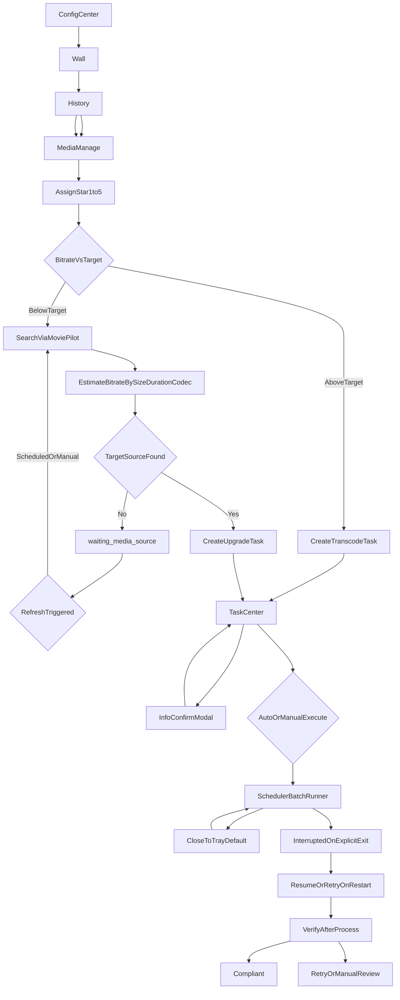

# 任务中心：从前端到后端的完整逻辑说明（SSOT）

本文档为 **任务中心** 相关产品与技术逻辑的 **单一事实来源**。实现与评审以本文为准；与旧版 PRD 冲突时以本文为准。  
**技术条文索引**：`transcode` → **§2.4**、**§17**；`upgrade` → **§2.5**；`delete` → **§2.3**（含 **§2.3.5** HTTP/鉴权）；checkpoint / 幂等 / v1 恢复 → **§18**；进程分层、观影降载与磁盘阈值 → **§13.1**；跨页用户旅程示意（mermaid）→ **§19**。项目管理与里程碑见 `**PROJECT_MANAGEMENT.md`**（仓库根目录），**不承载**上述实现细则。

---

## 1. 范围与目标

### 1.1 范围

- **任务中心**：列表与状态展示；单条/批量 **调度类**操作入口；日志区（首版可占位）。
- **任务调度**（本文含义）：任务的 **添加**、**从任务中心移除**（见 §7.3，与「删除类治理任务」区分）；在 **按任务类型划分的多条逻辑队列** 上管理 **活跃执行槽** 与 **FIFO 顺序**（**优先级**暂不实现）；**停泊** 与 **排队等槽** 的区分；侧栏按钮 **不** 直接点选 Flow 内某一步，只作用在调度层。
- **任务 Flow**：单条任务自创建起按 `**actionType` 绑定唯一一条 Flow**（步骤、分支、专有停泊规则）；由 **该类型的 Flow 模块** 实现。调度只负责 **是否准许推进、是否占槽**，不替代 Flow 内部条件判断。

### 1.2 非目标（当前阶段）

- 全局「暂停整表 / 关调度时钟」类产品开关（不需要）。
- 显式 **优先级** 队列、抢占。
- **按时间窗口自动允许调度**（「定时模式」）：可作为后续增强，与 **自动/手动** 正交（见 **§6.4**）。
- 任务日志的完整采集与展示（首版占位即可）。

---

## 2. 术语：任务调度 vs 任务 Flow

| 维度   | 任务调度                                                            | 任务 Flow                                                           |
| ---- | --------------------------------------------------------------- | ----------------------------------------------------------------- |
| 负责内容 | 入池/出池；同视频互斥；并发槽；手动/自动下 **是否准许推进**；**按 `actionType` 分队列** 的 FIFO | 步骤顺序、分支；**各类型专有**（如补源 `waiting_media_source`、删除的确认与回收步骤、转码的编码校验等） |
| 典型问题 | 能否添加入池？能否占槽？是否冻结？                                               | 这一步做完下一步是什么？                                                      |

**原则**：调度 **不得** 绕过 Flow 门槛；Flow **不得** 单方面无视并发上限。通过状态字段与 API 契约协作。

### 2.1 三类任务与三条 Flow（定稿）

产品将可入池的 **治理动作** 统一为 **三种任务类型**，各自对应 **一条独立 Flow**（步骤与业务规则只在 **该 Flow** 内定义）：

| `actionType` | 用户语义（示例）      | Flow 要点（摘要）                                                      |
| ------------ | ------------- | ---------------------------------------------------------------- |
| `delete`     | 从库中移除该片（删除档等） | **仅经 Emby 删除条目**；步骤与 `status` 见 **§2.3**                         |
| `transcode`  | 码率压缩          | 预检 → 编码执行 → 校验 →（可选替换前确认）→ **replace 子流程**（见 **§2.4**）           |
| `upgrade`    | 洗版 / 补源提升     | **§2.5**：MoviePilot、码率估算与排序、`waiting_media_source` 字段与重搜节奏、落盘与校验 |

策略上的 **保留 / 已达目标** **不入任务池**，不对应 Flow。

### 2.2 可扩展性与 Flow 隔离（架构约定）

- **可扩展**：整体框架按 **「任务类型（`actionType`）→ 专属 Flow 实现 → 该类型在调度层的队列与占槽策略」** 延展。未来可 **追加** 新的 `actionType` 与新 Flow，仅需扩展 **类型注册**、**配置项**（如并发上限）、**入队校验** 与本文 SSOT；**不要求** 改写已有 Flow 的核心业务步骤。
- **隔离**：各 Flow **独立演进**。共享部分仅限于 **公共任务模型字段**（§3）、**调度与用户操作语义**（§8–§10）、以及经刻意抽象的 **共用工具**（例如日志、IPC 形状）。**修改某一 Flow**（例如仅调整洗版重试策略）**不应** 迫使修改其他 Flow 的实现；若出现强耦合，应重构为「共享内核 + 各 Flow 插件」而非交叉改代码。

### 2.3 删除 Flow（`actionType: delete`）— 仅经 Emby、步骤与 `status`

#### 2.3.1 技术路线

- **唯一执行入口**：通过 **Emby Server** 官方能力删除该 `**itemId`** 对应条目（库记录与磁盘内容按 **Emby 服务端实现** 处理）。
- **禁止**：客户端根据本机解析的「影片文件夹路径」直接删除整包目录（视频、海报、NFO 等）；避免路径映射错误导致误删。

#### 2.3.2 执行模式与确认（产品定稿）

- **不允许自动模式「一键到底」**：即使用户在配置中心选择 **自动执行**，`**delete` 任务仍不得在无人确认的情况下连续推进直至 `done`**。Flow 必须 在 `**awaiting_user_confirm` 停泊**，待用户在任务中心完成 **信息确认**（展示内容由 Emby `**DeleteInfo`** 或等价接口填充，以实现为准）后，才允许进入 `**executing`** 调用删除 API。
- **用户未确认、关闭弹窗或暂不处理**：任务 **长期保持** `awaiting_user_confirm`，**不**自动改为 `paused`，**不**自动从队列移除；用户可稍后再次打开确认，或通过 §7.3 **从任务中心移除任务** 将记录移出调度池。

#### 2.3.3 校验（`verify`）通过条件

- **仅** 以再次请求 Emby **该 `itemId`** 时 **条目已不存在** 为准（典型为 HTTP **404** 或 API 约定的等价「无此条目」响应）。
- **不要求**：客户端校验磁盘上影片文件夹是否已清空、不要求对本机路径扫盘或枚举附属文件。

#### 2.3.4 主路径节点与 `status` 对照

| 序号  | 节点（业务含义）                                        | `status`                | 占槽 / 停泊 |
| --- | ----------------------------------------------- | ----------------------- | ------- |
| 1   | 手动模式下已入池、尚未发令                                   | `pending_manual`        | 停泊（不占槽） |
| 2   | 已获准调度，等待删除类并发空位                                 | `queued`                | 排队等槽    |
| 3   | 预检：连接与权限、条目仍存在；拉取删除预览（如 `DeleteInfo`）；**不调用删除** | `precheck`              | 占槽      |
| 4   | 待人确认：用户确认后方可调用删除 API                            | `awaiting_user_confirm` | 停泊（不占槽） |
| 5   | 执行：发起 Emby 删除请求                                 | `executing`             | 占槽      |
| 6   | 校验：按 §2.3.3 确认条目已不存在                            | `verify`                | 占槽      |
| 7   | 成功结案                                            | `done`                  | 结案      |

**说明**：`waiting_media_source` **不用于** 删除 Flow。失败、`paused`、`interrupted` / `resume_pending` 等与其它类型共用 §4.3、§8–§9 语义；删除 API 或验收失败以 `failed_hard`（或有限次重试策略，另文细化）结案失败时，**不**为此扩展专用 `status`。

#### 2.3.5 HTTP API 与鉴权（实现索引，与 PRD §7.3.1 对表）

- **删除请求**：`DELETE /Items/{ItemId}`（路径与版本差异以实现为准）。客户端 **不** 按本机解析路径删除整包影片目录。  
- **用户会话**：多数服务端要求删除具备 **用户 `AccessToken`**。若配置 `**embyUserPassword**`（与 API Key 同级本地敏感）：删除前 `POST /Users/AuthenticateByName`，`Username` 与当前 `userId` 对应显示名一致，`Pw` 为所填密码；以返回令牌作为后续删除请求的 `api_key` / `X-Emby-Token`（以实现为准）。  
- **未填密码**：可仍以 API Key 发起删除并附带查询参数 `**UserId`**；若返回类似 `Parameter 'user' null`，UI 提示配置密码后重试。  
- **删除预览（可选）**：`GET /Items/{ItemId}/DeleteInfo` 等，供 `awaiting_user_confirm` 弹窗（见 §2.3.2）。

---

### 2.4 转码 Flow（`actionType: transcode`）— 执行步骤、替换与异常对表

> 本节为 `**transcode` Flow技术实现** 的 **单一事实来源（SSOT）**：步骤、占槽、资源池、编码器/DV、临时目录、原子替换、hash、重试、异常与配置检验。**产品能力边界与模块叙述** 仍以 `EmbyDesktopPlayer_PRD_v1.0.0_modules.md` §5.4 等为补充。  
> **任务异常全集（A1～F3）** 见 **§17**。

#### 2.4.1 与调度 / 资源池的关系

- **正式执行准入（与 PRD §5.4.1 对表）**：当 `**currentEquivalentBitrate > targetBitrate + safetyMargin`** 时允许按策略创建/执行转码任务；`targetBitrate` 来自星级策略（见 PRD §4.2 / §4.5）；`**safetyMargin`** 为可配置滞回（与 PRD「±1 Mbps」等规则一致，具体键名以实现为准）。**当前前端实现**「是否建议转码」仍以 PRD §4.5 为准（如 **5★ 永不**、删除档永不）。  
- **逻辑队列**：`transcode` 占 **本类型 FIFO 队列槽**（`transcodeConcurrency`），语义见 §5。
- **编码资源池（GPU/CPU）**：压制阶段另受 **编码资源池 Gate** 约束（进程/worker 级绑定 **单一**编码设备为主线：NVENC / QSV / AMF / CPU x265 等）；**洗版（`upgrade`）不占用** 该池（见 **§2.4.9**）。  
- **DV 等分支**：Flow 内可增加 **信息确认** 停泊；不占槽规则同其它 `awaiting_user_confirm`。

#### 2.4.2 临时目录与输出命名（E18 摘要）

- **临时根目录** 须由用户在配置中心 **显式配置并持久化**；**不**提供「按库是否 NAS 自动选路径」。任务输出写在临时根下 **每任务隔离子目录**（或等价约定），避免交叉污染。  
- **Growing 输出文件** 必须使用 **与目标成片最终文件名不同的约定名**（例如 `*.etp.partial` /任务级临时名），**禁止**在临时目录使用与 **目标路径最终 basename完全相同** 的文件名，否则跨目录 **拷贝/并存** 时易发生同名冲突。  
- **路径映射**（Emby ↔ 本机）用于 **源路径** 与 **替换目标路径** 解析；临时根 **不参与**「自动映射」。  
- **文案提示**（非自动逻辑）：建议将 **partial、中间文件** 放在 **转码执行机本机**（优先 **SSD**）；临时目录若设在 **与源相同的 NAS**，将产生长时间 **读源 + 写临时** 负载，需用户自行权衡。

#### 2.4.3 主路径节点与 `status`（与 §4.3 展示可对表）

| 序号  | 节点（业务含义）                                                            | `status`（典型）            | 占槽 / 停泊 |
| --- | ------------------------------------------------------------------- | ----------------------- | ------- |
| 1   | 手动未发令                                                               | `pending_manual`        | 停泊（不占槽） |
| 2   | 获准调度，等转码槽                                                           | `queued`                | 排队等槽    |
| 3   | 预检：连接、权限、**临时根**、源可读、**源占用/锁定（E21）**、策略/DV 专检等                      | `precheck`              | 占槽      |
| 4   | 压制：FFmpeg 写 **临时 partial**，占用 **编码资源池**                             | `executing`             | 占槽      |
| 5   | **压制后**校验（ffprobe / 策略 / DV 附加检）                                    | `verify`                | 占槽      |
| 6   | **替换前确认**（产品默认：**须确认**；配置可开「校验通过后自动替换」则跳过本行）                        | `awaiting_user_confirm` | 停泊（不占槽） |
| 7   | **替换（replace）**：见 §2.4.4，实现上可仍报 `executing`/`verify` 或由 Flow 子状态机承载 | 视实现                     | 占槽      |
| 8   | 成功结案                                                                | `done`                  | 结案      |

**校验失败**：**删除本条 partial**（不支持编码断点续跑），不进入替换；结案 `failed_hard` 或按产品与 Flow 定义有限重试（与 **replace 整段重试** 区分）。

#### 2.4.4 替换（replace）子流程 — 顺序、hash、重试

**空间预检（原则）**：开压前仅 **粗检**（预估+余量）；**partial 已落地后** 用 **实际文件大小** 在替换前做 **临时卷 / 目标卷峰值** 检。临时卷满、`ENOSPC` 等属 **任务异常**（§17 B类）。

**顺序（跨卷典型；同卷可用 rename/move 等价化）**：

1. **仅当目标成片已存在**：对 **当前磁盘上的目标文件** 计算 `**pre_replace_hash`**（全文件摘要，算法如 xxHash64/Blake3，实现定稿），写入 **任务持久化**；**不对** staging 新文件、**不对**替换后的新成片算 hash（产品定稿）。**无被覆盖文件** 时 `pre_replace_hash` 记空并走「无 `.bak`」分支（若产品不支持则预检拦截）。
2. 将 **partial** 接至目标目录 **staging 名**：`Target.etp.new`（或等价约定后缀），**不**直接覆盖最终 `Target`。
3. 对 `**Target.etp.new`** 做 **校验（ffprobe/策略）**，**不算 hash**；失败则 **删除 `.new`**，**不**动线上 `Target`。
4. **改名链**：`Target` → `Target.etp.bak`；`Target.etp.new` → `Target`（均在目标目录内尽量连续完成）。
5. **清理**：删除临时目录中本条 partial 等；`**.etp.bak`** 默认 **不**自动删除（见 §2.4.5 与 §17）。

**整段 replace 重试**：**replace 子流程整体** 失败时，从 **安全起点** 恢复后 **自动重试整段 replace 至多 3 次（写死）**；**第 4 次仍失败** → 任务进入 **需人工介入**（明示残留 `.new`/`.bak`/partial 风险，引导 **孤儿扫描**）。

**与 hash 存储**：**首版仅任务持久化**；**不依赖** 独立「本地媒体数据库」表。媒体管理页渲染态无持久化 **不阻塞** replace。

#### 2.4.5 孤儿文件扫描与「一键清理」

- **须做**：应用启动或周期任务扫描 **约定后缀**（如 `*.etp.partial`、`*.etp.new`、`*.etp.bak`）及 **临时根下任务残留**，与 **任务记录/状态机** 对账。  
- **一键清理**：列表展示后批量删除；**严禁**用 `*.mkv` 等会命中 **正式成片** 的规则做默认全选删除。  
- `**Target.etp.bak`（旧版备份）**：默认不纳入「一键全选」；仅当任务已 replace 成功且盘上 `.bak` 的 hash 等于该任务 `pre_replace_hash` 等条件满足时，才可 **建议**删除；无任务记录的 orphan **默认不勾选**，需用户明确确认。

#### 2.4.6 杜比视界（DV）与受控转码

- `**transcode` 高码率压制** 在 **杜比视界（DV）片源** 经 **预检识别** 后，走 **受控转码**：必须经任务中心 **额外信息确认**（用户明确知情后方能推进）。  
- **执行层**：采用经社区验证的 **DV→HDR10** 色彩处理链路（例如 **libplacebo** 做 IPTPQc2/BT.2020+PQ 等转换、**dovi_tool** 处理 RPU/Profile，与所选 FFmpeg 构建能力对齐）。**不得**对 DV 源使用「普通 HDR x265 参数直接重编码」作为默认路径。  
- **验收**：在通用 `verify` 之外，对 DV 任务保留 **偏色回归** 相关检查（短段解码或等价抽检；不采纳则拒绝替换）。  
- **产品定位**：DV 压制 **不**单独标为「实验功能」标签；与 **非 DV 压制** 共用同一 `actionType` 与队列，仅 Flow 内分支与确认门槛不同。

#### 2.4.7 FFmpeg 编码器与处理器选型（定稿）

| 模式                               | 适用                               | 优点                         | 缺点                                                                |
| -------------------------------- | -------------------------------- | -------------------------- | ----------------------------------------------------------------- |
| **CPU（`libx265`）**               | 默认 **画质基准**、HDR10/DV 色彩链之后需高质量封装 | 同码率下通常 **质量最稳**、可复现、不挑显卡驱动 | **最慢**、多任务时 CPU 占用高                                               |
| **NVIDIA NVENC（`hevc_nvenc`）**   | 已安装 **受支持驱动** 的独显（GeForce/RTX 等） | **吞吐高**、适合批量与多任务           | 同码率下质量 historically 弱于 x265（新代卡已改善）；需 **Windows 驱动与 FFmpeg 编译选项** |
| **Intel Quick Sync（`hevc_qsv`）** | 带核显的 Intel CPU                   | **省电**、与独显并存时可把重活交给独显      | 画质/参数集因代际差异大，需按代测试                                                |
| **AMD AMF（`hevc_amf`）**          | AMD 独显                           | 速度快                        | 质量与兼容性需按代验证                                                       |

**多 GPU（核显 + 独显）**

- **单条压制任务**：默认 **整条链路绑定单一设备**，避免「解码在 A、滤镜在 B、编码在 C」跨进程拼管线的复杂度与隐式同步。推荐优先级：**独显 NVENC**（速度）或 **CPU x265**（画质）；**核显 QSV** 作为 **无独显 / 希望独显空闲** 时的选项。  
- **libplacebo / Vulkan**：色彩计算优先使用 **用户指定的 GPU**（通常独显）；若不可用再回退 **核显** 或 **CPU 软件滤镜**（若 FFmpeg 构建支持），并在配置中心或日志中明示回退原因。  
- **多任务并行**（`transcodeConcurrency` > 1）：可为 **不同任务** 分配不同编码器实例（例如任务 1→GPU0、任务 2→CPU）；实现上以 **进程/worker 级** 绑定 `CUDA_VISIBLE_DEVICES` / Vulkan device index / QSV device 等为宜。  
- **配置中心**：提供 **「压制编码器：自动 / CPU x265 / NVIDIA / Intel QSV / AMD AMF」**；**自动** 可为：检测到可用 NVENC → NVENC，否则 QSV，否则 CPU。**DV 路径**首版可强制 **与全片色彩链同一 GPU**（若用 GPU 编码）或 **CPU x265** 以降低变量（以实现验证为准，本文保留弹性）。

**依赖与打包（实现备忘）**：Windows 发行需约定 **随包或用户自备** 的 FFmpeg 构建（是否含 **libplacebo、NVENC、Vulkan**）；DV 所需 **dovi_tool** 与全功能 FFmpeg 是否在安装向导中检测，落在 `**archive/DEVELOPMENT_PROGRESS.md`** 与实现清单，**不以本文变更代替工程记录**。

#### 2.4.8 配置中心：资源池首次检验与保存语义（C11 / C12 / C13）

- **C11 — 资源池首次检验**：用户在配置中心完成 **编码资源池（及关联项）** 并点击 **保存/应用** 时，执行 **默认首次检验**（FFmpeg 可用性、所选硬件能力、DV 所需组件等）。**不通过**则提示 **资源池配置失败或未生效**，**不得**拖到首条转码任务才首次报错。  
- **C12 —「保存」含义**：指用户点击 **保存/应用**、表单持久化到本机的时刻；校验、警告（如 CPU 未入池等）语义均指该动作之后 **配置生效或被拒绝**。  
- **C13 — 配置 UI**：**首版不做**「简易/高级」折叠分区，单页呈现即可。

#### 2.4.9 与调度及其它产品定稿（B7、B10、E17、E20、E21、版本范围）

- **B7 — 队列策略**：各 `actionType` 逻辑队列内 **严格 FIFO**，**不**做「队首阻塞时向后扫描可运行任务」。  
- **B10 — `upgrade` 与转码资源**：**洗版** Flow **不包含**与 `transcode`相同的 FFmpeg 重编码压制为必经步骤；**不**占用 **转码编码资源池**。若未来增加「补源后再压」，须 **单独立项** 资源模型。  
- **E17 — 进度与 ETA**：**不**自动杀进程；任务卡以 **进度条** 与可选 **阶段文案** 为主。**ETA** 仅允许 **粗估**（如已处理时长/进度或历史同档外推），**须标注为估算**；无可靠数据时 **不显示** 或显示「计算中…」。  
- **E20 — 睡眠**：**首版不做**「执行中阻止系统睡眠」；与托盘/后台常驻阶段一并评估（项目管理见 `**PROJECT_MANAGEMENT.md`**）。  
- **E21 — 源占用**：任务 **获准进入 Flow 之初**（或预检最早步骤）检测该片源是否 **被播放/锁定**；若正被使用则 **整任务停泊**，**不占编码资源**，提示用户关闭占用后再继续（`delete` / `transcode` / `upgrade` 共用此语义）。  
- **版本范围（A5）**：转码治理 **当前仅电影**；多版本 Item 以 **默认 MediaSource** 为准。  
- **replace 安全目标**：失败时 **优先保证线上 `Target`** 不因半截 replace 损坏；D1/D2 等见 **§17.4**。  
- **任务卡体积字段**：`transcodeOriginalSizeGb` / `transcodeResultSizeGb` 写入任务记录并展示「原体积 → 结果体积」（以磁盘实测为准，与 Emby 是否已刷新无关）。

#### 2.4.10 非本期：编码资源池横向扩容（远端节点备忘）

- **近期**：单机 **进程内 Gate** 统一编码配额；Flow 内「申请 GPU/CPU 编码资源」只对该 Gate 负责。  
- **未来（未立项）**：其它 PC/NAS 上 **轻量编码节点**、远端额度（如 `remoteGpuSlots`）与任务回传；须单独立项（协议、鉴权、路径与合规）。实现上预留 **资源池接口可序列化、可扩展**，避免 Gate 写成不可拆全局静态。

#### 2.4.11 压制中暂停（与 §9.7 对表）

- 全局 **§9.2** 对占槽任务默认为 **软停**；`**transcode`** 在 **已产生临时产物或占用编码器** 的压制阶段，**暂停** 按 **§9.7**：须 **确认** → 终止 FFmpeg → **删除本条 `*.etp.partial` 等临时产物** → **释放编码资源池与转码槽** → `paused`；再次 **执行** 从安全起点重跑，**无断点续压**。  
- **未进入压制前**：可弱提示或沿用 §9.2，释资源释槽后 `paused`。

---

### 2.5 洗版 Flow（`actionType: upgrade`）— 补源、`waiting_media_source`与 MoviePilot

> 本节补齐 PRD **§5.4.2、§5.4.3、§7.7、§8.2** 中与 **任务状态机 / 调度** 直接相关的实现约束；星级与「是否建议洗版」的产品规则仍以 PRD §4.5 为准。

#### 2.5.1 与转码的边界

- **洗版** **不以** 与 `transcode` 相同的 **FFmpeg 重编码压制** 为必经步骤；**不**占用 **转码编码资源池**（§2.4.9 B10）。主路径为 **搜源 → 候选评估 → 信息确认 → 获取片源 → 落盘与校验 → 替换/入库路径**（具体步骤由 `upgrade` Flow 实现）。

#### 2.5.2 执行层条件（摘要）

- **通用条件**：`currentEquivalentBitrate` **明显低于** 策略目标，且 **候选** 经评估 **优于** 当前资源（含 MoviePilot 搜索与 **本应用侧** 排序）。  
- **MoviePilot 联动原则**（PRD §8.2.1）：优先使用 **API**（搜索/下载/历史），**避免**直接读对方数据库。  
- **码率估算口径**（PRD §8.2.2，与 PRD §4.3 一致）：总码率 `sizeGB × 8192 / max(1, durationSec)`（Mbps 经验换算）；视频码率 = 总码率减去音频与容器开销估计；结合 **编码标签** 做加权评分 / 排序。  
- **结果处理**（PRD §8.2.3）：候选达标 → 进入可执行/可确认路径；候选不达标 → `waiting_media_source`；接口鉴权失败或系统错误 → `failed_hard`（或按 Flow 定义有限重试）。

#### 2.5.3 `waiting_media_source` 与任务字段

- **不得**将「无达标补源」直接判为终态失败；状态为 `**waiting_media_source`**（停泊，不占执行槽语义见 §4.2）。  
- **建议持久化字段**（与 PRD §5.4.3 一致，键名以实现为准）：`lastSearchAt`、`nextSearchAt`、`searchAttempt`、`bestCandidateScore`。  
- **再搜触发**：①到达 `nextSearchAt` **自动重搜**；② 用户 **立即重搜**；③ **策略变化**（星级、目标策略、站点策略等）触发刷新。

#### 2.5.4 补源周期重搜节奏（PRD §7.7.1）

| 搜索次数区间        | 间隔              |
| ------------- | --------------- |
| 第 **1～3** 次   | 每 **24 小时**     |
| 第 **4～10** 次  | 每 **3 天**       |
| 第 **11** 次及以后 | 每 **7 天**（低频监控） |

#### 2.5.5 结果判定（PRD §7.7.2）

- 若出现候选满足 `**estimatedBitrate >= targetMin`** 且 **质量评分优于** 当前资源：进入 **可执行 / 待信息确认** 路径（`awaiting_user_confirm` 等），**不以**独立「质量审阅」顶层页为必经入口。  
- 否则保持 `waiting_media_source`，更新 `nextSearchAt` 等字段。

#### 2.5.6 示例场景（说明性，原 PRD §7.7.3）

- 用户将条目设为 5★，当前无达标补源 → 任务处于 `waiting_media_source`。  
- 数日后应用启动触发到期重搜，出现达标候选 → 进入可执行/信息确认路径 → 入队或由用户确认后继续 Flow（不经独立「质量审阅」顶页）。

---

## 3. 任务数据模型（逻辑）

- **id**：任务唯一标识。
- **itemId**：Emby 媒体条目；互斥与展示均按 **视频维度**。
- **itemName**：展示。
- **actionType**：`delete` | `transcode` | `upgrade`。业务假设：同一视频 **任意时刻至多一条未结案治理任务**；互斥 **不区分** 类型（不会出现同 `itemId` 同时转码与洗版、或删除与另两类并行等合法态）。
- **status**：扁平枚举，**不使用 `phase` 子字段**（区分语义用不同 `status`，如 `verify` 与 `awaiting_user_confirm`）。
- **progress / createdAt / updatedAt**。
- **retryCount**：洗版重试、或其它 Flow 通用重试计数（以实现为准）。  
- `**lastSearchAt` / `nextSearchAt` / `searchAttempt` / `bestCandidateScore`**：主要为 `**upgrade`** 在 `**waiting_media_source**` 阶段使用（§2.5.3）。  
- `**pre_replace_hash**`（可选）：仅 `**transcode**` 在 replace 前对 **旧版目标文件** 的摘要（§2.4.4）。  
- 其他类型可按需扩展字段；调度仅消费「是否可回排队」等与调度相关的信号。

---

## 4. 状态、用户可见文案、停泊与槽位

### 4.1 三类调度语义

| 概念       | 含义                             | 用户可见示例                                     |
| -------- | ------------------------------ | ------------------------------------------ |
| **停泊**   | 不占活跃执行槽，且不在「已获准、排队等槽」的就绪队      | 待启动、待信息确认、`waiting_media_source`、已暂停（冻结后）等 |
| **排队等槽** | 已获准调度，等待并发空位                   | 排队中                                        |
| **占槽**   | 占用该类型 Flow 的执行名额（转码/洗版/删除各自计数） | 预检中、执行中、校验中（`verify`）                      |

**关键**：各 `actionType` 的并发配置（如 `transcodeConcurrency`、`upgradeConcurrency`、`deleteConcurrency`）表示 **该类型同时占槽** 的任务数上限，**不是** 「未结案任务数」。进入 `waiting_media_source`、`awaiting_user_confirm`、`pending_manual`（未发令）等 **释放或不占** 槽（`pending_manual` 未发令时不参与占槽）。

### 4.2 `waiting_media_source`

表示等待 **媒体片源 / 补源资源**（或未到再搜时间），**不是** 「等系统 CPU/并发槽」。旧名 `waiting_source` 应迁移为 `waiting_media_source`。

### 4.3 内部 `status` 与展示（摘要）

完整对照可实现时与代码枚举一致；展示层可将多状态聚合为「进行中」「等待中」等 **视图分组**（非持久化 `phase`）。

**共用（转码/补源均可出现）**：

| 内部 `status`                         | 用户可见（示例）        | 停泊？ | 槽位            |
| ----------------------------------- | --------------- | --- | ------------- |
| `pending_manual`                    | 待启动             | 是   | 不占、不发令则不推进    |
| `queued`                            | 排队中             | 否   | 排队等槽          |
| `precheck` / `executing` / `verify` | 预检中 / 执行中 / 校验中 | 否   | 占槽            |
| `paused`                            | 已暂停             | 是   | 不占（软停：占槽步结束后） |
| `interrupted` / `resume_pending`    | 已中断 / 待恢复       | 视实现 | 对表            |
| `done` / `failed_hard`              | 已完成 / 已失败       | —   | 结案            |

**洗版专有**：`waiting_media_source`（停泊）。**信息确认**（补源候选、删除前确认等）：`awaiting_user_confirm`（停泊）；**是否出现、出现几次** 由 **各 Flow** 定义，调度层只识别该状态 **不占槽 / 不自动推进** 直至 Flow 或用户完成确认。

---

## 5. 多逻辑队列（删除 / 转码 / 洗版）

- 逻辑上 **三条队列**，与 §2.1 三种 `actionType` 一一对应：`delete`、`transcode`、`upgrade`。每条队列 **FIFO**，并有 **独立占槽上限**（配置示例：`deleteConcurrency`、`transcodeConcurrency`、`upgradeConcurrency`；具体键名以实现与配置中心为准）。
- **同视频互斥**（§7.2）保证不会出现「同 `itemId` 多条未结案任务并行」的合法态；多队列用于 **按类型隔离容量**（例如删除与重转码互不抢同一并发名额），**不是** 鼓励同一视频堆积多类任务。
- **默认处理习惯（非抢占优先级）**：实现 **不** 做队列内抢占；产品侧可保留「**1～2★** 删除确认优先于其它治理」等作为 **运营/用户习惯**描述（PRD §7.5）。
- **未来扩展**：新增 `actionType` 时，**默认**为其增加 **一条逻辑队列 + 独立并发配置**，并单独撰写该类型的 Flow 说明；**不** 要求改动已有三条 Flow 的定义。

---

## 6. 配置中心：「任务调度与补源」

### 6.1 执行模式（仅影响 **添加瞬间**）

- **自动**：新任务添加后 **即获准调度**（进入 **排队等槽** 语义，如 `queued`）。**例外**：`**actionType: delete`** 仍须经过 §2.3.2，**不得**因自动模式跳过 `**awaiting_user_confirm`** 直至结案。
- **手动**：新任务添加后为 **待启动**（如 `pending_manual`），须用户 **执行**（单条或批量）后发令。

### 6.2 并发与补源节奏参数

- 删除 / 转码 / 洗版 各类并发：**占槽** 上限（各类型独立）。
- 快/中/慢重试等（主要针对洗版）：**概念上属 `upgrade` Flow**，可托管在本页 UI。

### 6.3 海报墙：观看后打分自动入队

- **开关** `wallRatingAutoEnqueue`：海报墙确认已观看并 **完成打分** 后，是否按策略 **自动创建并入队**；关闭则只保存星级不入队。

### 6.4 定时 / 时间窗口（后续增强）

- 按用户配置的 **时间窗口** 自动允许调度：可作为 **后续增强**，与 **§6.1 自动/手动** 正交；**不以**旧稿「定时模式」单独替代「自动模式」（PRD §7.1）。

---

## 7. 任务添加与删除

### 7.1 添加入口（三种）

1. **媒体库 · 单条**
2. **媒体库 · 批量**
3. **海报墙 · 观看后打分**（受 §6.3 开关控制）

**移除**：观看历史中「添加任务」类入口取消（与媒体库重复）。

### 7.2 同视频互斥（须在后端/主进程入队 API 强制执行）

- 若存在任意 **未结案** 任务（`status` 非 `done` / `failed_hard`），**禁止** 为该 `itemId` 再创建任务。前端可预校验，**不能** 作为唯一保障。

### 7.2.1 原盘类资源不得入队（与 PRD §5.4.0 对表）

- **定义**：资源为 `**.iso` 映像**，或磁盘上存在 `**BDMV` 目录结构**（含 Emby 路径经 **pathMap** 映射后在本机可验证的情形），视为 **原盘类**。  
- **规则**：原盘类 **禁止** 创建 `**transcode`** 与 `**upgrade`** 任务；入队 API **须拒绝** 并返回明确错误；UI **单条提示**、**批量跳过并汇总**；用户需先提取或转封装为常规片源后再治理。

### 7.3 从任务中心「移除」任务（非删除类 Flow）

> 本节指用户将某条 **任务记录** 从调度池 **移除**，**不是** §2.1 中 `**actionType: delete` 的媒体删除 Flow**。

- **调度**：该任务从可调度集合 **移除**（实现可物理删记录或归档）。
- **Flow/业务回滚**：若任务已产生副作用（文件、元数据等），回滚 **范围与失败策略** 另文细化；本文仅要求产品与后端对 **移除** 与 **暂停** 区分清楚。

---

## 8. 用户操作：执行（Execute）

- 任务 **生成时即绑定预设 Flow**。**自动模式**：添加瞬间即 **发令**，可由调度推进。**手动模式**：须 **执行** 作为发令枪。`**delete` 任务**在自动模式下亦 **不得** 跳过 §2.3.2 所述确认停泊（§2.3.2）。
- **执行** = **准许调度器按该任务 Flow 继续推进**（**不是** 再次执行「添加任务」逻辑，不是第二次入业务池）。
- **批量执行** 与 **单条执行** **语义完全相同**，仅作用范围不同。
- 若任务 **已在推进中**（占槽干活：`precheck` / `executing` / `verify`），**执行无效**，按钮 **置灰**。
- 若 `**paused`**：**执行** = **恢复推进**（重新准许调度）。
- `awaiting_user_confirm`、`waiting_media_source`：**执行** **置灰**；推进由信息确认 / Flow 重试负责。

---

## 9. 用户操作：暂停（Pause）

### 9.1 总语义

**暂停** = **调度层冻结**：冻结期间调度器 **不推进** 该任务 Flow；任务仍保留；恢复 **只** 通过 **执行**。

### 9.2 占槽时（策略 **B：软停**）

- 当前 Flow **步骤允许正常收尾**，不强行中断该步。
- **该步结束后** 不再进入下一步，进入 `**paused`**；**该步执行期间仍占槽**，**结束后释放槽位**。

### 9.3 `awaiting_user_confirm` / `waiting_media_source`

- **允许暂停**；`paused` 期间不因计时/到期自动推进，直至 **执行**（与弹窗联动实现可对表）。

### 9.4 `pending_manual`

- **禁止暂停**，置灰，提示 **任务尚未启动**（或等价文案）。

### 9.5 其他

- `done` / `failed_hard`：不可暂停。
- **批量暂停** = 单条语义 × 选中集合。
- 暂停 **不**解除同视频互斥。

### 9.6 实现提示

软停可引入 `**pause_requested`** / `**pause_pending`** 等中间标记：占槽中先标记，**本步结束** 再落 `paused` 并释槽；避免与「立即释槽」混淆。

### 9.7 例外：`transcode` 已进入压制后的暂停

当 `**actionType: transcode`** 且 Flow 已进入 **产生临时产物或占用编码器** 的压制阶段时，用户 **暂停** **不** 采用 §9.2「等本步自然收尾」的通用软停，而由 **Flow 专用逻辑** 处理：

- **须先经用户确认**：提示 **暂停将终止当前压制、已压制进度丢失、临时文件将删除、原片不会被替换**；取消则不打断。
- **确认后**：终止相关进程、**清理本条任务全部临时产物**、**释放编码资源池与槽位**，任务进入 `**paused`**；再次 **执行** 时 **不保留** 半截编码进度（与 **§18.4** v1 恢复策略一致）。

未进入压制前（无临时产物或等价判定）的暂停，仍可沿用 §9.2 或与产品约定为 **弱提示** 后立即 `paused`；与压制中暂停的区分见 **§2.4.11**。

---

## 10. 用户操作：移除（概要）

- **移除** = 任务从系统移除 + **业务回滚**（若需要）由后端定义；与 **暂停** 不同（暂停保留任务与互斥占用）。
- 回滚范围、部分成功、失败告警：**待产品与后端细则**。

---

## 11. 任务中心 UI

### 11.1 结构（均需表头）

1. **任务状态**：统计、筛选、状态展示（内部状态映射中文，如待启动/排队中等）。
2. **任务操作与明细**：勾选「参与手动批量」；每行 **移除、暂停、执行、信息确认**（无批量信息确认）。
3. **任务日志**：首版 **占位**。

### 11.2 左侧栏（对勾选条目）

- **全选**（当前列表可勾选范围）、**取消全选**。
- **批量移除、批量暂停、批量执行**（与单条 **执行/暂停** 同语义）。

### 11.3 信息确认

- **洗版**：补源候选等以 **弹窗** 完成。**删除**：删除前确认以 **弹窗** 完成，内容与 §2.3.2、§2.3.4 对表。**废弃** 独立「质量审阅」页面与顶层入口。

### 11.4 批量执行前提示（目标能力，PRD §7.4）

- 正式版建议在用户 **批量执行** 前展示 **粗估**：预计 **耗时**、预计 **磁盘占用**、预计 **负载影响（CPU/IO）**；与 **§2.4.9 E17** ETA 可共用部分数据来源。

---

## 12. 前端职责（摘要）

- 路由与壳；任务列表与状态映射；统一入队封装与互斥错误展示；批量勾选；信息确认弹窗；配置读写；持久化策略与后端列表对齐。

---

## 13. 后端 / 主进程职责（摘要）

- 入队 API：**强制互斥**；**原盘拦截**（§7.2.1）；按执行模式设置初始调度态。
- **多队列**调度（按 `actionType`）、占槽计数、软停与 `paused` 协作；`refresh` / Flow 回调对表。
- 移除与回滚策略落地；IPC 暴露列表与控制接口。

### 13.1 进程分层与负载策略（与 PRD §8.1 对表）

- `**renderer`**：页面与轻状态；**不**执行 FFmpeg 等重任务。  
- `**main`**：调度中枢（队列、生命周期、托盘、**中断恢复** 等）。  
- `**worker`**（或等价子进程）：`**transcode`** 的 FFmpeg 压制；`**upgrade`** 的搜源/下载/落盘校验、`**waiting_media_source`** 到期重搜等后台工作。洗版 **不**与转码共用 **编码资源池**（§2.4.9 B10）。  
- **并发默认值**：删除 / 转码 / 洗版 **各类** 并发 **可独立配置**；常见起点为各 **1**（以实现为准）。  
- **观影会话降载**：观影活跃时 **降低或暂停** 高负载任务（PRD §8.1.2；**首版可未实现**，与 `**PROJECT_MANAGEMENT.md`** 阶段对齐）。  
- **磁盘阈值**：当关键卷可用空间 **低于配置阈值** 时，**禁止新任务启动**（已运行任务按 Flow 处理；阈值与检测卷以实现为准）。

---

## 14. Flow 与调度协作（概念）

- **调度 → Flow**：已获准且分配到槽位，从当前步骤继续（或本步收尾后检查 `pause_requested`）。
- **Flow → 调度**：需信息确认、进入 `waiting_media_source`、释放槽、可回 `queued` 等事件。

---

## 15. 错误与提示（摘要）

- 互斥入队失败：明确提示同视频已有进行中任务。
- `pending_manual` 点暂停：提示未启动。
- 网络/写入失败：可重试；列表以服务端为准。

---

## 16. 与当前前端实现的差异（迁移提示）

- 侧栏与按钮语义须与 §8–§11 完全一致；软停需 **pause_pending** 等与当前「立即变 paused」区分。
- 执行按钮禁用规则与 §8 对表。
- 完整后端入队互斥、回滚、Worker 取消：**待主进程实现**。
- **类型覆盖**：当前前端可能 **仅实现** `transcode` / `upgrade` 的队列模拟；`**delete` 任务化** 与 **第三条队列** 以本文 §2.1、§5 为准逐步对齐，不改变已有类型的 Flow 契约。

---

## 17. 任务异常分类（A1～F3，产品参考）

> 下列用于 **转码 / 替换 / 清理** 的统一故障建模与 UI 文案；**结案、释池、删文件** 细则与 Flow 协作见 **§2.4**、**§9.7**。  
> **原则**：以 **持久化 Flow 步骤 + 磁盘残留** 为准恢复；**不可信 partial删除**；**replace 半完成** 优先 **整段 replace 重试 3 次**（§2.4.4），再人工。

### 17.1 排队 / 准入（未开压）

| 代号     | 情形                                          |
| ------ | ------------------------------------------- |
| **A1** | 目标/源被占用、锁定、只读挂载、权限不足 → 停泊或失败，**不占编码池**。     |
| **A2** | 临时根未配置、不存在、不可写 → **预检失败**，不写入 partial。      |
| **A3** | Worker 崩溃发生在 **尚未创建 partial** → 通常无垃圾或仅空目录。 |

### 17.2 压制中（写 partial）

| 代号     | 情形                                                           |
| ------ | ------------------------------------------------------------ |
| **B1** | 临时卷 `ENOSPC` / 磁盘满 → partial **不可信**，删除 partial，**不支持断点续压**。 |
| **B2** | 进程 kill、OOM、用户中止（含 §9.7 确认后中止）→ 删临时产物。                       |
| **B3** | 断电 / 硬关机 / 蓝屏 → 同 B2；重启后 **扫描残留**（§2.4.5）。                   |
| **B4** | 编码器/滤镜/参数错误 → 明确错误码，删 partial 或按 Flow 结案。                    |
| **B5** | 源路径瞬时不可达（NAS 断连、SMB 超时）→ 失败可重试入队策略另定。                        |
| **B6** | 长时间无心跳（假死）→ 超时策略归为此类。                                        |

### 17.3 压制后校验

| 代号     | 情形                                          |
| ------ | ------------------------------------------- |
| **C1** | 校验失败 → **不进入 replace**，**删除 partial**。      |
| **C2** | 校验中崩溃 → partial 可能完整但未「盖章」；按 **C1 或人工** 策略。 |
| **C3** | 校验通过瞬间断电 → 以 **持久化状态 + 磁盘** 幂等恢复。           |

### 17.4 替换链（`.etp.new` / `.etp.bak`）

| 代号     | 情形                                                                                     |
| ------ | -------------------------------------------------------------------------------------- |
| **D1** | 拷贝到 `.etp.new` 中途失败 → 删 **坏 `.new`**，**不动** 线上 `Target`。                               |
| **D2** | 已 `Target`→`.etp.bak` 但 `.new`→`Target` 失败 → **整段 replace 重试**（最多 3 次），**勿盲删 `.bak`**。 |
| **D3** | 切换完成，删 `.bak` 前断电 → 可能 **新 `Target` + `.etp.bak` 并存**；启动扫描后提示。                         |
| **D4** | 同盘 move/rename 异常 → 按实际残留 **恢复或重试 replace**。                                           |
| **D5** | 替换阶段才暴露权限/只读 → 半完成态，归 **人工介入**。                                                        |

### 17.5 清理与元数据

| 代号     | 情形                                           |
| ------ | -------------------------------------------- |
| **E1** | 临时目录删除失败（占用、杀软）→ 任务逻辑完成但 **标记磁盘垃圾**，由孤儿清理处理。 |
| **E2** | 任务已结案但临时根仍有残留 → **孤儿扫描**（§2.4.5）。            |

### 17.6 系统与外部

| 代号     | 情形                                         |
| ------ | ------------------------------------------ |
| **F1** | 应用升级/重启中断 in-flight → `interrupted` /扫描恢复。 |
| **F2** | 多 Worker 重复调度（若未来有）→ 应用 **每任务独占路径** 设计规避。  |
| **F3** | 时钟回拨、坏块 IO 错误 → 按 IO 失败与校验失败处理。            |

---

## 18. 持久化、checkpoint、幂等与 v1 恢复策略

> 与 PRD **§7.6** 对表；适用于 `**transcode` / `upgrade` / `delete`** 等需跨重启恢复的任务。

### 18.1 状态主路径与辅助状态（摘要）

- **主路径（示意）**：`queued` → `precheck` → `executing` → `verify` → `done`（各 Flow 可有分支或中间 `awaiting_user_confirm`，以各 §2.x 为准）。  
- **停泊**：`pending_manual`、`paused`、`awaiting_user_confirm`、`waiting_media_source` 等。  
- **占槽**：`precheck`、`executing`、`verify`（及实现约定的等价态）。  
- **异常 / 辅助**：`failed_hard`；`interrupted` / `resume_pending`。

### 18.2 Checkpoint 与启动恢复

- **执行中** 各 **阶段边界** 应将 **任务状态与关键字段** 持久化（checkpoint），以便崩溃、显式退出或断电后恢复。  
- **应用再次启动** 时：对在跑任务将 `**running` 类语义** 归并为 `**interrupted`（或等价）**，并向用户提示 **继续 / 重试 / 终止**（具体文案与按钮以实现为准）；选择须与 **Flow 安全起点** 及 **§17** 残留文件策略一致。

### 18.3 幂等与文件安全

- **幂等键（逻辑）**：`**taskId` + `itemId` + `actionType`**，并叠加各 Flow 所需字段；`**transcode`** 在 replace 前可叠加 `**pre_replace_hash`**（**仅**旧版目标文件摘要，**不**对新版成片持久化 hash）。  
- `**transcode` 文件语义**：输出 `***.etp.partial`**（或等价名），不得与目标成片最终名冲突；验收后按 `**Target.etp.new` / `Target.etp.bak` 改名链**替换（§2.4.4）。  
- **中断 / 崩溃 / 断电**：**checkpoint + 磁盘残留扫描**（§2.4.5）；**不可信 partial 删除**；**replace 半完成** 按 **整段 replace 重试 3 次** 与 **§17** 处理；**一键清理不得**泛匹配正式成片（如裸 `*.mkv`）。

### 18.4 v1 恢复简化策略（PRD §7.6.4）

- `**transcode`**：**从头重跑**，**不做** 编码断点续跑（与 §9.7、§2.4.11 一致）。  
- `**upgrade`**：若 **已向 MoviePilot/下载器下发** 任务，恢复时 **仅追踪进度**，**不重复下发** 同一下载（除非 Flow 显式判定失败需重试）。

---

## 19. 跨应用用户操作流程（示意，原 PRD §7.8）

> 下图描述 **配置 / 海报墙 / 媒体库 / 任务中心** 之间的 **产品级**串联，便于评审与 onboarding；**步骤细节、状态枚举与异常** 以 **§2～§18** 正文为准，**不**以图为 SSOT。

### 19.1 与 PRD 模块 F 的合并与冲突处理

- 原 `**EmbyDesktopPlayer_PRD_v1.0.0_modules.md` 模块 F**（任务中心、调度、Flow 规划）的 **可执行条文** 已全部迁入本文 **§1～§18** 及 **§19（本节流程图）**。  
- **若** PRD 摘要或其它文档与本文 **表述不一致**，以 `**TASK_CENTER_FULL_LOGIC.md`** 为准。

---

## 20. 文档维护

- Flow 步骤图、移除回滚细则可拆子文档；变更调度/执行/暂停定义时须同步更新本文。

---

*版本：2026-04 重新生成全文；含执行/暂停已定稿语义。**2026-04-18**：定稿 **三种任务类型 / 三条 Flow**（`delete` | `transcode` | `upgrade`）、**多逻辑队列** 与 **Flow 可扩展及隔离** 约定（§2.1–§2.2、§5）。**2026-04-18（补充）**：**§2.3** 删除 Flow——**仅 Emby 删除**、**自动模式不得跳过确认**、长期 `awaiting_user_confirm`、`**verify` 仅以条目不存在（如 404）为准**。**2026-04（补充）**：**§9.7**——`transcode` 已进入压制后的 **暂停** 为例外：确认后 **中止、删临时产物、释资源**，**不**沿用 §9.2 通用软停。**2026-04-18（本会话）**：**§2.4** 转码 Flow（临时目录、命名、replace、`**pre_replace_hash` 仅旧版且仅存任务持久化**、replace **整段重试 3 次**、孤儿清理）；**§17** 异常 **A1～F3**。**2026-04-18（迁移）**：`**transcode` Flow 全部技术细则**（含 DV、编码器/资源池、C11/C12、E17/E20/E21、E18 全文、远端池备忘）统合入 **§2.4.6～§2.4.11**；项目管理以 **`PROJECT_MANAGEMENT.md`** 为准（历史稿见 `archive/DEVELOPMENT_PLAN.md`），实现以本文为 SSOT。**2026-04-18（PRD 对齐）**：增补 **§2.3.5**（删除 API）、**§2.5**（`upgrade`/MoviePilot/§7.7）、**§7.2.1**（原盘入队拦截）、**§13.1**（进程分层与磁盘/观影策略）、**§18**（checkpoint/幂等/v1 恢复）、**§11.4**（批量执行前提示）等。**2026-04-18（PRD 模块 F 合并）**：原 PRD **§7.7.3** 示例 → **§2.5.6**；**§7.8** mermaid → **§19**；**§20** 为文档维护（原 §19 顺延）。*