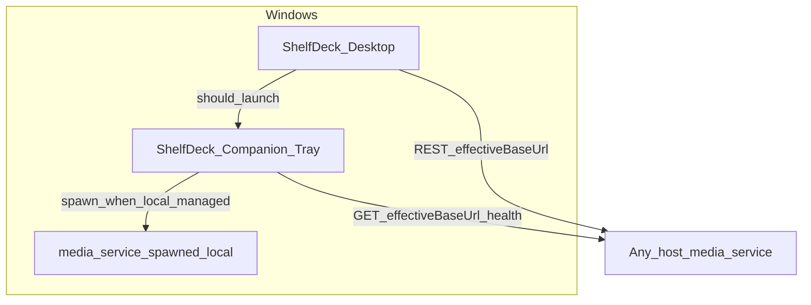

# ARCH — ShelfDeck 小助手（Windows 托盘媒体管理服务监督）

> **SSOT 路径**：`[ARCH_TRAY_MEDIA_SERVICE_SUPERVISOR.md](./ARCH_TRAY_MEDIA_SERVICE_SUPERVISOR.md)` · 文档索引 `[DOC_GOVERNANCE.md](../DOC_GOVERNANCE.md)`  
> **用户向名称**：**ShelfDeck 小助手** · 工程包 `shelfdeck-media-tray-supervisor` · 目录 `media-tray-supervisor/`

## 文档信息与变更摘要

| 项 | 内容 |
| --- | --- |
| 关联需求 | `[REQ_FEATURE_windows-tray-media-service-supervisor.md](../requirements/REQ_FEATURE_windows-tray-media-service-supervisor.md)` · `[REQ_FEATURE_desktop-backend-connection-and-windows-lifecycle.md](../requirements/REQ_FEATURE_desktop-backend-connection-and-windows-lifecycle.md)` |
| 行为细则 | `[DESIGN_TRAY_MEDIA_SERVICE_SUPERVISOR.md](../design/DESIGN_TRAY_MEDIA_SERVICE_SUPERVISOR.md)` |
| 实现目录 | `media-tray-supervisor/` |
| 历史验收 | 2026-04-20 独立托盘能力见 `PRJ_ITERATION_SUMMARY_tray_supervisor_20260420.md`；**小助手模型**（配置同源、黄绿红、左键面板）以 DESIGN 最新版为准 |

## 上下文与目标

在 **Windows** 上提供 **ShelfDeck 小助手**：任务栏托盘 + **左键轻量面板**，用于 **展示与编辑**（与 Desktop 同源）**媒体管理服务连接**、**对健康状态着色（黄/绿/红）**、并在产品规则允许时 **启动/停止** **当前已配置后端**（实现路径因本机/远端而异，见 DESIGN §3.3）。

### 与 `media-desktop` 的关系

- **体验**：用户打开 Desktop 时 **应** 连带启动小助手；**关闭 Desktop 主窗口** **不**关闭小助手。  
- **实现**：可为 Desktop 拉起伴生可执行文件、或安装器组合；**不必**与 Desktop 同一 Electron 进程（当前仓库仍为 **独立** `media-tray-supervisor` 包）。  
- **配置**：`effectiveBaseUrl` / API Key 的 **持久化文件** 由 **小助手** **独占写入**；Desktop **只读** 同一文件（见 `DESIGN_DESKTOP_BACKEND_ENDPOINT`）。

### 非目标

- 在小助手进程内嵌 Fastify（仍为 **小助手 + 本机场景下受管 `media-service` 子进程（可无）** 的多进程边界）。

## 架构视图

- **健康探测**：`GET {effectiveBaseUrl}/v1/health`，与 Desktop 门禁一致。  
- **本机 spawn**：仍可对 `media-service` 执行 `node src/server.js`（`TRAY_MEDIA_SERVICE_ROOT`、`cwd` 等见下表）。

## 关键决策与约束

| 决策 | 说明 |
| --- | --- |
| 配置单源 | **小助手** 写、Desktop **读** 同一连接存储；见 DESIGN_DESKTOP_BACKEND_ENDPOINT |
| 健康 URL | **非**写死 127.0.0.1；随 `effectiveBaseUrl` |
| 子进程命令 | `node src/server.js`，`cwd` = `media-service` |
| media-service 根路径 | `TRAY_MEDIA_SERVICE_ROOT` 或默认 `../media-service` |

## 接口与集成边界

- **OpenAPI**：无新增路径 **原则**；消费 `GET /v1/health`；**队列摘要** 须与 Desktop 对齐同一任务/队列 **只读** 数据源（可复用既有 sync 或队列读取契约；缺省时由本工程补齐最小只读能力，见 DESIGN §1）。  
- **远端启停**：无通用远程 kill；须 OPS/帮助说明 NAS 侧管理（DESIGN §3.3）。  
- **环境变量继承**：本机 spawn 时子进程继承小助手环境；可注入 `MEDIA_SERVICE_PORT`。

## 横切关注点

- **日志**：见 `OPS_TRAY_MEDIA_SERVICE_SUPERVISOR.md`。  
- **安全**：持久化 API Key 须按 Desktop 同等保护；左键面板 **不** 明文长密钥。

## 风险与演进

- **连接文件竞态**：**唯一写者** 为小助手；Desktop 只读 + 文件变更监视即可；小助手内部仍可对写入加锁。  
- **当前工程**：安装器/分发物须覆盖小助手与 Desktop 组合（及可选捆绑 `media-service`）；**开机自启** 开关与注册行为见 OPS。

## 追溯与关联文档

| 文档 | 关系 |
| --- | --- |
| `[REQ_FEATURE_windows-tray-media-service-supervisor.md](../requirements/REQ_FEATURE_windows-tray-media-service-supervisor.md)` | 需求 |
| `[DESIGN_TRAY_MEDIA_SERVICE_SUPERVISOR.md](../design/DESIGN_TRAY_MEDIA_SERVICE_SUPERVISOR.md)` | 行为 SSOT |
| `[DESIGN_DESKTOP_BACKEND_ENDPOINT.md](../design/DESIGN_DESKTOP_BACKEND_ENDPOINT.md)` | 连接 SSOT |
| `[ARCH_SYSTEM_OVERVIEW.md](./ARCH_SYSTEM_OVERVIEW.md)` | 系统总览 |
| `[DEV_SETUP.md](../dev/DEV_SETUP.md)` | 本地联调 |
| `[PRJ_MANAGEMENT.md](../project/PRJ_MANAGEMENT.md)` | 项目管理 |
