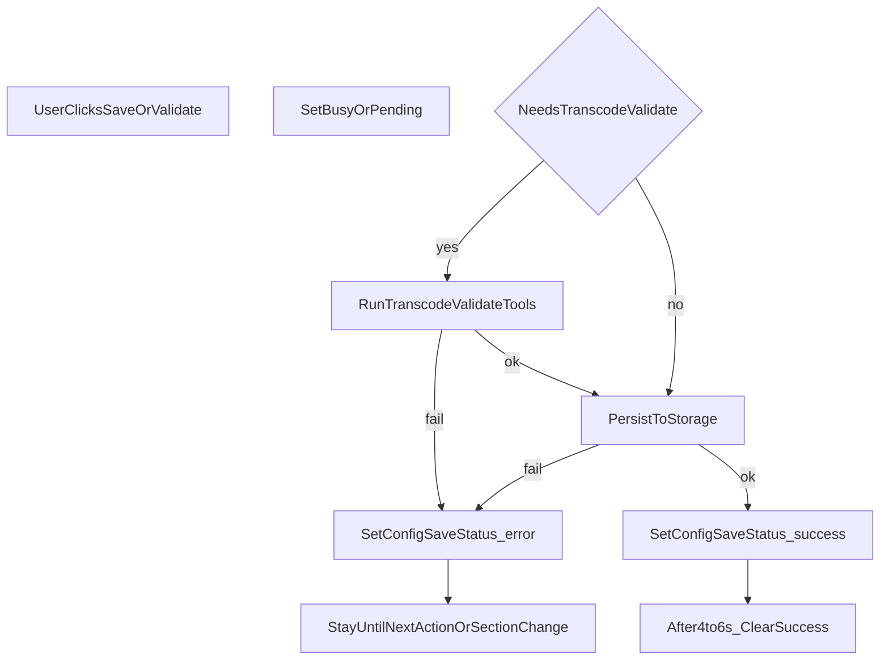

# DESIGN_CONFIG_CENTER_SAVE_FEEDBACK — 配置中心保存与检验反馈（呈现与交互）

> **SSOT 路径**：`[DESIGN_CONFIG_CENTER_SAVE_FEEDBACK.md](./DESIGN_CONFIG_CENTER_SAVE_FEEDBACK.md)` · 文档索引 `[DOC_GOVERNANCE.md](../DOC_GOVERNANCE.md)`  
> **关联需求**：`[REQ_FEATURE_config-center-save-feedback.md](../requirements/REQ_FEATURE_config-center-save-feedback.md)`  
> **文案句式与禁区**：`[DESIGN_DESKTOP_UI_COPY.md](./DESIGN_DESKTOP_UI_COPY.md)`（第 4.1 节等）；本文不重复 § 禁区全文。

配置字段含义仍以 `[DESIGN_CONFIG_AND_PATHS.md](./DESIGN_CONFIG_AND_PATHS.md)` 为 SSOT。任务状态机与 Flow 仍以 `[DESIGN_TASK_CENTER.md](./DESIGN_TASK_CENTER.md)` 为 SSOT。

---

## 0. 实现与验收状态（非行为 SSOT）

- **工程交付**：2026-04-20（UTC+8）按 `[REQ_FEATURE_config-center-save-feedback.md](../requirements/REQ_FEATURE_config-center-save-feedback.md)` 与本文完成实现与回归。
- **产品验收**：2026-04-20（UTC+8）通过；REQ 文首「状态」为 **已实现（工程与产品验收通过）**；同迭代 **媒体服务壳层门禁**见 `[REQ_FEATURE_desktop-requires-media-service.md](../requirements/REQ_FEATURE_desktop-requires-media-service.md)` / `[DESIGN_DESKTOP_MEDIA_SERVICE_AVAILABILITY.md](./DESIGN_DESKTOP_MEDIA_SERVICE_AVAILABILITY.md)`；迭代摘要见 `[PRJ_ITERATION_SUMMARY_config_center_media_service_gate_20260420.md](../project/PRJ_ITERATION_SUMMARY_config_center_media_service_gate_20260420.md)`。

---

## 1. 目标与非目标

### 1.1 目标

- 用户在配置中心任意分区点击「保存」或等价操作后，能**立即区分**三类结果：**进行中**、**成功**、**失败**。
- **成功**的语义：本次操作所涉配置已按该分区职责**写入本机持久化**（及实现规定的同步副作用，若有）；用户可合理认为**后续依赖该配置的功能将按本次内容生效**。若某分区仍有额外前置条件（如须先「测试联通」），成功文案可简短提示，但**不得**把未写入夸成已就绪。
- **失败**的语义：本次**未能**完成上述持久化或前置校验；须给出**原因**（可读中文，见 `DESIGN_DESKTOP_UI_COPY` 第 4.1 节「保存与检验」）。

### 1.2 非目标

- 不规定具体 React 组件拆分文件名；实现以 `media-desktop/src/App.tsx` 为主入口，样式可为 `src/styles.css` 中的提示类。
- 不改变 OpenAPI 与媒体管理服务契约。

---

## 2. 与全局错误横幅的边界

- 壳层 `**appErrorBanner`**（由全局 `error` state 驱动）用于：**任务中心执行过程**、**其它顶层页面**的一般错误、以及**非「配置保存」语义**的提示。
- **配置中心内**针对「保存本页」「保存码率策略」「保存任务中心」「保存转码相关配置」「保存豆瓣会话」及**配置语境下的检验**之成败，应写入 `**configSaveStatus`（见下）**，**不**写入全局 `error`，避免与任务执行错误抢占同一位置、也避免用户误以为「保存失败」来自播放/任务流水线。

---

## 3. 状态模型：`configSaveStatus`

采用专用对象（方案 A），与当前侧栏分区 `ConfigSection`（`emby` | `policy` | `scheduler` | `douban`）对齐。

| 字段        | 类型                           | 说明                                                             |
| --------- | ---------------------------- | -------------------------------------------------------------- |
| `kind`    | `idle` | `success` | `error` | 当前反馈类型；`idle` 表示无反馈或已清除。                                       |
| `message` | `string`（可选）                 | 成功或失败的主文案；失败须含原因或指向「原因：…」句式（与 `DESIGN_DESKTOP_UI_COPY` 一致）。    |
| `section` | `ConfigSection`（可选）          | 发起本次反馈的分区；用于仅在**当前浏览分区与之一致**时展示，或用于切换分区时清除过时反馈（实现择一策略，见第 5 节）。 |

**进行中**：可用同一结构 `kind: 'pending'` 或在组件层用独立 `boolean`（如 `configSaveBusy`）表示；若使用 `kind: 'pending'`，须在 UI 上与 `idle` 区分（如按钮「保存中…」）。

---

## 4. 检验与持久化保存的分开展示

- **检验转码资源池**（独立按钮）：结果写入 `**transcodeProbeHint`**（命名示例）或等价专用状态，内容为检验摘要（如 ffmpeg/ffprobe/入池设备等），**不得**与「保存任务中心成功」共用同一变量。
- **保存任务中心 / 保存转码相关配置**：持久化结果仅写入 `**configSaveStatus`**（及必要的进行中标志），成功短句见 `DESIGN_DESKTOP_UI_COPY` 第 4.1 节。

历史实现若将二者混在 `transcodeValidateHint` 中，应在实现时拆分，以满足 `[REQ_FEATURE_config-center-save-feedback.md](../requirements/REQ_FEATURE_config-center-save-feedback.md)`。

---

## 5. 展示位置与分区切换

- **主展示**：配置页**主内容区顶部**（`<main>` 内、`panel` 内第一个子级之前或之后统一一条），固定为**一条**反馈带，避免 Emby/码率/任务/豆瓣四处散落不同样式。
- **与 `section` 对齐**：仅当用户当前选中的侧栏分区与 `configSaveStatus.section` **一致**时展示该条（避免在「码率策略」页看到「豆瓣保存成功」）。若在新一次保存前未清除，上一次成功/失败可被下一次操作覆盖。
- **切换侧栏分区**：切换时可将 `configSaveStatus` 置为 `idle`（推荐），避免残留；若保留跨分区展示，则须在文案中标明分区（实现复杂度更高，**不推荐**首版）。

---

## 6. 成功反馈的自动清除

- **强制**：`kind === 'success'` 展示后，在 **4～6 秒**（与 `enqueueHint` 同类短时提示一致）自动设为 `idle` 并清空 `message`。
- 清除**不**影响已持久化的配置数据。

---

## 7. 异步操作与按钮

- 对需要 `await` 的路径（含转码工具链检验、豆瓣会话写入等）：保存/检验按钮在请求进行中 **disabled**，主文案可为 **「保存中…」** 或 **「检验中…」**（与 `DESIGN_DESKTOP_UI_COPY` 术语一致，避免英文枚举作主标签）。
- 同步仅 `localStorage` 的路径仍应 **try/catch**；失败写入 `configSaveStatus` 为 `error`，成功为 `success` 并走第 6 节清除。

---

## 8. 分区分工与成功语义（简表）

| 侧栏分区      | 用户操作（典型）        | 成功语义（摘要）                                     | 失败来源（典型）              |
| --------- | --------------- | -------------------------------------------- | --------------------- |
| Emby 与播放器 | 保存本页            | Emby/播放器/阈值/路径映射等已写入本机                       | 存储异常、校验未通过（若实现前置校验）   |
| 码率策略      | 保存码率策略          | 媒体策略已写入本机，后续列表/策略估算按新值                       | 存储异常                  |
| 任务中心      | 保存任务中心；保存转码相关配置 | 调度与转码路径/资源池等已写入；与 DESIGN_CONFIG_AND_PATHS 一致 | 转码检验失败、存储异常、非桌面环境无法检验 |
| 豆瓣        | 保存豆瓣会话          | 会话数据已写入本机应用数据目录（若实现）                         | IPC/文件写入失败、校验失败       |

具体字符串模板不替代 `[DESIGN_DESKTOP_UI_COPY.md](./DESIGN_DESKTOP_UI_COPY.md)` 第 4.1 节。

### 8.1 媒体管理服务未可达

- 当壳层处于 `**unknown`** 或 `**offline**`（见 `[DESIGN_DESKTOP_MEDIA_SERVICE_AVAILABILITY.md](./DESIGN_DESKTOP_MEDIA_SERVICE_AVAILABILITY.md)`）时，**不得**对任何分区展示 **保存成功**；强门禁下用户通常无法触发保存。原因说明可 **并列** 引导用户到 **ShelfDeck 小助手** 配置或启动后端（Desktop **无** 媒体管理服务地址保存入口，见 `DESIGN_DESKTOP_BACKEND_ENDPOINT`）。
- 若仍触发保存（竞态或后续交互变化），须 **error** 语义，原因须说明无法连接或未启动媒体管理服务，可与壳层遮罩主句区分开（配置槽短句 + `formatSaveConfigFailed`）。
- **成功反馈定时清除**（第 6 节）仅在 **online** 且保存成功时适用；服务从 offline 恢复后，旧的「未保存」提示可被下一次操作覆盖，不以「成功」冒充。

---

## 9. 流程示意

---

## 10. 实现锚点（检索用，非代码 SSOT）

| 区域        | 主要位置（相对 `media-desktop/`）                                                       |
| --------- | ------------------------------------------------------------------------------- |
| 配置页壳层与反馈  | `src/App.tsx`                                                                   |
| 样式        | `src/styles.css`（反馈条成功/错误类名）                                                    |
| 主进程转码检验错误 | `electron/transcodeService.js`（错误串最终仍须满足 `DESIGN_DESKTOP_UI_COPY` 第 5 节若透出到配置槽） |

---

## 11. 测试要点（手工）

1. 各分区保存：成功出现、约 4～6 秒内消失；失败有原因且不占底部全局 `appErrorBanner`（配置语义下）。
2. 任务中心页内：先「检验」再「保存」，两种结果分区清晰、不串话。
3. 保存进行中：对应按钮不可连点。
4. 切换侧栏分区：无过时成功条残留（若按第 5 节切换即清）。

更正式验收见 `[REQ_FEATURE_config-center-save-feedback.md](../requirements/REQ_FEATURE_config-center-save-feedback.md)`。