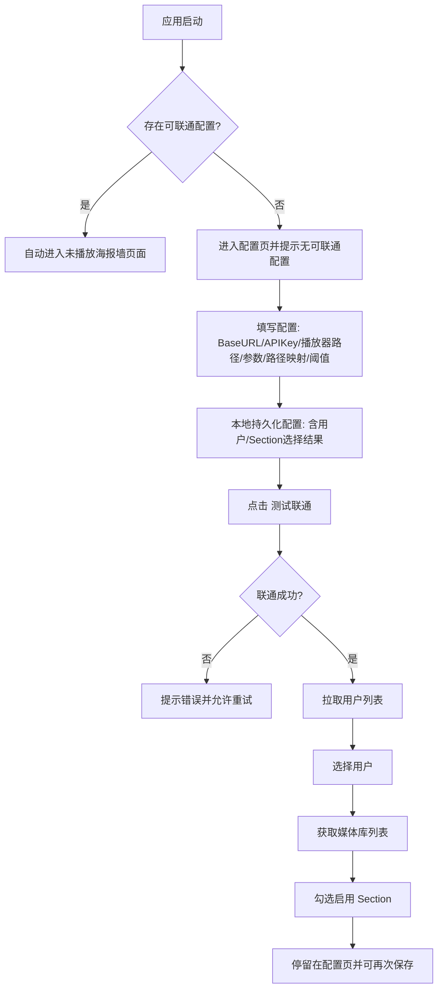
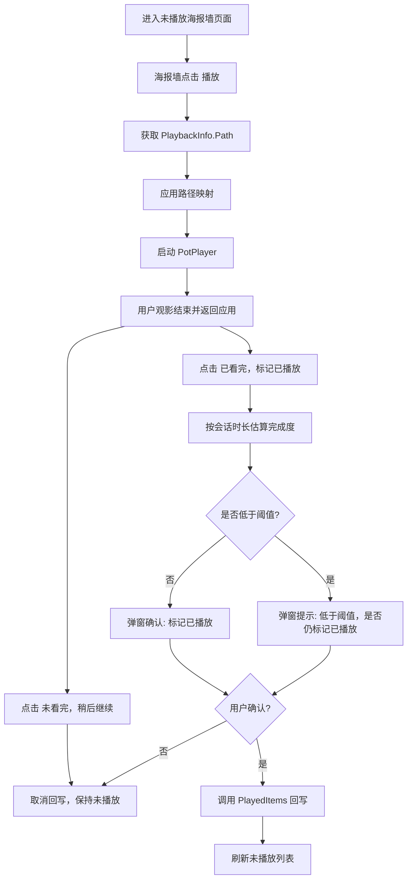

# DESIGN_FRONT_PLAYBACK — 信息架构、海报墙与前台播放闭环

> **SSOT 路径**：`[DESIGN_FRONT_PLAYBACK.md](./DESIGN_FRONT_PLAYBACK.md)` · 文档索引 `[DOC_GOVERNANCE.md](../DOC_GOVERNANCE.md)`

本文档描述 **五页信息架构**、**未播放海报墙**、**播放记录页**及 **前台播放闭环**（配置、路径映射、回写、Emby API 最小集）。媒体库治理与星级策略见 `[DESIGN_LIBRARY_AND_QUEUE.md](./DESIGN_LIBRARY_AND_QUEUE.md)`；任务中心行为见 `[DESIGN_TASK_CENTER.md](./DESIGN_TASK_CENTER.md)`。

**依赖**：五页壳层交互以 **媒体管理服务可达** 为前置（健康检查与门禁见 `[DESIGN_DESKTOP_MEDIA_SERVICE_AVAILABILITY.md](./DESIGN_DESKTOP_MEDIA_SERVICE_AVAILABILITY.md)`）；与 Emby 服务器是否在线相互独立。

---

## 1. 壳层与信息架构

### 1.1 顶层信息架构（五页 + 壳层）

应用采用**统一壳层**：顶部主导航约五页，每页**左侧为操作侧栏**、右侧为主内容区（实现与 `[REQ_PRODUCT_BASELINE_v1.0.0.md](../requirements/REQ_PRODUCT_BASELINE_v1.0.0.md)` 对齐）。

1. **配置中心（Config）**：**Emby 与播放器**、**任务调度与补源**（执行模式、**删除/转码/洗版多队列**并发、补源重试节奏、海报墙打分自动入队等）及其他配置分区（**不含** ShelfDeck 媒体管理服务 HTTP 基址表单，见 `[DESIGN_DESKTOP_BACKEND_ENDPOINT.md](./DESIGN_DESKTOP_BACKEND_ENDPOINT.md)`）。字段见 `[DESIGN_CONFIG_AND_PATHS.md](./DESIGN_CONFIG_AND_PATHS.md)`。
2. **未播放海报墙（Wall）**：观影入口；观看结束打分后，可按策略自动创建任务（受配置开关约束）。
3. **播放记录页（History）**：行为回放；**不再**承担「添加任务」类重入口（与媒体库重复者已收敛）。
4. **媒体库管理页（MediaManage）**：资产治理；全库列表（含已观看）、搜索与多维筛选（含**是否蓝光/原盘**）、单条/批量入队、星级与策略；列表展示**体积**、**原盘**、**当前/目标码率**、**预测体积**（电影行；按 `[DESIGN_LIBRARY_AND_QUEUE.md](./DESIGN_LIBRARY_AND_QUEUE.md)` 中策略与目标码率估算）、**豆瓣个人评分（匹配结果）与有效星级状态**（用于策略的星级：豆瓣优先）；侧栏汇总**当前库容量**与**电影按目标码率预测占用**；**原盘条目**不提供**码率压缩（Transcode）入队**（判定在本页刷新管线完成，见 `[DESIGN_LIBRARY_AND_QUEUE.md](./DESIGN_LIBRARY_AND_QUEUE.md)` **§4.0**；**洗版 Upgrade 仍允许**）。列表数据可持久化到本机 `localStorage`（`embyDesktopPlayerLibraryManageCacheV1`），与当前连接指纹绑定；**进入本页不自动拉取 Emby**，需用户主动「刷新媒体库列表」与服务器对齐（回写观看状态等流程可附带静默刷新以保持接近一致）。
5. **任务中心页（TaskCenter）**：任务列表、状态筛选、单条/批量**调度类**操作（移除、暂停、执行、批量执行等）；**补源信息确认**以**弹窗**完成。

### 1.2 非顶层页面 / 已调整项

- **质量审阅**：不再作为独立顶层页面与路由入口；候选确认纳入任务中心 **「信息确认」** 流程（与 `[DESIGN_TASK_CENTER.md](./DESIGN_TASK_CENTER.md)` 及 `[PRJ_MANAGEMENT.md](../project/PRJ_MANAGEMENT.md)` 中产品差距叙述一致）。
- **任务日志**：任务中心内**首版占位**，完整采集与检索为后续迭代。

### 1.3 页面职责与关系

#### 1.3.1 播放记录页 vs 媒体库管理页（核心边界）

- 播放记录页：行为回放页，关注“看了什么、何时看、看完状态”。
- 媒体库管理页：资产治理页，关注“是否达标、该怎么优化、排队状态”。

#### 1.3.2 数据关系

- 播放记录页输出“最近观看事实”（最近播放时间、频次、已看状态）。
- 媒体库管理页输出“质量状态”（用户标注星级、**豆瓣个人评分（若匹配）**、**有效星级**（策略用）、目标码率、当前码率偏差、任务状态）。
- 通过 `itemId` 关联，形成“行为流 + 资产流”双视角。

#### 1.3.3 操作关系

- 播放记录页允许轻操作：重新播放、已看/未看修正、跳转媒体库等（**不**在播放记录页执行重任务或任务控制）。
- 媒体库管理页负责重操作：星级调整、策略覆盖、批量入队。
- **任务执行控制**（执行、暂停、批量执行、批量暂停、移除等）**统一在任务中心**；配置项在**配置中心 → 任务调度与补源**维护。

---

## 2. 未播放海报墙与播放记录（摘要）

1. **未播放海报墙（Wall）**：观影入口；观看结束打分后，可按策略自动创建任务（受配置开关约束）。
2. **播放记录页（History）**：行为回放；**不再**承担「添加任务」类重入口（与媒体库重复者已收敛）。

---

## 3. 前台播放闭环（配置、流程与 API）

### 3.1 背景与核心痛点

#### 3.1.1 现状问题

- 官方 Emby Windows 客户端不能很好地接入第三方播放器。
- 内置播放器难以满足自定义渲染、音频直通等高级诉求。
- 用户当前流程繁琐：在 Emby 找片 → 手动找本地文件 → PotPlayer 播放 → 回 Emby 手动标记已播放。

#### 3.1.2 目标体验

- 在 Emby 相关列表中「一键播放」目标条目。
- 由本应用唤起第三方播放器播放本地/映射路径文件。
- 观影结束后，按规则确认并回写 Emby「已播放」状态，形成闭环。

### 3.2 关键业务约束（前台播放闭环）

- 配置流程：`保存配置` → `测试联通` →（成功后）加载用户列表并选择用户。
- 不手动输入 `UserId`，应由 API 拉取用户供选择。
- 未播放条目必须按已选择 Section 过滤。
- UI 采用海报墙风格。
- 回写「已播放」必须经过用户确认，不直接自动写入。
- 应用启动时，若存在「可联通配置」（联通成功且用户/Section 有效），应自动进入未播放海报墙页面。
- 若不存在可联通配置，停留在配置页并提示「没有可联通的配置，请先配置并测试联通」。

### 3.3 用户流程图（前台闭环）

#### 3.3.1 首次配置流程

#### 3.3.2 观影与回写流程

### 3.4 功能需求摘要（前台与配置）

以下内容与 **配置中心**、未播放海报墙等交叉对照；**媒体库全量列表缓存**（`embyDesktopPlayerLibraryManageCacheV1`）的约定以 **§1.1**（媒体库管理页）及 `[DESIGN_LIBRARY_AND_QUEUE.md](./DESIGN_LIBRARY_AND_QUEUE.md)` 正文为准。

**配置项（字段名与实现一致）** — 完整说明见 `[DESIGN_CONFIG_AND_PATHS.md](./DESIGN_CONFIG_AND_PATHS.md)`。

- `baseUrl`、`apiKey`、`userId`（来自用户选择）、`embyUserPassword`（可选；删除等写操作鉴权见 `[DESIGN_TASK_CENTER.md](./DESIGN_TASK_CENTER.md)` **§2.3.5**）
- `enabledSectionIds`、`playerExePath`、`argsTemplate`（支持 `{path}`、`{itemId}`）
- `pathMapFrom` / `pathMapTo`
- `markPlayedThresholdPercent`（默认 90）、`fallbackMinSeconds`

**播放与回写**

- 通过 `PlaybackInfo` 获取可播放文件路径；应用路径映射后按模板唤起第三方播放器。
- 不依赖「监控播放器进程退出」作为唯一依据；用户主动点击「已看完/未看完」。
- 低于阈值时二次提醒，用户仍可强制确认；确认后 `POST /Users/{UserId}/PlayedItems/{ItemId}`。

**本地日志（排障）**

建议记录：播放请求与参数（脱敏）、路径解析与映射、会话时长与阈值提示、用户确认/取消、回写结果与错误。

### 3.5 Emby API 清单（前台最小集）

与具体 Emby 版本差异时允许降级；**删除媒体**的请求鉴权与流程以 `[DESIGN_TASK_CENTER.md](./DESIGN_TASK_CENTER.md)` **§2.3.5** 为准，下表「删除」一行仅作端点索引。

| 用途       | 方法 / 路径                                                                                                                           |
| -------- | --------------------------------------------------------------------------------------------------------------------------------- |
| 测试服务     | `GET /System/Info`                                                                                                                |
| 用户列表     | `GET /Users/Query`（失败时可降级 `GET /Users`）                                                                                           |
| 媒体库      | `GET /Library/MediaFolders`                                                                                                       |
| 未播放列表    | 首选 `GET /Users/{UserId}/Sections/{SectionId}/Items`；不可用则 `GET /Users/{UserId}/Items?ParentId={SectionId}&Recursive=true`          |
| 播放路径与时长  | `GET /Items/{Id}/PlaybackInfo?UserId={UserId}`；补充 `GET /Items/{Id}`                                                               |
| 已播放回写    | `POST /Users/{UserId}/PlayedItems/{Id}`（可带 `DatePlayed`）                                                                          |
| 删除条目（治理） | `DELETE /Items/{ItemId}`；鉴权见 `[DESIGN_TASK_CENTER.md](./DESIGN_TASK_CENTER.md)` **§2.3.5**；可选 `GET /Items/{ItemId}/DeleteInfo` 预检 |

### 3.6 完成度与回写判定

- `completionPercent = sessionElapsedSeconds / runtimeSeconds * 100`（runtime 可得时）。
- 总时长不可得：使用 `fallbackMinSeconds` 兜底。
- 无论是否达到阈值，均由用户确认是否回写；取消则不回写。

### 3.7 UI 与异常场景（摘要）

**UI**

- 未播放条目使用海报墙；联通状态（已联通/未联通）需清晰展示。
- 配置页在启动检测失败时显示「没有可联通的配置」。
- 海报墙提供「更改配置」入口（返回配置页，不清空已保存配置）。

**异常与降级**

- Emby 不可达：阻止列表与回写，提示网络/地址问题。
- 用户列表为空：提示权限不足或接口不可用。
- 无可播放路径：不启动播放器，不回写。
- 会话信息丢失：提示重新播放后再操作。
- 回写失败：提示原因并记录日志。

### 3.8 前台闭环验收标准

作为 `[REQ_PRODUCT_BASELINE_v1.0.0.md](../requirements/REQ_PRODUCT_BASELINE_v1.0.0.md)` 全产品验收的**补充检查项**（后台治理见该文档「验收标准」）：

1. 用户可按「保存配置 → 测试联通 → 选择用户」完成初始化。
2. 媒体库可多选，未播放列表仅来自选中库。
3. 点击海报可正确唤起第三方播放器且打开目标文件。
4. 观影后可使用「已看完 / 未看完」两种动作。
5. 无论完成度是否达阈值，均需用户确认后才回写；确认后 Emby 状态更新成功。
6. 用户选择「未看完」或取消确认时不回写。
7. 关键动作均有本地日志可追踪。

### 3.9 指标建议（可观测性）

可与实现阶段的遥测/埋点设计对齐（命名仅供参考）：

`connection_test_success_total` / `connection_test_failure_total`、`user_list_load_success_total` / `user_list_load_failure_total`、`unplayed_load_success_total` / `unplayed_load_failure_total`、`player_launch_success_total` / `player_launch_failure_total`、`session_completion_estimated_total`、`mark_played_confirm_total`、`mark_played_cancel_total`、`mark_played_success_total` / `mark_played_failure_total`。

### 3.10 窗口、键盘与播放记录页详设

以下为壳层与播放记录页的细化，与当前 **五页架构（§1）** 兼容；若与 **§1** 或 `[PRJ_MANAGEMENT.md](../project/PRJ_MANAGEMENT.md)` 时间线所锚版本冲突，以 **§1**、需求母版中 **工程实现快照** 及项目管理为准。

- **窗口**：启动时窗口最大化（`maximize`），隐藏默认 `File/Edit/...` 菜单栏；恢复/最小化后再次激活时维持最大化（除非用户主动还原）。
- **海报墙键盘**（在无弹窗聚焦时）：方向键按网格移动焦点；`Enter` 播放；`R` 刷新列表；`Esc` 关闭弹窗或取消焦点；焦点移动时顶部可显示当前条目名称。
- **播放记录页**：一级入口与 **§1.1** 一致；按 `DatePlayed` 倒序；支持时间范围（7 天/30 天/全部）与媒体库筛选；支持重新播放与手动刷新。

### 3.11 风险与后续方向（摘要）

- **风险**：会话时长为估算值；不同 Emby 版本接口行为差异需兼容与降级。
- **后续（非承诺排期）**：更强播放器集成、更细粒度播放进度同步、会话调试面板等——以需求母版中风险/版本结论与迭代为准。

---

## 追溯与关联文档

| 文档                                                                                 | 关系             |
| ---------------------------------------------------------------------------------- | -------------- |
| `[DOC_GOVERNANCE.md](../DOC_GOVERNANCE.md)`                                        | 全库索引           |
| `[REQ_PRODUCT_BASELINE_v1.0.0.md](../requirements/REQ_PRODUCT_BASELINE_v1.0.0.md)` | 需求母版与全产品验收     |
| `[DESIGN_CONFIG_AND_PATHS.md](./DESIGN_CONFIG_AND_PATHS.md)`                       | 配置字段与路径映射      |
| `[DESIGN_LIBRARY_AND_QUEUE.md](./DESIGN_LIBRARY_AND_QUEUE.md)`                     | 媒体库与星级策略       |
| `[DESIGN_TASK_CENTER.md](./DESIGN_TASK_CENTER.md)`                                 | 任务中心与删除鉴权 SSOT |
| `[API_README.md](../api/API_README.md)` / `[openapi.yaml](../api/openapi.yaml)`    | 媒体管理服务 REST（如适用）  |

