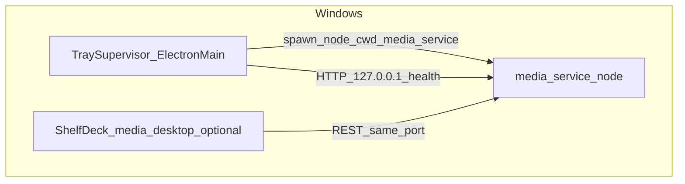

# ARCH — Windows 托盘媒体管理服务监督

> **SSOT 路径**：`[ARCH_TRAY_MEDIA_SERVICE_SUPERVISOR.md](./ARCH_TRAY_MEDIA_SERVICE_SUPERVISOR.md)` · 文档索引 `[DOC_GOVERNANCE.md](../DOC_GOVERNANCE.md)`

## 文档信息与变更摘要

| 项        | 内容                                                                                                                             |
| -------- | ------------------------------------------------------------------------------------------------------------------------------ |
| 关联需求     | `[REQ_FEATURE_windows-tray-media-service-supervisor.md](../requirements/REQ_FEATURE_windows-tray-media-service-supervisor.md)` |
| 行为细则     | `[DESIGN_TRAY_MEDIA_SERVICE_SUPERVISOR.md](../design/DESIGN_TRAY_MEDIA_SERVICE_SUPERVISOR.md)`                                 |
| 实现目录（计划） | 仓库内 `media-tray-supervisor/`（npm 包名 `**shelfdeck-media-tray-supervisor`**）                                                     |

## 上下文与目标

在 **Windows** 上提供**常驻系统托盘**的**监督进程**，作为 **媒体管理服务**（`media-service`）的 **父进程**：负责 **spawn 启动 / 重启 / 停止** 子进程，并对 `**GET /v1/health`** 做轮询，驱动托盘图标状态。

### 非目标

- 与 `media-desktop` 合并为同一 Electron 窗口应用（监督程序为**独立**可执行单元）。
- 在监督进程内嵌 Fastify（保持 **两进程**：监督者 + Node 子进程跑 `media-service`）。

## 架构视图

- **监督宿主**：**Electron 主进程**（无必须可见窗口），使用 `Tray` + `Menu`；与现有 `media-desktop` 使用相同 major 的 **Electron** 版本以降低环境差异。
- **子进程**：`node` 执行 `media-service/src/server.js`，`**cwd`** 为 `media-service` 包根目录（含 `node_modules` 解析）。

## 关键决策与约束

| 决策                    | 说明                                                                                                                                                                             |
| --------------------- | ------------------------------------------------------------------------------------------------------------------------------------------------------------------------------ |
| 两进程                   | 监督进程 ≠ HTTP 服务进程；崩溃与升级边界清晰。                                                                                                                                                    |
| 健康探测                  | `GET /v1/health`（`[media-service/src/app.js](../../media-service/src/app.js)`）；成功判定：`HTTP 2xx` 且 JSON 可解析且 `status === 'ok'`（与实现宽松匹配）。                                         |
| 端口                    | `MEDIA_SERVICE_PORT` 或 `CONTROL_PLANE_PORT`，默认 **18080**；子进程与环境变量对齐 `[media-service/src/server.js](../../media-service/src/server.js)`。                                        |
| 子进程命令                 | **推荐**：`node src/server.js`（`cwd` = `media-service`）；避免依赖全局 `npm`。                                                                                                             |
| `media-service` 根路径解析 | **开发**：环境变量 `**TRAY_MEDIA_SERVICE_ROOT`** 指向目录；未设置时默认监督进程源码旁路 `**../media-service**`（与仓库布局一致）。**打包**：必须通过 `**TRAY_MEDIA_SERVICE_ROOT`**（或安装器写入的等效配置）指向已释放的 `media-service` 目录。 |

## 接口与集成边界

- **与 OpenAPI**：无新增 REST；仅消费现有 health。
- **与 `media-desktop`**：`npm run dev:media-service` 仍可单独启动服务；若托盘已占用端口，命令行启动会失败——与「单实例」策略一致。开发者可只运行桌面 + 自管服务，或运行托盘 + 桌面。
- **环境变量继承**：子进程继承监督进程环境；可额外注入 `MEDIA_SERVICE_PORT` 等。

## 横切关注点

- **日志**：监督进程 stderr/可选落盘路径见 OPS；子进程 stdout/stderr 可继承控制台或重定向（实现阶段定最小可用策略）。
- **安全**：健康检查仅本机；不在托盘内持久化 API Key。

## 风险与演进

- **仅监督自 spawn 的子进程**：第一版不承诺管理用户手动启动的「孤儿」`node`；若端口已被占用且健康通过，启动前应提示「端口已被占用」，见 DESIGN。
- **后续**：安装器将 `media-service` 与监督程序一同释出；开机自启见 OPS。

## 追溯与关联文档

| 文档                                                                                                                             | 关系     |
| ------------------------------------------------------------------------------------------------------------------------------ | ------ |
| `[REQ_FEATURE_windows-tray-media-service-supervisor.md](../requirements/REQ_FEATURE_windows-tray-media-service-supervisor.md)` | 需求     |
| `[DESIGN_TRAY_MEDIA_SERVICE_SUPERVISOR.md](../design/DESIGN_TRAY_MEDIA_SERVICE_SUPERVISOR.md)`                                 | 状态机与菜单 |
| `[ARCH_SYSTEM_OVERVIEW.md](./ARCH_SYSTEM_OVERVIEW.md)`                                                                         | 系统总览   |
| `[DEV_SETUP.md](../dev/DEV_SETUP.md)`                                                                                          | 本地联调   |

