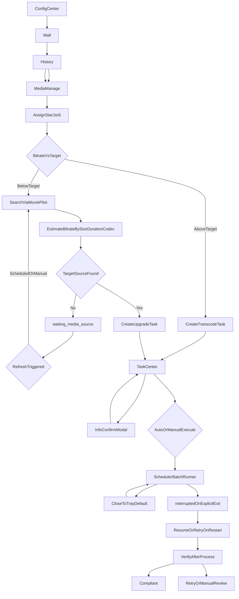

# DESIGN_TASK_CENTER — 任务中心：从前端到后端的完整逻辑说明（SSOT）

> **SSOT 路径**：`[DESIGN_TASK_CENTER.md](./DESIGN_TASK_CENTER.md)` · 文档索引 `[DOC_GOVERNANCE.md](../DOC_GOVERNANCE.md)`

本文档为 **任务中心** 相关产品与技术逻辑的 **单一事实来源**。实现与评审以本文为准；与其它材料冲突时以 `[DOC_GOVERNANCE.md](../DOC_GOVERNANCE.md)` **SSOT 与冲突处理**为准，**任务中心可执行行为**仍以本文为准。  
**技术条文索引**：**术语与对象模型** → **§2.0**；**任务调度（运行时）** → **§3**；`transcode` → **§5**（**§5.0** 导读、**§5.1** 资源池总览与 Flow×槽位表、**§5.1.0** 可选用设备探测、**§5.1.1** / **§5.1.2** 展开、**§5.8** 检验与保存/合并写入、**§5.12** `verify`/**replace** 边界）、**§17**；`upgrade` → **§6**；`delete` → **§4**（含 **§4.5** HTTP/鉴权）；**任务中心设置（配置中心）** → **§7**（**§7.2** 任务调度、**§7.3** 删除 Flow 占位、**§7.4** 转码表单与拖拽排序/单独保存、**§7.5** 洗版表单）；checkpoint / 幂等 / v1 恢复 → **§18**；进程分层、观影降载 → **§13.1**；跨页用户旅程示意（mermaid）→ **§19**。项目管理与里程碑见 `[PRJ_MANAGEMENT.md](../project/PRJ_MANAGEMENT.md)`；**beta 工程落地与 mvp 代码路径对照**见需求基线 `[REQ_PRODUCT_BASELINE_v1.0.0.md](../requirements/REQ_PRODUCT_BASELINE_v1.0.0.md)` **工程实现快照**，**不重复**写入本 SSOT 正文。

---

## 1. 范围与目标

### 1.1 范围

- **任务中心**：列表与状态展示；单条/批量 **调度类**操作入口；日志区（首版可占位）。
- **任务调度**（本文含义）：任务的 **添加**、**从任务中心移除**（见 §3.7.4，与「删除类治理任务」区分）；在 **按 `actionType` 划分的逻辑队列**（§2.0（5）、§3.3）上维护 **FIFO** 与 **类型任务槽**（§2.0（6））占用；区分 **停泊** 与 **排队等槽**（§2.0（8））；侧栏按钮 **不** 直接点选 Flow 内某一步，只作用在调度层。
- **任务 Flow**：单条任务自创建起按 `**actionType` 绑定唯一一条 Flow**（步骤、分支、专有停泊规则）；由 **该类型的 Flow 模块** 实现。调度只负责 **是否准许推进、是否占类型任务槽**（及 `transcode` 在压制阶段占用的 **具体编码设备子槽**，§2.0（6）（7）），不替代 Flow 内部条件判断。

### 1.2 非目标（当前阶段）

- 全局「暂停整表 / 关调度时钟」类产品开关（不需要）。
- 显式 **优先级** 队列、抢占。
- **按时间窗口自动允许调度**（「定时模式」）：可作为后续增强，与 **自动/手动** 正交（见 **§7.2.5**）。
- 任务日志的完整采集与展示（首版占位即可）。

---

## 2. 术语与核心对象

全文 **任务、调度、资源、槽** 等词 **只** 按下文含义使用；后文若出现同义词，**语义须与此一致**。

### 2.0 核心对象与统一用词（全文以此为准）

**（1）任务（治理任务）**  
一条 **任务** = 一条持久化的 **任务记录**（数据字段见 §3.4），表示对某一 Emby `**itemId`** 执行一种 `**actionType` 治理动作**（`delete` | `transcode` | `upgrade`）。**不是** Windows 进程、**不是** FFmpeg 进程的同义词；后两者是实现承载。

**（2）任务池 / 可调度集合**  
**入池**：任务记录进入应用维护的 **可调度集合**（可被调度层决定是否推进）。**出池**：含 **结案**（`done` / `failed_hard`）与 **从任务中心移除**（§3.7.4，非 `delete` Flow）。文中 **调度池** 与 **可调度集合** 同义。

**（3）调度层**  
负责：**入池校验**（互斥、对 `**transcode`** 的 **原盘类拦截** §3.7.3 等）、**执行模式**（§7.2.1），**是否准许 Flow 继续推进**、**按类型的 FIFO 排队**、**类型任务槽** 的占用计数、`**schedulingHold`**（§3.4）所表达的 **排队原因**（不新增一堆 `status`）。**不**实现各 `actionType` 的业务步骤细节。

**（4）任务 Flow**  
绑定在某一 `**actionType` 上的步骤与状态机**：下一步做什么、`status` 如何迁移、何时 **停泊**、何时 **占类型任务槽**。由各 Flow 模块实现；**须服从**调度层并发与互斥。

**（5）逻辑队列**  
按 `**actionType` 划分** 的 **FIFO 任务序列**（§3.3）。**不是** OS 线程队列；**不是**「编码资源池」里 **按设备占槽** 的语义（见（7））。

**（6）类型任务槽（`…Concurrency`）**  
配置项：`deleteConcurrency`、`transcodeConcurrency`、`upgradeConcurrency`。含义：**该类型**任务中，同时允许处于 **占槽**（见（8））状态的 **任务条数上限**。**未结案** 但 **停泊 / 排队等槽** 的任务 **不计入** 该上限（见 §3.5.1）。  
`**transcode` 特例**：除 **类型任务槽** 外，另须满足 **各入池编码设备的子槽**（（7）），**占槽时** 与 **具体设备** 绑定。

**（7）编码资源池（仅 `transcode`）**  
**不是**泛指的「整机 CPU/内存」，而是：**压制阶段「最终视频编码」** 可用的 **配置 + 记账单元**，包含：**编码设备列表**（用户勾选参与池的 **每张显卡 / 核显 / CPU x265** 等 — **不同后端、不同物理卡，各为池中独立一条**）、**每设备子槽数**（该设备上 **同时允许几路**并行压制）、**设备优先级顺序**（占槽时 **从高到低尝试**）、**CPU 参与策略**（策略 1 / 2，§5.1.2）、以及运行时按设备计数的 `**Gate`**（`tryAcquire` / `release`）。`**upgrade`（洗版）不使用** 本池（§5.9）。**面向用户的配置说明与示例** 见 **§5.1**；占槽算法见 **§5.1.1**、**§5.1.2**。

**（8）占槽 · 排队等槽 · 停泊**  
与 §3.5.1 **同一套定义**，此处为摘要：  

- **占槽**：任务处于 `precheck` / `executing` / `verify`（及实现约定的等价态），**占用一条**对应 `actionType` 的 **类型任务槽**；`**transcode`** 在 `**executing`** 时还须占用 **某一具体编码设备** 的一条 **设备子槽**（进入 `executing` 起算，细节 §5.1.1）。  
- **排队等槽**：已获准调度，`status` 常为 `queued`，**等待类型任务槽或（对 `transcode`）目标编码设备子槽** 空出；**不占槽**。  
- **停泊**：不占类型任务槽、且 **不处于**「已获准排队等槽」的就绪语义；如 `pending_manual`（未发令）、`awaiting_user_confirm`、`waiting_media_source`、`paused` 等（§3.5.3）。

**（9）「资源」在本文中的三种含义（避免混读）**  

| 用语               | 指什么                  | 典型出现处                     |
| ---------------- | -------------------- | ------------------------- |
| **编码资源 / 编码资源池** | （7）仅 **transcode**   | §5.x、§7.4、§13.1           |
| **媒体片源 / 补源资源**  | BT/下载候选、磁盘上的影片文件是否到位 | `waiting_media_source`、§6 |
| **磁盘空间 / 卷**     | 临时根、目标成片所在卷剩余空间      | §5.4、§17 B 类              |

**（10）同视频互斥 · 结案**  
**互斥**：同一 `itemId` **任意时刻至多一条未结案**治理任务（§3.4、§3.7.2）。**结案**：`done` 或 `failed_hard`，任务 **不再占用** 类型任务槽与（若适用）**编码设备子槽**。

**（11）任务调度（动作；行文简称「调度」）**  
与 **§3.1** 一致：指调度层对已入池任务在运行时的 **准许推进、排队次序、槽位记账**；**不在此边界内**的见 §3.1 与 **§2.0.1**。

### 2.0.1 调度层与任务 Flow 的职责边界

| 维度   | 调度层                                                                                                          | 任务 Flow                                                            |
| ---- | ------------------------------------------------------------------------------------------------------------ | ------------------------------------------------------------------ |
| 负责内容 | 入池/出池；同视频互斥；**类型任务槽** 与 **FIFO**；手动/自动下 **是否准许推进**；`**transcode`** 另协调 **编码资源池**（**每设备子槽**、`schedulingHold`） | 步骤顺序、分支；**各类型专有**（如补源 `waiting_media_source`、删除的确认与回收步骤、转码的编码与校验等） |
| 典型问题 | 能否添加入池？能否 **占类型任务槽**？是否 **停泊 / 排队**？                                                                         | 这一步做完下一步是什么？                                                       |

**原则**：调度 **不得** 绕过 Flow 门槛；Flow **不得** 单方面无视 **类型任务槽 / 各编码设备子槽** 上限。通过 `status`、`schedulingHold` 与 API 契约协作。

### 2.1 三类任务与三条 Flow（摘要）

三种 `actionType`与三条逻辑队列的 **定稿表** 见 **§3.3**；**可扩展 / 隔离** 约定见 **§2.2**。

### 2.2 可扩展性与 Flow 隔离（架构约定）

- **可扩展**：整体框架按 **「任务类型（`actionType`）→ 专属 Flow 实现 → 该类型在调度层的队列与占槽策略」** 延展。未来可 **追加** 新的 `actionType` 与新 Flow，仅需扩展 **类型注册**、**配置项**（如并发上限）、**入队校验** 与本文 SSOT；**不要求** 改写已有 Flow 的核心业务步骤。
- **隔离**：各 Flow **独立演进**。共享部分仅限于 **公共任务模型字段**（§3.4）、**调度与用户操作语义**（§8–§10）、以及经刻意抽象的 **共用工具**（例如日志、IPC 形状）。**修改某一 Flow**（例如仅调整洗版重试策略）**不应** 迫使修改其他 Flow 的实现；若出现强耦合，应重构为「共享内核 + 各 Flow 插件」而非交叉改代码。术语与槽位定义 **须先** 与 **§2.0** 一致。

## 3. 任务调度

本节整合 **调度层** 在运行时的技术条文：任务记录形状、槽与 `status`、逻辑队列、入池与移除等。**用户操作**「执行 / 暂停 / 移除」见 **§8–§10**；各 `actionType` 的 **Flow 步骤** 见 **§4–§6**；**任务中心设置（配置中心）** 见 **§7**。

### 3.1 任务调度（动作）在本文中的含义

**调度** 在口语中可泛指向「何时跑任务」；在本文 **SSOT** 中，**任务调度（动作）** 特指调度层对已 **入池** 的任务记录所做的一组 **运行时决策与记账**，包括：

- **准许与否**：是否允许任务处于 **可排队等槽 / 可占槽推进**（与 `**pending_manual`**、`**queued`**、执行模式在「添加瞬间」写入的初始态一致；细则见 **§3.5–§3.7**）。
- **队列次序**：在 `**delete` / `transcode` / `upgrade` 三条逻辑队列** 内分别 **FIFO**（见 **§3.3**）。
- **槽位与停泊语义**：**类型任务槽 / 编码设备子槽、排队等槽、停泊** 的划分见 **§2.0（6）（7）（8）**与 **§3.5.1**；与配置项对应的并发上限见 **§7.2**。

**不在**「任务调度」边界内：各 Flow 的 **业务步骤**（压制参数、replace 链、MoviePilot 调用等）、**用户显式操作** 的完整语义（**§8–§10**），以及 **任务中心设置** 各模块的 **产品布局**（技术语义 **§7**、**§4～§6**）。若指「按日历/窗口允许跑任务」，见 **§7.2.5**（定时 / 时间窗口），与上文 **运行时调度决策** 正交。

### 3.2 调度层与任务 Flow 的职责边界

职责对照 **以 §2.0.1 为准**（此处不重复表格）。本章 **§3** 侧重 **运行时条文**（数据字段、状态、队列入池等）；**用词** 一律与 **§2.0（1）～（11）** 对齐。

### 3.3 三种治理类型与三条逻辑队列

产品将可入池的 **治理动作** 统一为 **三种任务类型**，各自 **一条独立 Flow**（业务规则只在 **该 Flow** 内定义）；调度层为其各维护 **一条逻辑队列**（严格 **FIFO**，各自并发上限见 **§7.2**；键名以实现与 **任务中心设置（§7）** 为准）。

| `actionType` | 用户语义（示例）      | Flow 要点（摘要）                                                    |
| ------------ | ------------- | -------------------------------------------------------------- |
| `delete`     | 从库中移除该片（删除档等） | **仅经 Emby 删除条目**；步骤与 `status` 见 **§4**                         |
| `transcode`  | 码率压缩          | 预检 → 编码执行 → 校验 →（可选替换前确认）→ **replace 子流程**（见 **§5**）           |
| `upgrade`    | 洗版 / 补源提升     | **§6**：MoviePilot、码率估算与排序、`waiting_media_source` 字段与重搜节奏、落盘与校验 |

策略上的 **保留 / 已达目标** **不入任务池**，不对应 Flow。

**队列与习惯**：三条队列与上表 **一一对应**。**同视频互斥**（§3.7.2）避免同 `itemId` 多条未结案并行；多队列用于 **按类型隔离容量**。**默认处理习惯（非抢占优先级）**：实现 **不** 做队列内抢占（本文 §7.5）。**未来扩展**：新 `actionType` →新队列 + 独立并发 +独立 Flow 说明。

**实现备忘**：调度 `refresh`、Flow 回调与进程分工见 **§13**；协作关系见 **§14**。

### 3.4 任务记录与调度相关字段（逻辑）

- **id**：任务唯一标识。
- **itemId**：Emby 媒体条目；互斥与展示均按 **视频维度**。
- **itemName**：展示。
- **actionType**：`delete` | `transcode` | `upgrade`。业务假设：同一视频 **任意时刻至多一条未结案治理任务**；互斥 **不区分** 类型。
- **status**：扁平枚举，**不使用 `phase` 子字段**。
- **progress / createdAt / updatedAt**。
- **retryCount**：洗版重试、或其它 Flow 通用重试计数（以实现为准）。  
- `**lastSearchAt` / `nextSearchAt` / `searchAttempt` / `bestCandidateScore`**：主要为 `**upgrade`** 在 `**waiting_media_source**` 阶段使用（§6.3）。  
- `**pre_replace_hash**`（可选）：仅 `**transcode**` 在 replace 前对 **旧版目标文件** 的摘要（§5.4）。  
- `**transcodeOriginalSizeGb`** / `**transcodeResultSizeGb`**（可选）：`transcode` **整文件**体积记账（GB），用于任务卡与节省容量展示（§5.9）。  
- `**schedulingHold`**（可选）：任务处于 `queued` 等已获准调度态，但因 编码资源池 内 无可用设备子槽、无满足 CPU 参与策略的设备等（§2.0（7）、§5.1.1）或 `**invalid_config**` 暂不可推进时的原因结构体（如 `code` + 可选 `detail`）；亦可扁平为 `queueHoldCode` / `queueHoldMessage`。**v1** 可恒为空（§5.12）。  
- 其他类型可按需扩展字段；调度仅消费「是否可回排队」等与调度相关的信号。

### 3.5 状态、停泊、槽位与用户可见展示

#### 3.5.1 三类调度语义

| 概念       | 含义                                                                                         | 用户可见示例                                     |
| -------- | ------------------------------------------------------------------------------------------ | ------------------------------------------ |
| **停泊**   | 不占 **类型任务槽**，且不在「已获准、排队等槽」的就绪队（§2.0（8））                                                    | 待启动、待信息确认、`waiting_media_source`、已暂停（冻结后）等 |
| **排队等槽** | 已获准调度，等待 **类型任务槽** 或（对 `transcode`）**某一池内设备的子槽** 空出                                        | 排队中                                        |
| **占槽**   | 占用该 `**actionType` 类型任务槽**；`**transcode`** 在 `**executing`** 时还须占 **某一编码设备子槽**（§2.0（6）（7）） | 预检中、执行中、校验中（`verify`）                      |

**关键**：各 `actionType` 的 `**…Concurrency`** 表示 **该类型同时占类型任务槽** 的任务数上限，**不是** 「未结案任务数」。进入 `waiting_media_source`、`awaiting_user_confirm`、`pending_manual`（未发令）等 **释放或不占类型任务槽**（`pending_manual` 未发令时不参与占槽）。`**transcode` 的设备子槽**（按 **具体编码设备** 计数，§2.0（7）、§5.1.1）另计。展示层可与 **§2.0（8）** 对表。

#### 3.5.2 `waiting_media_source`

表示等待 **媒体片源 / 补源资源**（§2.0（9），或未到再搜时间），**不是** 「等 **类型任务槽** 或 `**transcode` 编码设备子槽**」。旧名 `waiting_source` 应迁移为 `waiting_media_source`。

#### 3.5.3 内部 `status` 与展示（摘要）

**共用（转码/补源均可出现）**：

| 内部 `status`                         | 用户可见（示例）        | 停泊？ | 槽位            |
| ----------------------------------- | --------------- | --- | ------------- |
| `pending_manual`                    | 待启动             | 是   | 不占、不发令则不推进    |
| `queued`                            | 排队中             | 否   | 排队等槽          |
| `precheck` / `executing` / `verify` | 预检中 / 执行中 / 校验中 | 否   | 占槽            |
| `paused`                            | 已暂停             | 是   | 不占（软停：占槽步结束后） |
| `interrupted` / `resume_pending`    | 已中断 / 待恢复       | 视实现 | 对表            |
| `done` / `failed_hard`              | 已完成 / 已失败       | —   | 结案            |

**洗版专有**：`waiting_media_source`（停泊）。**信息确认**：`awaiting_user_confirm`（停泊）；出现次数由 **各 Flow** 定义，调度层只识别 **不占槽 / 不自动推进** 直至确认完成。

### 3.7 添加入口、互斥、原盘类（仅 `transcode`）门禁与从任务中心移除

#### 3.7.1 添加入口（三种）

1. **媒体库 · 单条**
2. **媒体库 · 批量**
3. **海报墙 · 观看后打分**（受 §7.2.3 `wallRatingAutoEnqueue` 控制）

**移除**：观看历史中「添加任务」类入口取消（与媒体库重复）。

#### 3.7.2 同视频互斥（须在后端/主进程入队 API 强制执行）

- 若存在任意 **未结案** 任务（`status` 非 `done` / `failed_hard`），**禁止** 为该 `itemId` 再创建任务。前端可预校验，**不能** 作为唯一保障。

#### 3.7.3 原盘类资源与 `**transcode`** 入队（与 `[DESIGN_LIBRARY_AND_QUEUE.md](../design/DESIGN_LIBRARY_AND_QUEUE.md)` **§4.0** 定义对表）

**职责划分（定稿）**

- **谁判定「是否原盘类」**：**媒体库管理页（MediaManage）** 在 **「刷新媒体库列表」**、拉取 Emby 条目并 **结合应用设置中的路径映射（`pathMap`）解析本机路径** 时完成探测与归类；结果写入 **本机列表缓存**（`[DESIGN_LIBRARY_AND_QUEUE.md](../design/DESIGN_LIBRARY_AND_QUEUE.md)`：`localStorage` 键 `embyDesktopPlayerLibraryManageCacheV1`，与 **当前连接指纹** 绑定）。列表支持 **筛选「是否蓝光/原盘」**、展示 **原盘** 列（同文档 **§1**）。  
- **任务中心**：**不** 承担对 ISO/BDMV 的 **再次权威判定**；只展示 **已入池任务** 及调度类操作，**不在任务中心页面对媒体条目做原盘扫描**。  
- **入队 API / 主进程**：对 `**actionType: transcode`** 可做 **与媒体库同源规则** 的 **纵深校验**（例如请求体携带 `isDiscLike` / `discLikeReason` 由媒体库写入，或携带 `itemId` 时服务端读取 **同一缓存**），防止绕过 UI；**判定逻辑仍须与媒体库刷新管线一致**，避免两处各写一套启发式。

**原盘类定义（与 DESIGN_LIBRARY_AND_QUEUE §4.0 一致）**

- 资源为 `**.iso` 映像，或磁盘上存在 `**BDMV` 目录结构**（含 Emby 返回路径经 **路径映射** 转换后 **在本机可验证** 的情形），视为 **原盘类**，与「常规单文件 / 文件夹片源」区分。

**产品规则（定稿；与 DESIGN_LIBRARY_AND_QUEUE §4.0 现行字面的差异以本文为准）**

- **仅影响 `transcode**`：**原盘类**条目 **不得** 创建 **码率压缩（`transcode`）** 任务。媒体库页 **不提供** 该条目的转码入队（按钮置灰或等价）；单条 / 批量场景中 **须跳过** 并 **汇总说明**；若请求仍到达入队 API，**须拒绝** `transcode` 并返回 **明确错误码/文案**。用户需先 **提取或转封装为常规容器** 后再转码。  
- `**upgrade`（洗版 / 补源）**：不受 本条限制；原盘类条目 允许 创建 `**upgrade**` 任务（补源与「对原盘做 FFmpeg 重编码压缩」是不同能力）。  
- `**delete**`：本条 **不定义** 删除档 / 删除 Flow 是否允许；**删除** 以 **§4** 与星级策略为准。

#### 3.7.4 从任务中心「移除」任务（非删除类 Flow）

> **移除**：用户把一条 **治理任务记录** 从 **可调度集合 / 任务中心列表** 中拿掉。**不等于** 对媒体库条目执行 `**actionType: delete`** 的 **删库 Flow**（§4）；后者是 **另一类任务**，走 Emby 删除 API 与专用确认流。

| 维度       | **本节的「移除」**（§3.7.4）                                  | `**delete` Flow**（§4）               |
| -------- | ---------------------------------------------------- | ----------------------------------- |
| **对象**   | 任务中心里的一条 **任务记录**                                    | Emby 上的 `**itemId`** 媒体条目（库内删除）     |
| **典型入口** | 任务中心 · 移除 / 批量移除                                     | 媒体库策略、任务中心 `**delete` 任务** 的确认与执行   |
| **调度结果** | 记录从池移除或归档；**同视频互斥** 若仅此任务，则 **释放** 该 `itemId` 的未结案占用 | 条目删除成功后 Flow 结案；磁盘与元数据按 **Emby 行为** |

- **调度层**：移除后该记录 **不再** 参与 FIFO、**不再** 占 **类型任务槽 / 编码设备子槽**（若移除前占槽，须按实现 **显式释放** 与取消 in-flight worker，避免泄漏配额）。  
- **Flow / 副作用**：若任务已写 **临时文件**、已发起下载、或已处于 replace 中途，**移除是否触发清理、是否保留孤儿扫描可见残留** — **范围与失败策略** 由实现细则与 **§5.5 / §17** 对表，**本文只要求**：产品与后端在文案与 API 上 **严格区分**「移除任务」与「暂停」「删除媒体」「结案失败」。  
- **用户预期**：移除 **不承诺**「撤销已完成的磁盘替换」；仅保证 **不再自动推进** 该任务。

## 4. 删除 Flow（`actionType: delete`）— 仅经 Emby、步骤与 `status`

### 4.1 技术路线

- **唯一执行入口**：通过 **Emby Server** 官方能力删除该 `**itemId`** 对应条目（库记录与磁盘内容按 **Emby 服务端实现** 处理）。
- **禁止**：客户端根据本机解析的「影片文件夹路径」直接删除整包目录（视频、海报、NFO 等）；避免路径映射错误导致误删。

### 4.2 执行模式与确认（产品定稿）

- **不允许自动模式「一键到底」**：即使用户在 **任务中心设置 · 任务调度**（§7.2.1）选择 **自动执行**，`**delete` 任务仍不得在无人确认的情况下连续推进直至 `done`**。Flow 必须 在 `**awaiting_user_confirm` 停泊**，待用户在任务中心完成 **信息确认**（展示内容由 Emby `**DeleteInfo`** 或等价接口填充，以实现为准）后，才允许进入 `**executing`** 调用删除 API。
- **用户未确认、关闭弹窗或暂不处理**：任务 **长期保持** `awaiting_user_confirm`，**不**自动改为 `paused`，**不**自动从队列移除；用户可稍后再次打开确认，或通过 §3.7.4 **从任务中心移除任务** 将记录移出调度池。

### 4.3 校验（`verify`）通过条件

- **仅** 以再次请求 Emby **该 `itemId**` 时 **条目已不存在** 为准（典型为 HTTP **404** 或 API 约定的等价「无此条目」响应）。
- **不要求**：客户端校验磁盘上影片文件夹是否已清空、不要求对本机路径扫盘或枚举附属文件。

### 4.4 主路径节点与 `status` 对照

| 序号  | 节点（业务含义）                                        | `status`                | 占槽 / 停泊 |
| --- | ----------------------------------------------- | ----------------------- | ------- |
| 1   | 手动模式下已入池、尚未发令                                   | `pending_manual`        | 停泊（不占槽） |
| 2   | 已获准调度，等待删除类并发空位                                 | `queued`                | 排队等槽    |
| 3   | 预检：连接与权限、条目仍存在；拉取删除预览（如 `DeleteInfo`）；**不调用删除** | `precheck`              | 占槽      |
| 4   | 待人确认：用户确认后方可调用删除 API                            | `awaiting_user_confirm` | 停泊（不占槽） |
| 5   | 执行：发起 Emby 删除请求                                 | `executing`             | 占槽      |
| 6   | 校验：按 §4.3 确认条目已不存在                              | `verify`                | 占槽      |
| 7   | 成功结案                                            | `done`                  | 结案      |

**说明**：`waiting_media_source` **不用于** 删除 Flow。失败、`paused`、`interrupted` / `resume_pending` 等与其它类型共用 §3.5.3、§8–§9 语义；删除 API 或验收失败以 `failed_hard`（或有限次重试策略，另文细化）结案失败时，**不**为此扩展专用 `status`。

### 4.5 HTTP API 与鉴权（实现索引，与本文删除 Flow 对表）

- **删除请求**：`DELETE /Items/{ItemId}`（路径与版本差异以实现为准）。客户端 **不** 按本机解析路径删除整包影片目录。  
- **用户会话**：多数服务端要求删除具备 **用户 `AccessToken**`。`**embyUserPassword**`（与 API Key 同级本地敏感）及 **Server / API Key / UserId** 等连接项归 **Emby 播放（或连接）配置页** 管理，**不**放在任务中心设置页的「删除 Flow」模块（§7.3），以免与「删除媒体」语义混淆。若已配置 `**embyUserPassword**：删除前` POST /Users/AuthenticateByName`，`Username`与当前`userId `对应显示名一致，`Pw`为所填密码；以返回令牌作为后续删除请求的`api_key`/`X-Emby-Token`（以实现为准）。  
- **未填密码**：可仍以 API Key 发起删除并附带查询参数 `**UserId`**；若返回类似 `Parameter 'user' null`，UI 提示用户到 **Emby 播放配置** 补全密码或会话策略后重试。  
- **删除预览（可选）**：`GET /Items/{ItemId}/DeleteInfo` 等，供 `awaiting_user_confirm` 弹窗（见 §4.2）。

---

## 5. 转码 Flow（`actionType: transcode`）— 执行步骤、替换与异常对表

> 本节为 `**transcode` Flow技术实现** 的 **单一事实来源（SSOT）**：步骤、占槽、资源池、编码器/DV、临时目录、原子替换、hash、重试、异常与配置检验。**产品能力边界与模块叙述** 仍以 `[DESIGN_LIBRARY_AND_QUEUE.md](../design/DESIGN_LIBRARY_AND_QUEUE.md)` **§4**（转码/洗版摘要）等为补充。  
> **任务异常与故障分类** 见 **§17**。

### 5.0 基础 Flow 在做什么（通读导读）

**业务目标**：在星级策略给定的 **目标码率带** 内，把当前 **偏高码率** 的片源 **重编码为更小体积的成片**，并在验收通过后 **原子地替换** 库里的正式成片（失败则 **不破坏** 线上 `Target`，见 §5.4、§5.12）。

**主链路（概念顺序，与 `status` 细表见 §5.3）**：

1. **入池与调度**：任务进入 `transcode` **逻辑队列**；在 **类型任务槽** 有空位且（进入压制前）**某一池内编码设备** 尚有空子槽时，由调度准许 Flow 向前推进（见 **§5.1**、§2.0（6）（7））。
2. **预检（`precheck`）**：连接、路径映射、临时根、源可读、**源占用/锁定**（§5.9）、策略与 **DV 等专检**；**不**在此时写最终成片。
3. **压制（`executing`）**：FFmpeg 将视频 **编码写入临时目录** 下的 **partial**（约定名如 `*.etp.partial`，见 §5.2）；本条 **占用某一具体编码设备的一条子槽**（§5.1.1）。
4. **压制后校验（`verify`）**：对 partial / staging 成片做 **分层验收**（§5.3.2）；**不通过** 则删 partial、**不进入 replace**。
5. **（可选）用户确认**：默认 **verify 通过后自动 replace**；若开启「替换前须确认」或 **DV 单独确认**，则先 `**awaiting_user_confirm` 停泊**（§5.3 表第 6 / 6b 行）。
6. **替换子流程（replace）**：把合格成片经 `**Target.etp.new` → 改名链** 换入正式路径，并可对旧版算 `**pre_replace_hash`**；细节见 **§5.4**。
7. **结案（`done`）**：清理临时、释放槽位；失败路径见 **§17**。

**读完 §5.0 后**：**调度与资源池**（含 **§5.1.0** 设备探测）→ **§5.1**；**临时目录与命名** → **§5.2**；**状态机主表与 verify 分层** → **§5.3**；**replace / hash / 重试** → **§5.4**；**DV、编码器选型、产品定稿与异常边界** → **§5.6** 及以后。

### 5.1 转码资源池与调度

**本节回答三件事**：（1）**编码资源池** 在配置里长什么样；（2）它和 **逻辑队列 / 类型任务槽** 是什么关系；（3）任务在 Flow 里 **哪一步向池「借」哪台设备的子槽、哪一步归还**。**术语锚点**：§2.0（5）（6）（7）（8）；**状态主表**：§5.3。

**与资源池正交的准入（仅一笔）**：能否 **创建/值得做** 转码任务，仍按 DESIGN_LIBRARY_AND_QUEUE §4.1：`currentEquivalentBitrate > targetBitrate + safetyMargin` 等；星级与「是否建议转码」见 DESIGN_LIBRARY_AND_QUEUE §3（如 **5★ 永不**、删除档永不）。**本节不展开码率公式**。

---

**面向用户的说明（任务中心设置 · 转码 Flow / 帮助文案可据此缩写）**

- **不同后端、不同显卡，在池子里是不同条目**：例如 **两张 NVIDIA卡** = **两个** NVENC **设备**（各绑本卡的并行路数）；再勾选 **Intel 核显 QSV** = **又一个** 设备；**CPU `libx265`** = **又一个** 设备。**没有**「全机硬件编码共用一个总数」这种混在一起的计数。  
- **每张（或每个）参与池的显卡，由用户单独设「同时开几路」** — 即该设备自己的 **子槽上限**。**示例**：同一台机器上，**低端卡设 1 路**、**高端卡设 3 路** → 调度在某一时刻最多可在 **高端卡** 上并行 **3** 条压制、在 **低端卡**上并行 **1** 条，**两卡配额互不抢占**。  
- 用户可 **只勾 GPU、只勾 CPU，或混勾**；多卡时 **只把要用的卡纳入池**，未纳入的卡 **不参与** `tryAcquire`。

---

**1）资源池在整体架构中的位置**

| 概念                               | 管什么                                                                               | `transcode` 是否涉及                         |
| -------------------------------- | --------------------------------------------------------------------------------- | ---------------------------------------- |
| **逻辑队列**（§2.0（5）、§3.3）           | 按 `actionType` 分队列、队内置 **FIFO**                                                   | 是：一条 `transcode` 队列                      |
| **类型任务槽** `transcodeConcurrency` | 同时允许多少条 `transcode` 处于 **占槽推进态**（预检/校验/替换等整条链路的大名额）                               | 是                                        |
| **编码资源池**（§2.0（7））               | **最终视频编码** 落在 **哪一台池内设备**、该设备 **是否还有空子槽**（**每设备独立计数** + **用户优先级** + **CPU 参与策略**） | **仅** `transcode`；`**upgrade` 不用**（§5.9） |

**要点**：逻辑队列解决 **「轮到谁」**；类型任务槽解决 **「这一类任务总共能并行推进几条」**；编码资源池解决 **「开压时占用哪张卡 / 哪条 CPU 逻辑设备的第几路子槽」**。三者同时生效，**取最紧的那层**。

---

#### 5.1.0 可选用设备列表从何而来（产品定稿）

- **列表来源**：资源池配置页中，用户可见、可勾选 **入池** 的 **每一行编码设备**（各 GPU 的 NVENC / QSV / AMF 等能力行，以及 **可选的** CPU `libx265` 逻辑设备行），均由 **应用对本机执行「能力探测」** 得到并展示；**不是**产品内置的静态硬件型号清单，**不是**用户手填的设备名，**不是**未经验证的臆造条目。探测须综合 **本机已识别的 GPU/核显**、**驱动是否可用** 与 **约定使用的 FFmpeg 可执行文件及其编译能力**（编码器枚举、试初始化等，以实现为准）。**CPU `libx265` 行** 仅在探测认定当前 FFmpeg 可进行软件 x265 编码时出现在候选列表中（与 §5.8 保存校验一致）。
- **用户操作**：用户 **只从该探测列表** 中勾选入池、设定 **子槽**，并以 **拖拽表格行** 设定 **优先级顺序**（**越靠上越优先**；持久化为每条目的 `priority` 字段，如 0、10、20…）；宜提供 **「刷新设备列表」**（重新探测），以便更换硬件、更新驱动或更换 FFmpeg 后对齐。
- **与已保存配置**：持久化的池与 **稳定设备键** 绑定；重新探测后某键对应设备 **不存在或不可用** 时，应由 **刷新提示** 或 **保存校验** 标明失效行，避免静默引用已拔除或已变更的硬件。

---

**2）资源池在配置里由什么组成（实现视角）**

- **编码设备列表**：**候选行** 来自 **§5.1.0** 探测；每项至少包含：**稳定设备键**（如 GPU 索引 + 后端类型 NVENC/QSV/AMF，或 CPU/`libx265`逻辑设备）、**是否入池**、**该设备子槽上限**（同时几路）、在 **全局优先级列表** 中的 **顺序**（**配置页以拖拽行为主**，§7.4）。详见 **§7.4**、**§5.7**、**§5.8**。  
- **每设备 Gate 计数**：对 **每个入池设备** 维护当前占用 ≤ 该设备子槽上限；`**tryAcquire(deviceId)` / `release(deviceId)`** 只动 **这一台** 的计数。  
- **CPU 参与策略**（产品二选一，§5.1.2）：决定 **CPU 逻辑设备** 在占槽时 **是否与 GPU 设备同台竞争**（策略 1），还是 **仅当任务只能 CPU 压** 才允许用 CPU（策略 2）。  
- **持久化**：开压前须确定 `**resolvedDeviceId`**（或等价）并写入任务记录，**崩溃恢复** 后须能复原 **占的是哪台设备的子槽**（§18）。

---

**3）Flow 中如何使用资源池（阶段 × 槽位）**

下面只列 **与池相关** 的行为；`pending_manual`、`awaiting_user_confirm` 等停泊态见 §5.3。

| Flow 阶段（典型 `status`） | **类型任务槽**（`transcodeConcurrency`） | **编码设备子槽**                               | 与池相关的动作                                                                                                  |
| -------------------- | --------------------------------- | ---------------------------------------- | -------------------------------------------------------------------------------------------------------- |
| **排队等推进**（`queued`）  | 未占（排队等槽）                          | 未占                                       | 已获准在类型队列中排队；若 **类型槽已满** 或按 **§5.1.2** 遍历后 **无任何设备可 acquire**，可保持 `queued` 并写入 `**schedulingHold`**（§3.4） |
| **预检**（`precheck`）   | **占**                             | 通常 **不占**（未启动最终编码）                       | 校验路径、临时根、源、DV 专检等；**不**应长时间占用设备子槽                                                                        |
| **压制**（`executing`）  | **占**                             | **占**（**恰好一台**池内设备的一条子槽，与 §5.1.2 解析结果一致） | 启动 FFmpeg 前 `**tryAcquire` 成功**；压制结束 **离开 `executing` 前 `release`同一设备**                                  |
| **压制后校验**（`verify`）  | **占**                             | **不占**（已在离开压制时释放）                        | ffprobe / 策略 / DV 层验收                                                                                    |
| **replace**（§5.4）    | **占**（实现若映射为子状态仍视为占类型槽）           | **不占**                                   | 磁盘改名链；**不**使用编码池                                                                                         |

**小结**：**设备子槽** **只包裹「写 partial 的压制阶段」**；**verify / replace** 不占设备子槽，但仍可能占 **类型任务槽**。

---

**4）`schedulingHold` 与「保存配置时检验失败」的区分**

- `**schedulingHold`**：任务已 **获准调度**（常为 `queued`），但因 **池内设备全满**、**CPU 参与策略不允许** 使用 CPU、或设备热插拔不可用等 **暂不能进入压制**。  
- **保存时首次检验失败**（§5.8）：用户在 **任务中心设置 · 转码 Flow** **保存/应用** 编码资源池时 **检验未通过**；属于 **配置未生效**，与运行中 `queued` 等待不是同一类提示。

**v1** 允许不实现 `schedulingHold` 结构体，仅用队列次序表达等待（§5.12）。

---

#### 5.1.1 设备子槽与 Gate（§5.1 第 2～3 节的展开）

- **类型任务槽**（`transcodeConcurrency`）：计数 **处于占槽语义** 的 `transcode` 条数，上限见 **§7.2**。含 `precheck` / `executing` / `verify` 及与 replace 对齐的实现约定态（§5.3）。  
- **编码设备子槽**：**每个入池设备** 各自一个 **子槽上限**（用户为 **该卡 / 该逻辑 CPU** 配置的「同时几路」）；仅对 `**executing`** 计数 **占用条数**。  
- **Acquire**：进入 `**executing` 写码前**，须已对 **某一具体 `deviceId`** `tryAcquire` 成功；失败则 **不得** 开压，任务保持 `**queued`**（或等价），可填 `schedulingHold`。  
- **Release**：压制结束（进入 `verify` 或失败结案路径）时对 **同一 `deviceId`** `release`；**禁止**在 verify/replace 阶段仍持有设备子槽。  
- **与 `upgrade` 的边界**：洗版 **永不** `tryAcquire` 编码池设备（§5.9）。

---

#### 5.1.2 占槽顺序：任务属性 × 设备优先级 × CPU 参与策略

单条任务 **整条链路绑定唯一最终编码设备**（与该设备的后端一致，§5.7）。**进入压制前** 按下述顺序决定 **落在哪台设备**。

**步骤 A — 判定本条任务的编码属性**

- `**gpu_ok`**：在当前策略 / 片源 / DV 链路下，**允许** 使用 **池内某一 GPU 类设备**（NVENC / QSV / AMF）完成 **最终视频编码**。  
- `**cpu_only`**：**只能** 由 **CPU `libx265`** 完成最终编码（例如产品定义的强制 CPU 路径、或池中未配置任何可用 GPU 设备等）。

（实现可将二者做成互斥或 `gpu_ok` 为真时仍可能因用户配置而走到 CPU，**以占槽算法为准**。）

**步骤 B — 按用户配置的「设备优先级」自上而下尝试**

- 将 **入池设备** 排成有序列表（任务中心设置 · 转码 Flow 表单中 **以拖拽排序为主**，**越靠上越优先**；落盘为 `priority` 升序，§7.4）。  
- **从高到低**依次尝试：若该设备 **适用于本条任务**（见步骤 C）、且 `**tryAcquire` 仍有空子槽**，则 **选定该设备** 并开压；**若该设备子槽已满，试下一个设备**（**不**要求「先挤满所有 GPU 才允许试 CPU」—— **前排满即顺延**）。  
- 若遍历结束仍无可 acquire 设备 → `queued` / `schedulingHold`。

**步骤 C — CPU 参与策略（与优先级正交）**

| 策略                  | 含义                              | `gpu_ok` 任务在占槽时                                                                    |
| ------------------- | ------------------------------- | ---------------------------------------------------------------------------------- |
| **策略 1（CPU 正常参与池）** | CPU 逻辑设备与 GPU **一样按优先级排队**      | **可以** 在 **排在它前面的 GPU 设备都满子槽之后**，占用 **CPU** 子槽开压（若任务也允许走 CPU）。                     |
| **策略 2（CPU 仅备用）**   | CPU 在池中，但 **只服务 `cpu_only` 任务** | **只尝试 GPU 设备**；**不** 为 `gpu_ok` 任务分配 CPU 子槽。`cpu_only` 任务 **只** 在 CPU 设备上 acquire。 |

**不使用 CPU、仅使用已入池 GPU**：**不**提供独立「仅硬件」类开关。是否允许 CPU 参与最终编码 **完全由设备列表中是否将 CPU/`libx265` 行勾选入池** 决定；用户 **不入池 CPU 行** 即等价于池中无 CPU 子槽，`cpu_only` 任务将 **无法开压** 直至 **入池 CPU 行** 或调整任务策略。**保存时**（§5.8）须校验 **入池组合** 与 CPU 参与策略不自相矛盾（例如池内无任何可用 GPU 且 CPU 亦未入池，却需承接依赖编码器的任务等 — 以实现规则为准）。

**与 Flow 的衔接**

1. **预检末尾 / 进入压制前**：完成步骤 A～C，得到 `**resolvedDeviceId`**（及后端类型，供 FFmpeg 绑定）。
2. `**tryAcquire` / `release`**：仅针对该 `**resolvedDeviceId`**。
3. **持久化**：写入任务记录，**重启恢复** 须复原设备占用（§18）。
4. **DV / libplacebo**：色彩链与最终编码器可能在 **不同 GPU** 上 — **子槽只按「最终视频编码」所在设备计数**；若实现将解码/滤镜与编码拆设备，须在 **§13.1 worker** 层避免重复计数或泄漏，本文以 **单 worker 单编码设备** 为默认心智模型。

---

**DV 与信息确认（与资源池并列，非子槽问题）**：DV 受控转码可在 Flow 内增加 `**awaiting_user_confirm`**；与 **§5.3**「替换前确认」默认关 **正交**。不占类型任务槽的规则同 §3.5.3。

### 5.2 临时目录与输出命名（摘要）

- **临时根目录** 须由用户在 **任务中心设置 · 转码 Flow**（§7.4）**显式配置并持久化**；**不**提供「按库是否 NAS 自动选路径」。任务输出写在临时根下 **每任务隔离子目录**（或等价约定），避免交叉污染。  
- **Growing 输出文件** 必须使用 **与目标成片最终文件名不同的约定名**（例如 `*.etp.partial` /任务级临时名），**禁止**在临时目录使用与 **目标路径最终 basename完全相同** 的文件名，否则跨目录 **拷贝/并存** 时易发生同名冲突。  
- **路径映射**（Emby ↔ 本机）用于 **源路径** 与 **替换目标路径** 解析；临时根 **不参与**「自动映射」。  
- **文案提示**（非自动逻辑）：建议将 **partial、中间文件** 放在 **转码执行机本机**（优先 **SSD**）；临时目录若设在 **与源相同的 NAS**，将产生长时间 **读源 + 写临时** 负载，需用户自行权衡。

### 5.3 主路径节点与 `status`（与 §3.5.3 展示可对表）

| 序号  | 节点（业务含义）                                                                   | `status`（典型）            | 占槽 / 停泊                 |
| --- | -------------------------------------------------------------------------- | ----------------------- | ----------------------- |
| 1   | 手动未发令                                                                      | `pending_manual`        | 停泊（不占 **类型任务槽**）        |
| 2   | 获准调度，等 **类型任务槽** 或 **编码设备子槽**（§5.1.1）；可带 `schedulingHold`                  | `queued`                | 排队等槽                    |
| 3   | 预检：连接、权限、**临时根**、源可读、**源占用/锁定**（§5.9）、策略/DV 专检等                            | `precheck`              | 占 **类型任务槽**；设备子槽 §5.1.1 |
| 4   | 压制：FFmpeg 写 **临时 partial**，占用 **类型任务槽 + 某一设备子槽**                           | `executing`             | 类型槽 + 设备子槽（§5.1.1）      |
| 5   | **压制后**校验（分层见 **§5.3.2**）                                                  | `verify`                | 占 **类型任务槽**；**不**占设备子槽  |
| 6   | **替换前确认**（**默认关闭**：校验通过后 **自动进入 replace**，**不**弹确认；**开启** 后本行才出现）          | `awaiting_user_confirm` | 停泊（不占 **类型任务槽**）        |
| 6b  | **DV 单独确认**（可选）：与第 6 行 **独立**；可在 **预检后 / 开压前** 即停泊，亦可与策略合并为单次确认（产品二选一，须写清） | `awaiting_user_confirm` | 停泊                      |
| 7   | **替换（replace）**：见 §5.4、**§5.12**；实现可子状态机或仍映射 `executing`/`verify`          | 视实现                     | **占类型任务槽**（不占设备子槽）      |
| 8   | 成功结案                                                                       | `done`                  | 结案                      |

**定稿**：**「替换前须确认」默认为关** — `verify` **通过后自动** 进入 **§5.4 replace**；用户显式打开配置时才插入第 6 行停泊。**DV** 的知情确认 **可单独保留**（第 6b），**不**被「自动 replace」配置一并关掉，除非产品明确「一键全自动」（不推荐首版）。

**校验失败**：**删除本条 partial**（不支持编码断点续跑），**不进入 replace**；结案 `failed_hard` 或按产品与 Flow 定义有限重试（与 **replace 整段重试** 区分）。**verify 与 replace 的边界** 见 **§5.12**。

#### 5.3.1 封装与码控（码率 / 编码参数的产品封装）

- **用户可见**：星级策略、目标码率带、`safetyMargin`、HDR/DV 分支等 **已由产品封装**；任务卡可展示 **目标区间** 与 **阶段**，**不**要求用户逐条改 x265 专家参数。  
- **实现**：Flow 将策略 **编译** 为 **FFmpeg 参数集**（含 **CRF / VBV / preset** 等），版本化记录于日志；**同策略重跑** 应可复现。**配置变更** 对已 `queued` 任务是否生效：**以「发令 / 开压前快照」为准**（实现须定义），避免执行中参数漂移。

#### 5.3.2 `verify` 分层（压制后）

1. **基础层**：容器可读、时长、分辨率、HDR元数据 **是否与策略一致**（ffprobe 等）。
2. **策略层**：等价码率 / 文件大小 **是否落入目标带**（与准入公式 **不同角色**：准入是 **要不要建任务**，verify 是 **成片是否合格**）。
3. **DV / 色彩层**：在基础层之上做 **RPU/Profile/色域** 与 **短段解码抽检**（§5.6），**不通过则不算 verify 通过**。

**原则**：**未通过 verify 的成片** **永不** 进入 replace（§5.12）；**通过 verify** 后行为由 **§5.3 第 6 行配置** 决定（自动 replace 或先确认）。

### 5.4 替换（replace）子流程 — 顺序、hash、重试

**空间预检（原则）**：开压前仅 **粗检**（预估+余量）；**partial 已落地后** 用 **实际文件大小** 在替换前做 **临时卷 / 目标卷峰值** 检。临时卷满、`ENOSPC` 等属 **任务异常**（§17）。

**顺序（跨卷典型；同卷可用 rename/move 等价化）**：

1. **仅当目标成片已存在**：对 **当前磁盘上的目标文件** 计算 `**pre_replace_hash`**（全文件摘要，算法如 xxHash64/Blake3，实现定稿），写入 **任务持久化**；**不对** staging 新文件、**不对**替换后的新成片算 hash（产品定稿）。**无被覆盖文件** 时 `pre_replace_hash` 记空并走「无 `.bak`」分支（若产品不支持则预检拦截）。
2. 将 **partial** 接至目标目录 **staging 名**：`Target.etp.new`（或等价约定后缀），**不**直接覆盖最终 `Target`。
3. 对 `**Target.etp.new`** 做 **校验（ffprobe/策略）**，**不算 hash**；失败则 **删除 `.new`**，**不**动线上 `Target`。
4. **改名链**：`Target` → `Target.etp.bak`；`Target.etp.new` → `Target`（均在目标目录内尽量连续完成）。
5. **清理**：删除临时目录中本条 partial 等；`**.etp.bak`** 默认 **不**自动删除（见 §5.5 与 §17）。

**整段 replace 重试**：**replace 子流程整体** 失败时，从 **安全起点** 恢复后 **自动重试整段 replace 至多 3 次（写死）**；**第 4 次仍失败** → 任务进入 **需人工介入**（明示残留 `.new`/`.bak`/partial 风险，引导 **孤儿扫描**）。

**与 hash 存储**：**首版仅任务持久化**；**不依赖** 独立「本地媒体数据库」表。媒体管理页渲染态无持久化 **不阻塞** replace。

### 5.5 孤儿文件扫描与「一键清理」

- **须做**：应用启动或周期任务扫描 **约定后缀**（如 `*.etp.partial`、`*.etp.new`、`*.etp.bak`）及 **临时根下任务残留**，与 **任务记录/状态机** 对账。  
- **一键清理**：列表展示后批量删除；**严禁**用 `*.mkv` 等会命中 **正式成片** 的规则做默认全选删除。  
- `**Target.etp.bak`（旧版备份）**：默认不纳入「一键全选」；仅当任务已 replace 成功且盘上 `.bak` 的 hash 等于该任务 `pre_replace_hash` 等条件满足时，才可 **建议**删除；无任务记录的 orphan **默认不勾选**，需用户明确确认。

### 5.6 杜比视界（DV）与受控转码

- `**transcode` 高码率压制** 在 **杜比视界（DV）片源** 经 **预检识别** 后，走 **受控转码**：必须经任务中心 **额外信息确认**（用户明确知情后方能推进，可与 **§5.3** 的「替换前确认」分开，见第 6b 行）。  
- **偏色机理（为何不能「当普通 HDR 压」）**：DV 携带 **RPU** 与 **逐场景/逐帧** 元数据，播放器与滤镜链须 **先正确还原** 再送显或再编码。若跳过 RPU/Profile 处理、或 **EOTF/色域矩阵** 与 **PQ** 链路不一致，重编码输出常见 **整体发灰、发绿/发红、高光裁切或暗部糊死** —属于 **可感知的产品缺陷**，而非「码率够就合格」。故默认路径 **必须** 走受控链路。  
- **执行层**：采用经社区验证的 **DV→HDR10** 色彩处理链路（例如 **libplacebo** 做 IPTPQc2/BT.2020+PQ 等转换、**dovi_tool** 处理 RPU/Profile，与所选 FFmpeg 构建能力对齐）。**不得**对 DV 源使用「普通 HDR x265 参数直接重编码」作为默认路径。  
- **验收**：在通用 `verify`（§5.3.2）之外，对 DV 任务保留 **偏色回归** 相关检查（短段解码或等价抽检；不采纳则 **verify 不通过**、拒绝 replace，§5.12）。  
- **产品定位**：DV 压制 **不**单独标为「实验功能」标签；与 **非 DV 压制** 共用同一 `actionType` 与队列，仅 Flow 内分支与确认门槛不同。

### 5.7 FFmpeg 编码器与处理器选型（定稿）

**与 §5.1 的关系**：下表中的 **NVENC / QSV / AMF / CPU（`libx265`）** 是 **后端类型**；**实际开压占槽** 落在 **编码资源池里用户配置的具体设备行**（每张卡 **单独「几路」**、**优先级**、**CPU 参与策略** 见 **§5.1**、§7.4）。

| 模式                               | 适用                               | 优点                         | 缺点                                                                |
| -------------------------------- | -------------------------------- | -------------------------- | ----------------------------------------------------------------- |
| **CPU（`libx265`）**               | 默认 **画质基准**、HDR10/DV 色彩链之后需高质量封装 | 同码率下通常 **质量最稳**、可复现、不挑显卡驱动 | **最慢**、多任务时 CPU 占用高                                               |
| **NVIDIA NVENC（`hevc_nvenc`）**   | 已安装 **受支持驱动** 的独显（GeForce/RTX 等） | **吞吐高**、适合批量与多任务           | 同码率下质量 historically 弱于 x265（新代卡已改善）；需 **Windows 驱动与 FFmpeg 编译选项** |
| **Intel Quick Sync（`hevc_qsv`）** | 带核显的 Intel CPU                   | **省电**、与独显并存时可把重活交给独显      | 画质/参数集因代际差异大，需按代测试                                                |
| **AMD AMF（`hevc_amf`）**          | AMD 独显                           | 速度快                        | 质量与兼容性需按代验证                                                       |

**多 GPU（核显 + 独显）**

- **单条压制任务**：默认 **整条链路绑定单一设备**（与 **§5.1.2** 解析出的 `resolvedDeviceId` 一致），避免「解码在 A、滤镜在 B、编码在 C」跨进程拼管线的复杂度与隐式同步。  
- **libplacebo / Vulkan**：色彩计算与 **最终编码** 尽量落在 **同一 GPU 设备**（若该任务走 GPU 编码）；若不可用再回退 **其它入池 GPU** 或 **CPU 软件滤镜**（若 FFmpeg 构建支持），须与 **§5.1.2** 的 **设备优先级** 一致 — **不得** 用一套「隐藏自动顺序」覆盖用户已保存的池顺序。回退原因应在 **任务中心设置** 或日志中明示。  
- **多任务并行**（`transcodeConcurrency` > 1）：不同任务可落在 **池内不同设备行**；实现上以 **进程/worker 级** 绑定 `CUDA_VISIBLE_DEVICES` / Vulkan device index / QSV device 等为宜。  
- **任务中心设置 · 转码 Flow（与 §5.1、§7.4 对齐；避免双轨矛盾）**：**最终用 NVENC / QSV / AMF / CPU 中哪一个**，由 **编码资源池** 的 **（1）设备是否入池、（2）每设备子槽余量、（3）用户配置的优先级顺序、（4）CPU 参与策略** 共同决定（**§5.1.2**），**不是** 再由另一个全局下拉 **「压制编码器：自动 →先 NV 再 QSV 再 CPU」** 单独裁决 —否则与 **用户排序** 冲突。  
  - **可提供的 UX**：**「将优先级与当前顺序对齐（0,10,20…）」** 等 **一键规整**（在不改变当前行顺序的前提下重写 `priority`），**仅辅助对齐持久化字段**；保存后 **唯一信源** 仍是用户确认过的 **有序设备列表**（以拖拽为准）。  
  - **不再作为 SSOT** 的旧表述：整机级 **「自动 = NVENC → QSV → CPU」** 与本文资源池模型 **二选一**；实现须 **删除或禁用** 会与池优先级 **竞态** 的旧开关。
- **DV 路径**：首版可要求 **色彩链与最终视频编码在同一 GPU 设备**（当 `resolvedDeviceId` 为 GPU 时），或统一走 **CPU `libx265`** 以降低变量（以实现验证为准，本文保留弹性）；**须落实在预检 / 设备筛选** 中（例如仅允许选用满足 DV 链路的池内设备），**不** 引入与 **§5.1.2** 冲突的第二条排序规则。

**依赖与打包（实现备忘）**：Windows 发行需约定 **随包或用户自备** 的 FFmpeg 构建（是否含 **libplacebo、NVENC、Vulkan**）；DV 所需 **dovi_tool** 与全功能 FFmpeg 是否在安装向导中检测，落在实现清单与发布检查项（历史进度稿已归档、不索引），**不以本文变更代替工程记录**。

### 5.8 资源池首次检验与保存语义（任务中心设置 · 转码 Flow）

- **资源池首次检验**：用户在 **任务中心设置 · 转码 Flow** 完成 **编码资源池（及关联项）** 并点击 **保存**（见下）时，若 **已填写转码临时根** 且在 **Electron** 中可用检验 IPC，则执行 **默认首次检验**（FFmpeg 可用性、**§5.1.0 已入池设备** 的实际能力、DV 所需组件等）。**不通过**则提示 **资源池配置失败或未生效**，**不得**拖到首条转码任务才首次报错。  
- **两种保存入口（实现定稿）**  
  - **保存任务中心（全量）**：将 **模块一 · 任务调度** 与 **模块三 · 转码 Flow** 等 **当前表单状态** 一并写入持久化（调度 JSON + Emby 配置中的相关字段），行为与上文检验规则一致。  
  - **保存转码 Flow 配置（合并写入）**：仅将 **转码 Flow 相关字段** 合并进已有持久化：**调度 JSON** 中更新 `transcodeAutoReplace`、`transcodeEncodePool`（及其实现约定的嵌套结构），**保留磁盘上已存的** `deleteConcurrency`、`runMode`、`transcodeConcurrency`、`upgradeConcurrency`、洗版重试节奏等 **模块一项**；**Emby 配置** 中更新 `transcodeTempRoot`、`ffmpegPath`、`ffprobePath`，**保留** `baseUrl` / `apiKey` 等其它键。检验规则与全量保存相同（有临时根且可检验时须通过 §5.8）。**界面 state** 不应用磁盘旧值覆盖用户正在编辑的其它模块，仅更新 `localStorage`（或等价存储）。
- **用户可见摘要**：配置页在 **保存转码 Flow** 控件下方，依据当前池生成 **简短说明**（入池设备种数、合计子槽、占槽尝试顺序、CPU 参与策略要点），并在 **保存成功且检验通过** 时明示 **转码资源池已保存成功**（文案以实现为准）。**不替代** §5.1 正文，仅为 **On-page 帮助**。  
- **「保存/应用」含义**：指用户点击上述任一保存动作、相关键写入本机的时刻；校验、警告语义均指该动作之后 **配置生效或被拒绝**。  
- **配置 UI**：**首版不做**「简易/高级」折叠分区，单页呈现即可。

### 5.9 与调度及其它产品定稿（摘要）

- **队列策略**：各 `actionType` 逻辑队列内 **严格 FIFO**，**不**做「队首阻塞时向后扫描可运行任务」。  
- `**upgrade` 与转码资源**：**洗版** Flow **不包含**与 `transcode`相同的 FFmpeg 重编码压制为必经步骤；**不**占用 **转码编码资源池**（**不**占 **任何编码设备子槽**，§5.1.1）。若未来增加「补源后再压」，须 **单独立项** 资源模型。  
- **进度与 ETA**：**不**自动杀进程；任务卡以 **进度条** 与可选 **阶段文案** 为主。**ETA** 仅允许 **粗估**（如已处理时长/进度或历史同档外推），**须标注为估算**；无可靠数据时 **不显示** 或显示「计算中…」。  
- **睡眠**：**首版不做**「执行中阻止系统睡眠」；与托盘/后台常驻阶段一并评估（项目管理见 `../project/PRJ_MANAGEMENT.md`）。  
- **源占用**：任务 **获准进入 Flow 之初**（或预检最早步骤）检测该片源是否 **被播放/锁定**；若正被使用则 **整任务停泊推进**，**不占编码设备子槽**（未开压或已让出 `executing`）；**是否仍占类型任务槽** 以实现为准（若停在 `precheck` 则可能仍占，§3.5.3）。    
- `**MediaSource` 与版本范围**：转码治理 **当前以电影为主**；**剧集** 若入池，**每条任务仍绑定单一 `itemId`**，源文件以 **Emby 该条目下所选 / 默认 `MediaSource`** 为准（多版本时 **须在 UI 明示** 正在治理哪一路径）。**切换默认 `MediaSource`** 对已存在任务是否影响：**以实现「快照」为准**（建议开压前冻结路径，避免中途换源）。  
- **体积 SSOT vs Emby 元数据**：`**transcodeOriginalSizeGb`** / `**transcodeResultSizeGb`** 以 **本机磁盘实测**（或 Flow 可信的 stat）为 **SSOT**，用于任务卡「原体积 → 结果体积 / 节省空间」；**不依赖** Emby 库刷新是否已完成。Emby 刷新滞后 **不阻塞** 结案，但可在任务卡上 **提示「库信息可能未更新」**（可选）。  
- **replace 安全目标**：失败时 **优先保证线上 `Target`** 不因半截 replace 损坏；rename 链上的异常分类见 **§17.4**。  
- **任务卡体积字段**：见上；与 **§3.4** 字段定义一致。

### 5.10 非本期：编码资源池横向扩容（远端节点备忘）

- **近期**：单机 **进程内 Gate** 统一编码配额；Flow 内「申请 GPU/CPU 编码资源」只对该 Gate 负责。  
- **未来（未立项）**：其它 PC/NAS 上 **轻量编码节点**、远端额度（如 `remoteGpuSlots`）与任务回传；须单独立项（协议、鉴权、路径与合规）。实现上预留 **资源池接口可序列化、可扩展**，避免 Gate 写成不可拆全局静态。

### 5.11 压制中暂停（与 §9.7 对表）

- 全局 **§9.2** 对占槽任务默认为 **软停**；`**transcode`** 在 **已产生临时产物或占用编码器** 的压制阶段，**暂停** 按 **§9.7**：须 **确认** → 终止 FFmpeg → **删除本条 `*.etp.partial` 等临时产物** → **释放所占编码设备子槽**（及类型任务槽，以实现为准）→ `paused`；再次 **执行** 从安全起点重跑，**无断点续压**。  
- **未进入压制前**：可弱提示或沿用 §9.2，释资源释槽后 `paused`。

### 5.12 `verify` / `replace` 边界与交叉引用

- `**verify` 结束条件**：压制产物 **仍在临时区**（或 staging），**未**对线上 `Target` 做破坏性改名；**通过** 后任务 **仍占类型任务槽** 直至 replace 完成或失败结案。  
- `**replace` 开始条件**：**verify 已通过**；若启用「替换前确认」，须 **用户确认后** 才进入 §5.4；**默认自动 replace** 时 **无额外停泊**。  
- **与 §17 对表**：`**verify` 阶段** 校验失败 → **删 partial、不触碰 `Target`**；**replace 子流程** 中的磁盘与改名链异常见 **§17.4**。  
- `**schedulingHold`**：不用于 `verify`/`replace` 业务失败；仅用于 `**queued` 等准入等待**（设备子槽、CPU 参与策略、配置热失效等，§5.1.1）。**v1** 可无该字段（§3.4）。

---

## 6. 洗版 Flow（`actionType: upgrade`）— 补源、`waiting_media_source`与 MoviePilot

> 本节补齐 **DESIGN_LIBRARY_AND_QUEUE §4.2、§4.3**、**本文 §6.4～§6.6** 及 `[ARCH_INTEGRATIONS.md](../architecture/ARCH_INTEGRATIONS.md)` 中 MoviePilot 联动与 **任务状态机 / 调度** 直接相关的实现约束；星级与「是否建议洗版」的产品规则仍以 DESIGN_LIBRARY_AND_QUEUE §3 为准。

### 6.1 与转码的边界

- **洗版** **不以** 与 `transcode` 相同的 **FFmpeg 重编码压制** 为必经步骤；**不**占用 **转码编码资源池**（§5.9）。主路径为 **搜源 → 候选评估 → 信息确认 → 获取片源 → 落盘与校验 → 替换/入库路径**（具体步骤由 `upgrade` Flow 实现）。

### 6.2 执行层条件（摘要）

- **通用条件**：`currentEquivalentBitrate` **明显低于** 策略目标，且 **候选** 经评估 **优于** 当前资源（含 MoviePilot 搜索与 **本应用侧** 排序）。  
- **MoviePilot 联动原则**（`[ARCH_INTEGRATIONS.md](../architecture/ARCH_INTEGRATIONS.md)`）：优先使用 **API**（搜索/下载/历史），**避免**直接读对方数据库。  
- **码率估算口径**（同 ARCH_INTEGRATIONS，与 DESIGN_LIBRARY_AND_QUEUE §2.3 一致）：总码率 `sizeGB × 8192 / max(1, durationSec)`（Mbps 经验换算）；视频码率 = 总码率减去音频与容器开销估计；结合 **编码标签** 做加权评分 / 排序。  
- **结果处理**（同 ARCH_INTEGRATIONS）：候选达标 → 进入可执行/可确认路径；候选不达标 → `waiting_media_source`；接口鉴权失败或系统错误 → `failed_hard`（或按 Flow 定义有限重试）。

### 6.3 `waiting_media_source` 与任务字段

- **不得**将「无达标补源」直接判为终态失败；状态为 `**waiting_media_source`**（**停泊**，不占 **类型任务槽**，语义见 §2.0（8）、§3.5.2）。  
- **建议持久化字段**（与 DESIGN_LIBRARY_AND_QUEUE §4.3 一致，键名以实现为准）：`lastSearchAt`、`nextSearchAt`、`searchAttempt`、`bestCandidateScore`。  
- **再搜触发**：①到达 `nextSearchAt` **自动重搜**；② 用户 **立即重搜**；③ **策略变化**（星级、目标策略、站点策略等）触发刷新。

### 6.4 补源周期重搜节奏

| 搜索次数区间        | 间隔              |
| ------------- | --------------- |
| 第 **1～3** 次   | 每 **24 小时**     |
| 第 **4～10** 次  | 每 **3 天**       |
| 第 **11** 次及以后 | 每 **7 天**（低频监控） |

### 6.5 结果判定

- 若出现候选满足 `**estimatedBitrate >= targetMin`** 且 **质量评分优于** 当前资源：进入 **可执行 / 待信息确认** 路径（`awaiting_user_confirm` 等），**不以**独立「质量审阅」顶层页为必经入口。  
- 否则保持 `waiting_media_source`，更新 `nextSearchAt` 等字段。

### 6.6 示例场景（说明性）

- 用户将条目设为 5★，当前无达标补源 → 任务处于 `waiting_media_source`。  
- 数日后应用启动触发到期重搜，出现达标候选 → 进入可执行/信息确认路径 → 入队或由用户确认后继续 Flow（不经独立「质量审阅」顶页）。

---

## 7. 配置中心：任务中心设置（四模块）

本文 **配置中心** 与产品 **任务中心设置** 页同指：用户在此配置 **调度与三条 Flow 相关的持久化项**。**键名、路由文案** 以实现为准；**技术语义** 以下列模块与 **§4～§6** 正文为准。

页面分为 **四个模块**（建议 Tab 或分区），与 **§3** 调度层、**§4～§6** 各 Flow 对齐，避免把 **Emby 连接/鉴权** 等与「删除条目」强绑定的项误放在「删除 Flow」分区（见 **§7.3**）。

### 7.1 四模块一览

| 模块          | 用途                                                                                     |
| ----------- | -------------------------------------------------------------------------------------- |
| **任务调度**    | 跨类型的调度策略：执行模式、各 `actionType` **类型任务槽** 上限、海报墙入队、可选排队原因展示、后续定时窗口等。                      |
| **删除 Flow** | **仅作说明与跳转**：**无**独立表单项；删除依赖的 **连接/鉴权** 在 **Emby 播放（或连接）配置页**（§4.5、§7.3）。               |
| **转码 Flow** | `transcode` 专属：临时目录、**编码资源池**（§5.1.0 探测列表、入池/子槽/顺序、CPU 参与策略）、替换/DV 确认类开关等；技术细则 **§5**。 |
| **洗版 Flow** | `upgrade` 专属：补源重搜节奏（及可覆盖，§6.4）、MoviePilot 等集成参数（若产品放在本页，§6.2）；**不占**转码编码池（§5.9）。       |

---

### 7.2 模块一：任务调度

**与 §2.0（6）、§3.3、§3.4 对表**。

#### 7.2.1 执行模式（仅影响 **添加瞬间**）

- **自动**：新任务添加后 **即获准调度**（进入 **排队等槽** 语义，如 `queued`）。**例外**：`**actionType: delete`** 仍须经过 §4.2，**不得**因自动模式跳过 `**awaiting_user_confirm`** 直至结案。
- **手动**：新任务添加后为 **待启动**（如 `pending_manual`），须用户 **执行**（单条或批量）后发令。

#### 7.2.2 类型任务槽（各 `actionType` 并发上限）

- `**deleteConcurrency`**：`**delete`** 同时 **占类型任务槽**（`precheck` / `executing` / `verify` 等）条数上限。  
- `**transcodeConcurrency`**：`**transcode`** **类型任务槽** 上限（与 **各编码设备子槽** 独立，须 **同时满足**，§5.1.1）。  
- `**upgradeConcurrency`**：`**upgrade`** 同时 **占类型任务槽** 条数上限。**洗版不占** `transcode` **编码设备子槽**。

#### 7.2.3 海报墙：观看后打分自动入队

- **开关** `wallRatingAutoEnqueue`：海报墙确认已观看并 **完成打分** 后，是否按策略 **自动创建并入队**；关闭则只保存星级不入队。

#### 7.2.4 `schedulingHold` 展示（可选）

- 配置页可提供 **文案模板** 或 **是否展示排队原因**；运行时字段见 **§3.4**。

#### 7.2.5 定时 / 时间窗口（后续增强）

- 按用户配置的 **时间窗口** 自动允许调度：可作为 **后续增强**，与 **§7.2.1 自动/手动** 正交；**不以**旧稿「定时模式」单独替代「自动模式」（历史「定时模式」稿；现以本文 §7.2.1 / §7.2.5 为准）。

---

### 7.3 模块二：删除 Flow（页面区块）

- **本模块不设独立配置表单项**（避免用户误以为在此配置「删库密码」等与 **媒体删除** 强绑定的敏感项）。  
- **删除 API 所需** 的 **用户会话密码**（`**embyUserPassword`**）、**Server / API Key / UserId** 等：**Emby 播放（或连接）配置页** 维护；行为见 **§4.5**。任务中心删除任务 **读取** 同一持久化连接配置。  
- **仍受任务中心约束的项**：**执行模式** 在 **§7.2.1**；`**deleteConcurrency`** 在 **§7.2.2**；**不得跳过确认** 见 **§4.2**（产品定稿，非本页开关）。

---

### 7.4 模块三：转码 Flow（表单与 §5 对表）

**与 §2.0（7）、§5.1、§5.1.0、§5.2、§5.3、§5.6～§5.8、§5.7 对表**。

- **临时根目录**：用户显式配置并持久化（§5.2）。  
- **编码资源池（结构化配置，键名以实现为准）**：**设备列表** — **候选行由 §5.1.0 探测提供**；每项含 **是否入池**、**设备键**（GPU 索引 + 后端 NVENC/QSV/AMF，或 CPU/`libx265`）、**该设备子槽上限**（同时几路）、**全局优先级顺序**（**以拖拽调整行顺序为主**，**越靠上越优先**；内部仍持久化为 `priority` 数值）。另含 **CPU 参与策略**（策略 1 / 2，§5.1.2）。**不**提供独立「仅硬件」开关：是否允许 CPU 占槽 **仅由用户是否将 CPU 行入池** 决定。**仅 `executing`** 占用设备子槽（§5.1.1）。**保存时**（§5.8）须能 **预检** 配置是否 **自相矛盾**（例如 `cpu_only` 任务无可选设备、策略 2 且池内无 GPU 入池却来了 `gpu_ok` 任务等 — 以实现规则为准）。  
- **「替换前须确认」**：默认关；**DV 单独确认** 与 §5.3 / §5.6 一致。  
- **辅助按钮**：**「将优先级与当前顺序对齐（0,10,20…）」** — 按 **当前表格展示顺序** 重写 `priority`，与拖拽落盘规则一致（§5.7）。  
- **保存转码 Flow 配置**：独立按钮，**合并写入** 规则见 **§5.8**（不覆盖磁盘上未提交的 **模块一 · 任务调度** 项）；按钮下方展示 **资源池说明摘要**（容量、占槽顺序、CPU 策略）及保存/检验结果提示。  
- **星级 / 目标码率带等**：若独立页面维护，本模块可 **摘要 + 跳转**（§5.3.1）。

---

### 7.5 模块四：洗版 Flow（表单与 §6 对表）

- **补源节奏**：`waiting_media_source` 重搜间隔、快/中/慢重试等：与 **§6.4** 默认表一致或 **用户可覆盖**；属 `upgrade` Flow 参数。  
- **MoviePilot / 其它补源集成**：若产品将 API 基址、密钥等放在本模块，须与 **§6.2** 原则一致；亦可仅在 **集成设置页** 维护，本模块 **仅状态与跳转**（以实现为准）。

---

## 8. 用户操作：执行（Execute）

- 任务 **生成时即绑定预设 Flow**。**自动模式**：添加瞬间即 **发令**，可由调度推进。**手动模式**：须 **执行** 作为发令枪。`**delete` 任务**在自动模式下亦 **不得** 跳过 §4.2 所述确认停泊（§4.2）。
- **执行** = **准许调度器按该任务 Flow 继续推进**（**不是** 再次执行「添加任务」逻辑，不是第二次入业务池）。
- **批量执行** 与 **单条执行** **语义完全相同**，仅作用范围不同。
- 若任务 **已在推进中**（占槽干活：`precheck` / `executing` / `verify`），**执行无效**，按钮 **置灰**。
- 若 `**paused`**：**执行** = **恢复推进**（重新准许调度）。
- `awaiting_user_confirm`、`waiting_media_source`：**执行** **置灰**；推进由信息确认 / Flow 重试负责。

---

## 9. 用户操作：暂停（Pause）

### 9.1 总语义

**暂停** = **调度层冻结**：冻结期间调度器 **不推进** 该任务 Flow；任务仍保留；恢复 **只** 通过 **执行**。

### 9.2 占槽时（策略 **B：软停**）

- 当前 Flow **步骤允许正常收尾**，不强行中断该步。
- **该步结束后** 不再进入下一步，进入 `**paused`**；**该步执行期间仍占槽**，**结束后释放槽位**。

### 9.3 `awaiting_user_confirm` / `waiting_media_source`

- **允许暂停**；`paused` 期间不因计时/到期自动推进，直至 **执行**（与弹窗联动实现可对表）。

### 9.4 `pending_manual`

- **禁止暂停**，置灰，提示 **任务尚未启动**（或等价文案）。

### 9.5 其他

- `done` / `failed_hard`：不可暂停。
- **批量暂停** = 单条语义 × 选中集合。
- 暂停 **不**解除同视频互斥。

### 9.6 实现提示

软停可引入 `**pause_requested`** / `**pause_pending`** 等中间标记：占槽中先标记，**本步结束** 再落 `paused` 并释槽；避免与「立即释槽」混淆。

### 9.7 例外：`transcode` 已进入压制后的暂停

当 `**actionType: transcode`** 且 Flow 已进入 **产生临时产物或占用编码器** 的压制阶段时，用户 **暂停** **不** 采用 §9.2「等本步自然收尾」的通用软停，而由 **Flow 专用逻辑** 处理：

- **须先经用户确认**：提示 **暂停将终止当前压制、已压制进度丢失、临时文件将删除、原片不会被替换**；取消则不打断。
- **确认后**：终止相关进程、**清理本条任务全部临时产物**、**释放所占编码设备子槽与类型任务槽**（以实现为准），任务进入 `**paused`**；再次 **执行** 时 **不保留** 半截编码进度（与 **§18.4** v1 恢复策略一致）。

未进入压制前（无临时产物或等价判定）的暂停，仍可沿用 §9.2 或与产品约定为 **弱提示** 后立即 `paused`；与压制中暂停的区分见 **§5.11**。

---

## 10. 用户操作：移除（概要）

- **移除** = 任务从系统移除 + **业务回滚**（若需要）由后端定义；与 **暂停** 不同（暂停保留任务与互斥占用）。
- 回滚范围、部分成功、失败告警：**待产品与后端细则**。

---

## 11. 任务中心 UI

### 11.1 结构（均需表头）

1. **任务状态**：统计、筛选、状态展示（内部状态映射中文，如待启动/排队中等）。
2. **任务操作与明细**：勾选「参与手动批量」；每行 **移除、暂停、执行、信息确认**（无批量信息确认）。
3. **任务日志**：首版 **占位**。

### 11.2 左侧栏（对勾选条目）

- **全选**（当前列表可勾选范围）、**取消全选**。
- **批量移除、批量暂停、批量执行**（与单条 **执行/暂停** 同语义）。

### 11.3 信息确认

- **洗版**：补源候选等以 **弹窗** 完成。**删除**：删除前确认以 **弹窗** 完成，内容与 §4.2、§4.4 对表。**废弃** 独立「质量审阅」页面与顶层入口。

### 11.4 批量执行前提示（目标能力）

- 正式版建议在用户 **批量执行** 前展示 **粗估**：预计 **耗时**、预计 **磁盘占用**、预计 **负载影响（CPU/IO）**；与 **§5.9**（进度与 ETA）可共用部分数据来源。

---

## 12. 前端职责（摘要）

- 路由与壳；任务列表与状态映射；统一入队封装与互斥错误展示；批量勾选；信息确认弹窗；配置读写；持久化策略与后端列表对齐。

---

## 13. 后端 / 主进程职责（摘要）

- 入队 API：**强制互斥**；对 `**transcode`** 的 **原盘类拦截**（§3.7.3，与媒体库判定同源）；按执行模式设置初始调度态。
- **多队列**调度（按 `actionType`）、占槽计数、软停与 `paused` 协作；`refresh` / Flow 回调对表。
- 移除与回滚策略落地；IPC 暴露列表与控制接口。

### 13.1 进程分层与负载策略（与 `[ARCH_SYSTEM_OVERVIEW.md](../architecture/ARCH_SYSTEM_OVERVIEW.md)` **§6.1** 对表）

- `**renderer`**：页面与轻状态；**不**执行 FFmpeg 等重任务。  
- `**main`**：调度中枢（队列、生命周期、托盘、**中断恢复** 等）。  
- `**worker`**（或等价子进程）：`**transcode`** 的 FFmpeg 压制；`**upgrade`** 的搜源/下载/落盘校验、`**waiting_media_source`** 到期重搜等后台工作。洗版 **不**与转码共用 **编码资源池**（§5.9）。  
- **并发默认值**：删除 / 转码 / 洗版 **各类** 并发 **可独立配置**；常见起点为各 **1**（以实现为准）。  
- **观影会话降载**：观影活跃时 **降低或暂停** 高负载任务（ARCH_SYSTEM_OVERVIEW **§6.1**；**首版可未实现**，与 `[PRJ_MANAGEMENT.md](../project/PRJ_MANAGEMENT.md)` 阶段对齐）。

---

## 14. Flow 与调度协作（概念）

- **调度 → Flow**：任务已 **获准调度** 且 **类型任务槽** 可用；对 `transcode` 在 `**executing`** 前还须对 **某一池内设备** `tryAcquire` 成功（§5.1.1）。满足后通知 Flow **从当前步骤继续**（或本步收尾后检查 `pause_requested` /软停，§9）。  
- **Flow → 调度**：上报 **停泊**（`awaiting_user_confirm`、`waiting_media_source`、`pending_manual`）、**释槽**（步进离开 `executing` 时 **释放该设备子槽**）、**结案**、**可回 `queued`** 等；`**schedulingHold**` 由调度在 `**queued**` 等待设备子槽或策略阻塞时写入（§3.4、§5.1.1）。  
- **边界**：调度 **不** 解析 FFmpeg 参数；Flow **不** 私自突破 `**…Concurrency`** 上限。

---

## 15. 错误与提示（摘要）

- 互斥入队失败：明确提示同视频已有进行中任务。
- `pending_manual` 点暂停：提示未启动。
- 网络/写入失败：可重试；列表以服务端为准。

---

## 16. 与当前前端实现的差异（迁移提示）

- 侧栏与按钮语义须与 §8–§11 完全一致；软停需 **pause_pending** 等与当前「立即变 paused」区分。
- 执行按钮禁用规则与 §8 对表。
- 完整后端入队互斥、回滚、Worker 取消：**待主进程实现**。
- **类型覆盖**：当前前端可能 **仅实现** `transcode` / `upgrade` 的队列模拟；`**delete` 任务化** 与 **第三条队列** 以本文 **§3.3** 为准逐步对齐，不改变已有类型的 Flow 契约。

---

## 17. 任务异常分类（A1～F3，产品参考）

> 下列用于 **转码 / 替换 / 清理** 的统一故障建模与 UI 文案；**结案、释池、删文件** 细则与 Flow 协作见 **§3.5**、**§5.12**、**§9.7**。  
> **原则**：以 **持久化 Flow 步骤 + 磁盘残留** 为准恢复；**不可信 partial删除**；**replace 半完成** 优先 **整段 replace 重试 3 次**（§5.4），再人工。

### 17.1 排队 / 准入（未开压）

| 代号     | 情形                                                                          |
| ------ | --------------------------------------------------------------------------- |
| **A1** | 目标/源被占用、锁定、只读挂载、权限不足 → 停泊或失败；**不占类型任务槽 / 不占编码设备子槽**（与 §2.0（8）、§5.9 源占用 一致）。 |
| **A2** | 临时根未配置、不存在、不可写 → **预检失败**，不写入 partial。                                      |
| **A3** | Worker 崩溃发生在 **尚未创建 partial** → 通常无垃圾或仅空目录。                                 |

### 17.2 压制中（写 partial）

| 代号     | 情形                                                           |
| ------ | ------------------------------------------------------------ |
| **B1** | 临时卷 `ENOSPC` / 磁盘满 → partial **不可信**，删除 partial，**不支持断点续压**。 |
| **B2** | 进程 kill、OOM、用户中止（含 §9.7 确认后中止）→ 删临时产物。                       |
| **B3** | 断电 / 硬关机 / 蓝屏 → 同 B2；重启后 **扫描残留**（§5.5）。                     |
| **B4** | 编码器/滤镜/参数错误 → 明确错误码，删 partial 或按 Flow 结案。                    |
| **B5** | 源路径瞬时不可达（NAS 断连、SMB 超时）→ 失败可重试入队策略另定。                        |
| **B6** | 长时间无心跳（假死）→ 超时策略归为此类。                                        |

### 17.3 压制后校验

| 代号     | 情形                                                           |
| ------ | ------------------------------------------------------------ |
| **C1** | `**verify` 阶段**校验失败 → **不进入 replace**（§5.12），**删除 partial**。 |
| **C2** | 校验中崩溃 → partial 可能完整但未「盖章」；按 **C1 或人工** 策略。                  |
| **C3** | 校验通过瞬间断电 → 以 **持久化状态 + 磁盘** 幂等恢复。                            |

### 17.4 替换链（`.etp.new` / `.etp.bak`）

| 代号     | 情形                                                                                     |
| ------ | -------------------------------------------------------------------------------------- |
| **D1** | 拷贝到 `.etp.new` 中途失败 → 删 **坏 `.new`**，**不动** 线上 `Target`。                               |
| **D2** | 已 `Target`→`.etp.bak` 但 `.new`→`Target` 失败 → **整段 replace 重试**（最多 3 次），**勿盲删 `.bak`**。 |
| **D3** | 切换完成，删 `.bak` 前断电 → 可能 **新 `Target` + `.etp.bak` 并存**；启动扫描后提示。                         |
| **D4** | 同盘 move/rename 异常 → 按实际残留 **恢复或重试 replace**。                                           |
| **D5** | 替换阶段才暴露权限/只读 → 半完成态，归 **人工介入**。                                                        |

### 17.5 清理与元数据

| 代号     | 情形                                           |
| ------ | -------------------------------------------- |
| **E1** | 临时目录删除失败（占用、杀软）→ 任务逻辑完成但 **标记磁盘垃圾**，由孤儿清理处理。 |
| **E2** | 任务已结案但临时根仍有残留 → **孤儿扫描**（§5.5）。              |

### 17.6 系统与外部

| 代号     | 情形                                         |
| ------ | ------------------------------------------ |
| **F1** | 应用升级/重启中断 in-flight → `interrupted` /扫描恢复。 |
| **F2** | 多 Worker 重复调度（若未来有）→ 应用 **每任务独占路径** 设计规避。  |
| **F3** | 时钟回拨、坏块 IO 错误 → 按 IO 失败与校验失败处理。            |

---

## 18. 持久化、checkpoint、幂等与 v1 恢复策略

> 与 **§18** 对表；适用于 `**transcode` / `upgrade` / `delete`** 等需跨重启恢复的任务。

### 18.1 状态主路径与辅助状态（摘要）

- **主路径（示意）**：`queued` → `precheck` → `executing` → `verify` → `done`（各 Flow 可有分支或中间 `awaiting_user_confirm`，以各 `**actionType` Flow 章 §4～§6** 为准）。  
- **停泊**：`pending_manual`、`paused`、`awaiting_user_confirm`、`waiting_media_source` 等。  
- **占槽**：`precheck`、`executing`、`verify`（及实现约定的等价态）。  
- **异常 / 辅助**：`failed_hard`；`interrupted` / `resume_pending`。

### 18.2 Checkpoint 与启动恢复

- **执行中** 各 **阶段边界** 应将 **任务状态与关键字段** 持久化（checkpoint），以便崩溃、显式退出或断电后恢复。  
- **应用再次启动** 时：对在跑任务将 `**running` 类语义** 归并为 `**interrupted`（或等价）**，并向用户提示 **继续 / 重试 / 终止**（具体文案与按钮以实现为准）；选择须与 **Flow 安全起点** 及 **§17** 残留文件策略一致。

### 18.3 幂等与文件安全

- **幂等键（逻辑）**：`**taskId` + `itemId` + `actionType`**，并叠加各 Flow 所需字段；`**transcode`** 在 replace 前可叠加 `**pre_replace_hash`**（**仅**旧版目标文件摘要，**不**对新版成片持久化 hash）。  
- `**transcode` 文件语义**：输出 `***.etp.partial`**（或等价名），不得与目标成片最终名冲突；验收后按 `**Target.etp.new` / `Target.etp.bak` 改名链**替换（§5.4）。  
- **中断 / 崩溃 / 断电**：**checkpoint + 磁盘残留扫描**（§5.5）；**不可信 partial 删除**；**replace 半完成** 按 **整段 replace 重试 3 次** 与 **§17** 处理；**一键清理不得**泛匹配正式成片（如裸 `*.mkv`）。

### 18.4 v1 恢复简化策略

- `**transcode`**：**从头重跑**，**不做** 编码断点续跑（与 §9.7、§5.11 一致）。  
- `**upgrade`**：若 **已向 MoviePilot/下载器下发** 任务，恢复时 **仅追踪进度**，**不重复下发** 同一下载（除非 Flow 显式判定失败需重试）。

---

## 19. 跨应用用户操作流程（示意）

> 下图描述 **配置 / 海报墙 / 媒体库 / 任务中心** 之间的 **产品级**串联，便于评审与 onboarding；**术语与槽位** 以 **§2.0** 为准；**步骤细节、状态枚举与异常** 以 **§3～§18** 与各 Flow（**§4～§6**）正文为准，**不**以图为 SSOT。

### 19.1 与需求母版的合并与冲突处理

- 原 `[REQ_PRODUCT_BASELINE_v1.0.0.md](../requirements/REQ_PRODUCT_BASELINE_v1.0.0.md)` 中 **任务中心域**（调度、Flow 规划）的 **可执行条文** 已全部迁入本文 **§1～§18**、**§19（流程图）** 及 **§2.0（术语 SSOT）**；母版现仅保留摘要与索引。  
- **若** 需求母版摘要或其它文档与本文 **表述不一致**，以 **DESIGN_TASK_CENTER.md** 为准。

---

## 20. 文档维护

- Flow 步骤图、移除回滚细则可拆子文档；变更调度/执行/暂停定义时须同步更新本文。

---

*版本：2026-04 重新生成全文；含执行/暂停已定稿语义。**2026-04-18**：定稿 **三种任务类型 / 三条 Flow**（`delete` | `transcode` | `upgrade`）、**多逻辑队列** 与 **Flow 可扩展及隔离** 约定（§2.2、§3.3）。**2026-04-18（补充）**：**§4** 删除 Flow——**仅 Emby 删除**、**自动模式不得跳过确认**、长期 `awaiting_user_confirm`、`**verify` 仅以条目不存在（如 404）为准**。**2026-04（补充）**：**§9.7**——`transcode` 已进入压制后的 **暂停** 为例外：确认后 **中止、删临时产物、释资源**，**不**沿用 §9.2 通用软停。**2026-04-18（本会话）**：**§5** 转码 Flow（临时目录、命名、replace、`**pre_replace_hash` 仅旧版且仅存任务持久化**、replace **整段重试 3 次**、孤儿清理）；**§17** 异常 **A1～F3**。**2026-04-18（迁移）**：`**transcode` Flow 全部技术细则**（含 DV、编码器/资源池、各小节技术细则与远端池备忘）统合入 **§5.6～§5.11**；项目管理以 `../project/PRJ_MANAGEMENT.md` 为准（历史项目管理稿已归档，现行文档不索引该路径），实现以本文为 SSOT。**2026-04-18（需求条文对齐）**：增补 **§4.5**（删除 API）、**§6**（`upgrade`/MoviePilot/补源周期）、**§3.7.3**（`transcode` 原盘类拦截）、**§13.1**（进程分层与磁盘/观影策略）、**§18**（checkpoint/幂等/v1 恢复）、**§11.4**（批量执行前提示）等。**2026-04-18（任务中心条文合并）**：原独立稿补源示例 → **§6.6**；跨应用流程 mermaid → **§19**；**§20** 为文档维护（原 §19 顺延）。**2026-04-18（结构）**：新增 **§3 任务调度**（整合原任务模型 / 状态与槽 / 多队列 / 入池与移除）；**§2.3–§2.5** 上浮为 **§4–§6**；原 **§6 配置中心** 顺延为 **§7**。**2026-04-18（SSOT 续写）**：**§2.0** 术语全文 + **§2.0.1**；**§3.2** 改为引用 §2.0.1；**§3.4**增补 `schedulingHold`、体积字段；**§3.5.1** 与 §2.0（8）对齐；**§5.1.1 / §5.1.2** 双槽与选路；**§5.3** 主路径定稿（默认 **verify 后自动 replace**，「替换前确认」默认关，**DV 单独确认** 行）；**§5.3.1 / §5.3.2**；**§5.6** DV **偏色机理**；**§5.9** 多 `MediaSource`、剧集/电影、**体积 SSOT**；**§5.12**；洗版 **§6.1～§6.6** 标题编号修正（原误为7.x）；**§7.2** 配置对表；**§14～§19** 与 **§17** 交叉引用收紧。**2026-04-18（原盘/移除定稿）**：§3.7.3 **原盘类判定在媒体库管理页**（`pathMap`、`embyDesktopPlayerLibraryManageCacheV1` 等，与 DESIGN_LIBRARY_AND_QUEUE §4.0 同源）；**仅禁止 `transcode`**，`**upgrade` 允许**；任务中心 **不做** 条目级原盘扫描；§3.7.4 **移除** 与 §4 `**delete` Flow** 对照表及调度/副作用说明；全文 **从任务中心移除** 交叉引用统一为 §3.7.4。**2026-04-18**：**§5.0** 转码章首 **基础 Flow 导读**（业务目标、主链路七步、后文索引）。**2026-04-18（核对）**：恢复 **§5.1** 结构化正文（架构表、配置组成、Flow×槽位、`schedulingHold` vs §5.8、**§5.1.1**/**§5.1.2** 展开）；与文首索引及 §5.0 导读对齐。**2026-04-18（资源池）**：**每编码设备独立子槽**（用户为每张入池显卡设「同时几路」）；**面向用户说明** 含 **低端卡 1 路 / 高端卡 3 路** 示例；**占槽** 按 **设备优先级** 自上而下 **满则顺延**；**CPU 参与策略 1/2**；废除 **全机 GPU/CPU 双桶** 计数模型，全文相关条已对齐。**2026-04-18**：**§7** 重写为任务中心设置 **四模块**（§7.2～§7.5）；**§7.3** 删除 Flow **不设表单项**，**Emby 连接/`embyUserPassword`** 归 **Emby 播放配置页**；补 **§5.1.0**；再删 **§13.1** 磁盘阈值条；**§3.1** 定时引用 **§7.2.5**。*